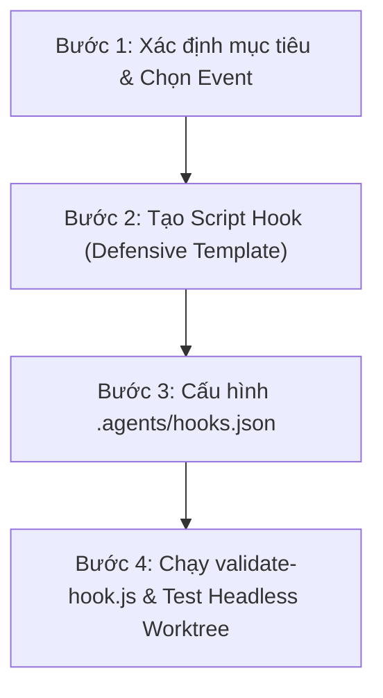

# ⚓ Antigravity Hook Architect

Skill này chịu trách nhiệm chuẩn hóa toàn bộ quy trình thiết kế, cấu hình và kiểm chứng cơ học hệ thống **Antigravity Lifecycle Hooks (`hooks.json`)**, ngăn ngừa 100% tình trạng suy diễn sai schema hoặc cấu hình hook không hoạt động.

---

## 1. Nguyên Tắc Cốt Lõi (Core Invariants)

1. **Tuân Thủ Tuyệt Đối Schema Spec:**
   Không tự sáng tạo trường cú pháp. Chỉ sử dụng 5 sự kiện chuẩn: `PreToolUse`, `PostToolUse`, `PreInvocation`, `PostInvocation`, `Stop` (xem [references/lifecycle-events.md](references/lifecycle-events.md)).
2. **Kỷ Luật I/O Contract:**
   - Đọc context từ `process.stdin` (JSON camelCase).
   - Xuất kết quả đúng cấu trúc ra `process.stdout`. Tuyệt đối không để `console.log` làm ô nhiễm stdout.
3. **Phòng Vệ Tối Đa (Defensive Fallback):**
   Mọi script hook bắt buộc bọc trong `try-finally`. Kể cả khi logging lỗi, hook vẫn phải xuất JSON hợp lệ ra stdout để không làm tê liệt agent.
4. **Kiểm Chứng Bằng Linter Cơ Học:**
   Trước khi bàn giao hoặc chạy thực tế, bắt buộc chạy script `scripts/validate-hook.js` để kiểm tra tĩnh toàn bộ cấu trúc file `hooks.json`.

---

## 2. Quy Trình 4 Bước Thiết Lập Hook Chuẩn



### Bước 1: Xác Định Mục Tiêu & Chọn Đúng Event
- **Kiểm soát/Chặn quyền (Safety Gate)** $\rightarrow$ Dùng `PreToolUse` (trả về `"decision": "deny"` hoặc `"decision": "allow"`).
- **Ghi log Wide Event / Telemetry** $\rightarrow$ Dùng `PreToolUse` & `PostToolUse` (đo `DurationMs` giữa 2 lượt).
- **Tiêm nhắc nhở / Context** $\rightarrow$ Dùng `PreInvocation` (trả về `injectSteps`).
- **Ngăn agent dừng sớm / Vòng lặp tự sửa lỗi (Loop Gate)** $\rightarrow$ Dùng `Stop` (trả về `"decision": "continue"` nếu test chưa pass).

### Bước 2: Tạo Script Hook Handler
Sao chép từ [templates/wide-event-hook.template.js](templates/wide-event-hook.template.js) vào `.agents/scripts/<ten-hook>.js`.
Đảm bảo:
- Sử dụng `performance.now()` để đo thời gian.
- Ghi log theo mẫu Wide Event (High Cardinality: `conversationId`, High Dimensionality: `toolCall.name`, args).
- Đáp ứng contract stdout.

### Bước 3: Cập Nhật `.agents/hooks.json`
Tham chiếu [templates/hooks.template.json](templates/hooks.template.json).
Lưu ý về đường dẫn command:
- Antigravity đặt CWD tại thư mục chứa `hooks.json` (`.agents/`).
- Do đó cú pháp gọi là: `node scripts/<ten-hook>.js <tham_so>`.

### Bước 4: Chạy Linter & Kiểm Chứng Cơ Học
Chạy lệnh kiểm định:
```bash
node .agents/skills/agy-hook-architect/scripts/validate-hook.js .agents/hooks.json
```
Chỉ khi linter báo `[APPROVED] Exit Code: 0`, cấu hình mới được công nhận đạt chuẩn.

---

## 3. Thư Viện Tài Nguyên Đi Kèm (Bundled Resources)

- [references/lifecycle-events.md](references/lifecycle-events.md): Bảng tra cứu toàn bộ 5 sự kiện, schema STDIN/STDOUT, matcher và tool list.
- [templates/hooks.template.json](templates/hooks.template.json): File mẫu `hooks.json` chứa đầy đủ 5 sự kiện.
- [templates/wide-event-hook.template.js](templates/wide-event-hook.template.js): Mã nguồn mẫu xử lý hook Node.js chuẩn Wide Event.
- [scripts/validate-hook.js](scripts/validate-hook.js): Script linter kiểm định schema tự động.
