# Advanced Mermaid Features

Advanced configuration, styling, theming, and other powerful features for creating professional diagrams.

## Frontmatter Configuration

Add YAML configuration at the top of diagrams:

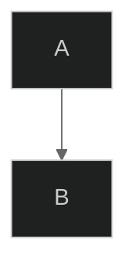

## Themes

### Built-in Themes

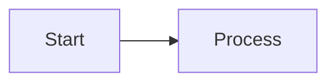

**Available themes:**

- `default` - Standard blue theme
- `forest` - Green earth tones
- `dark` - Dark mode friendly
- `neutral` - Grayscale professional
- `base` - Minimal base theme for customization

### Theme Examples

**Default Theme:**

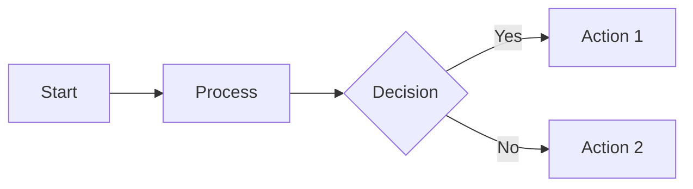

**Dark Theme:**

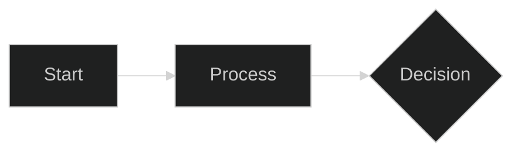

**Forest Theme:**

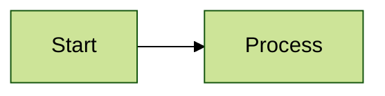

## Custom Theme Variables

Override specific colors:

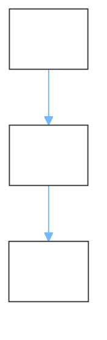

## Layout Options

### Dagre Layout (Default)

### ELK Layout (Advanced)

For complex diagrams with better automatic layout:

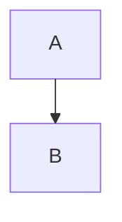

**ELK node placement strategies:**

- `SIMPLE` - Basic placement
- `NETWORK_SIMPLEX` - Network optimization
- `LINEAR_SEGMENTS` - Linear arrangement
- `BRANDES_KOEPF` - Balanced (default)

## Look Options

### Classic Look

Traditional Mermaid appearance:

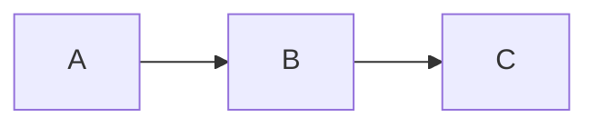

### Hand-Drawn Look

Sketch-like, informal style:

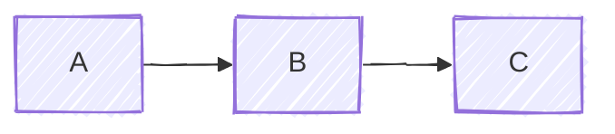

## Complete Configuration Example

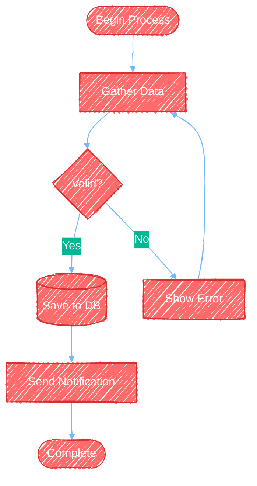

## Diagram-Specific Styling

### Flowchart Styling

**Class-based styling:**

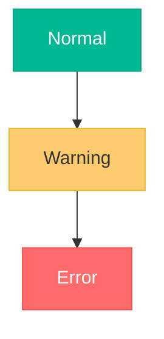

**Node-specific styling:**

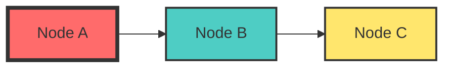

**Link styling:**

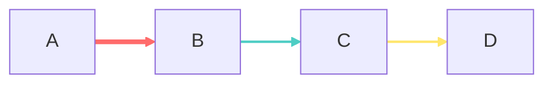

### Sequence Diagram Styling

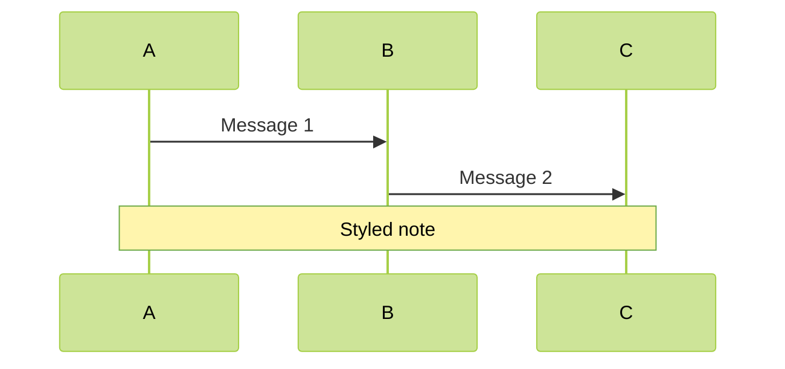

### Class Diagram Styling

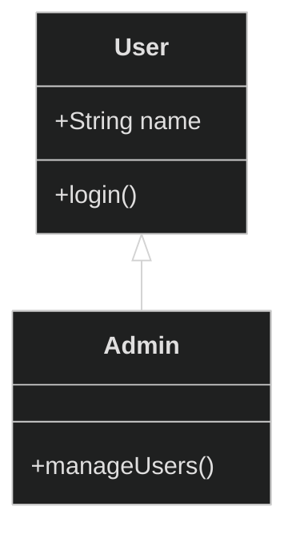

## Subgraph Styling

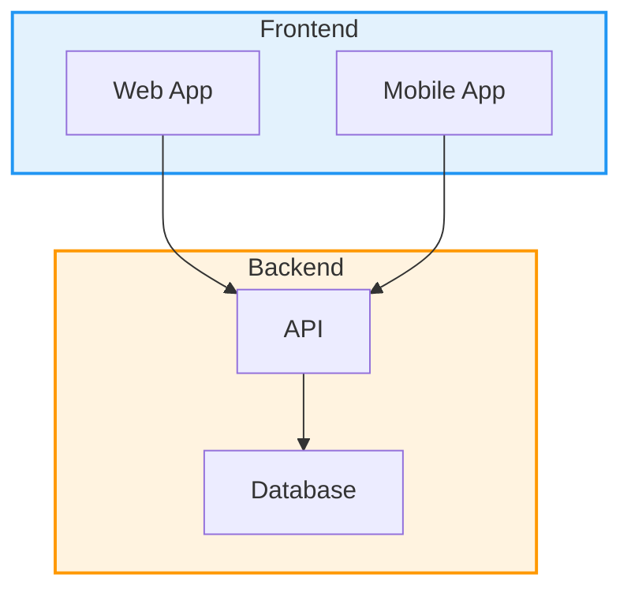

## Best Practices for Advanced Features

1. **Use themes consistently** - Pick one theme for related diagrams
2. **Don't over-style** - Too many colors can reduce clarity
3. **Test hand-drawn look** - Some diagrams work better with classic look
4. **Use ELK for complex layouts** - When dagre creates crossed lines
5. **Comment complex configurations** - Explain non-obvious styling choices
6. **Keep it accessible** - Ensure sufficient color contrast
7. **Test exports** - Verify diagrams render correctly in target format
8. **Version control configs** - Track theme changes in your repository
