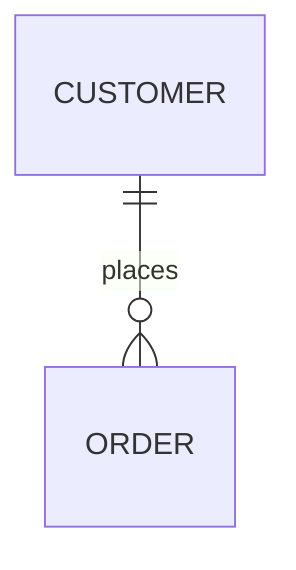
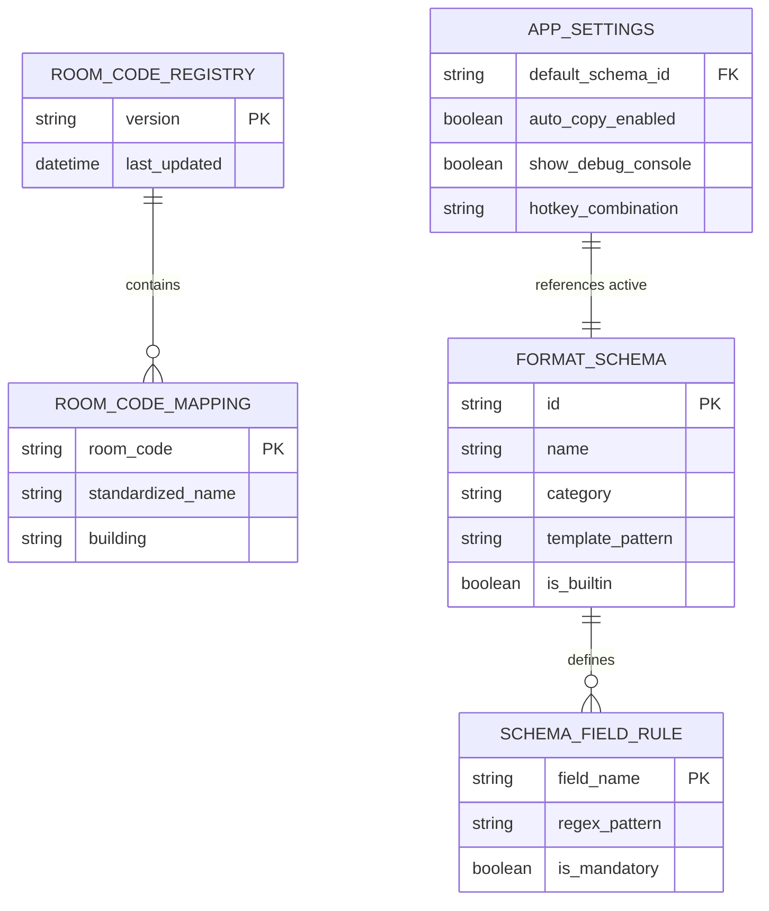

# Entity Relationship Diagrams (ERD)

ERDs model database and data schema relationships, showing tables/entities, their attributes, and relationships.

## Basic Syntax

## Attribute Constraints

- `PK` - Primary Key
- `FK` - Foreign Key
- `UK` - Unique Key
- `NN` - Not Null

## Cardinality Symbols

- `||` - Exactly one
- `|o` - Zero or one
- `}{` - One or many
- `}o` - Zero or many

## AppForms Data Model Example

