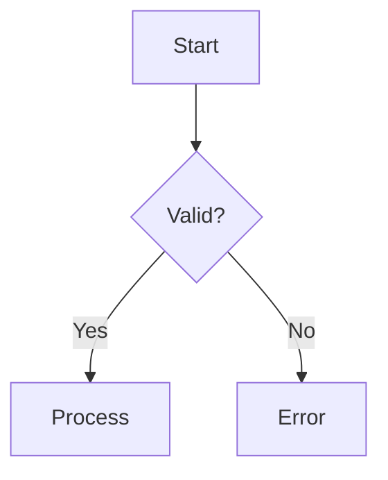
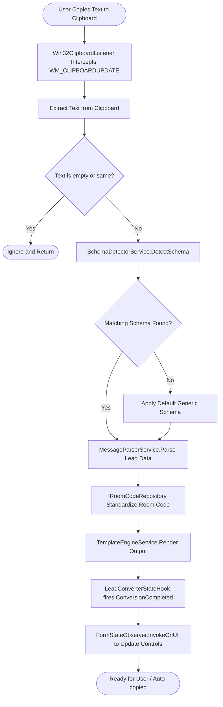

# Flowcharts

Flowcharts visualize processes, algorithms, decision trees, and user journeys.

## Basic Syntax

## Node Shapes

- `[Rectangle]` - Standard step / action
- `([Stadium])` - Start / End boundary
- `[[Subroutine]]` - Predefined process
- `[(Cylinder)]` - Database or file storage
- `((Circle))` - Connector / State
- `{Rhombus}` - Decision / Condition
- `[/Parallelogram/]` - Input / Output

## AppForms Clipboard Processing Flowchart Example

## Link Rules & Critical Syntax Guards

- Always wrap link labels with parentheses in double quotes: `A -->|"Parse (Fallback)"| B`.
- Never use unquoted `<` or `>` inside node text; use tildes `Result~T~` instead.
- Use exactly two hyphens for standard arrows `-->` or dotted `-.->`.
