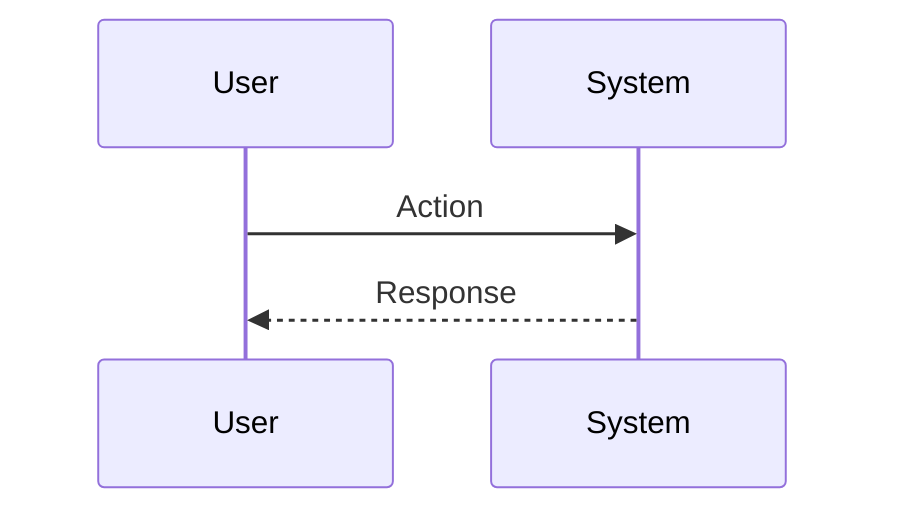
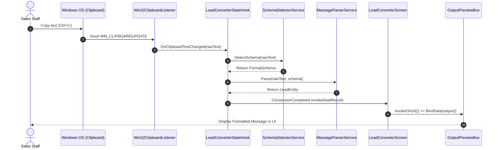

# Sequence Diagrams

Sequence diagrams show interactions between participants over time (API calls, event dispatches, WinForms message handling).

## Basic Syntax

## AppForms Sequence Diagram Example: Clipboard Conversion Flow

