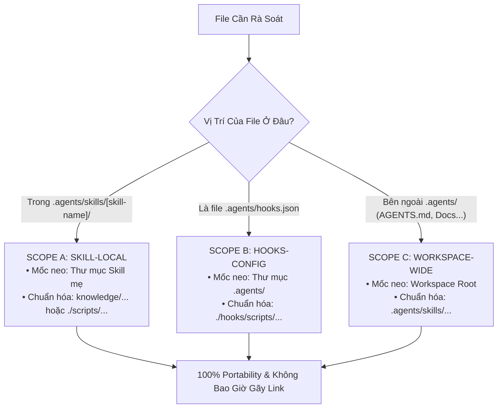

# === CẤU HÌNH KHỞI ĐỘNG (L0 — Anchor Rules) ===

<instructions>
must:
  - anchor_on_dot_agents_directory # Luôn lấy thư mục .agents làm mốc neo trung tâm để định vị Workspace Root
  - enforce_3_tier_scope_resolution # Phân biệt rạch ròi 3 vùng Scope: Skill-Local, Hooks-Config, và Workspace-Wide
  - ban_hardcoded_absolute_paths_in_repo # Tuyệt đối cấm lưu trữ file:///c:/... hoặc C:\... trong mã nguồn và tài liệu
  - preserve_external_web_urls # Không bao giờ can thiệp vào các đường dẫn bắt đầu bằng http://, https://
  - run_mechanical_verification_gate # Kiểm chứng kết quả bằng exit code 0 từ script verify_paths.py
must_not:
  - mix_hooks_cwd_with_workspace_root # Không sửa nhầm đường dẫn trong hooks.json thành relative từ root (vì hook CWD là .agents/)
  - allow_windows_backslashes_in_markdown # Không sử dụng dấu gạch chéo ngược \ trong các liên kết tài liệu Markdown
  - output_manual_assumptions_without_scan # Không phỏng đoán thủ công; bắt buộc chạy script quét cơ học
</instructions>

<context>

## Boot Sequence

1. Đọc `SKILL.md` (file này) — Nắm vững 3 vùng Scope và mốc neo `.agents`.
2. Tra cứu **Bản Đồ Điều Phối Ngữ Cảnh (§2)** để nạp tài liệu `references/path-resolution-matrix.md`.
3. Thực thi theo **Quy Trình 4 Bước Chuẩn Hóa (§3)**.
4. Chạy kiểm định cơ học qua `scripts/verify_paths.py` kết hợp schema `schemas/path-audit-schema.json`.

## Routing Map (Progressive Disclosure)

- **Core Protocol**: `SKILL.md`
- **Knowledge & Reference**: `references/path-resolution-matrix.md` (Ma trận chi tiết 3 vùng Scope và Failure Modes)
- **Tooling & Automation**: `scripts/verify_paths.py` (Script Python scan & fix), `scripts/Verify-Paths.ps1` (PowerShell runner)
- **Templates & Schemas**: `schemas/path-audit-schema.json`, `templates/path-verification-report.template.md`

</context>

---

## 1. Bản Đồ Điều Phối 3 Vùng Scope (Scope Resolution Map)



---

## 2. Bản Đồ Điều Phối Ngữ Cảnh (Context Routing Matrix)

| Tình Huống Gặp Phải | Tài Liệu / Công Cụ Kích Hoạt | Đầu Ra Tiêu Chuẩn |
| :--- | :--- | :--- |
| **Cần tra cứu quy tắc phân giải 3 Scope** | `references/path-resolution-matrix.md` | Hiểu rõ ranh giới giữa Skill-Local vs Hooks CWD |
| **Quét kiểm tra vi phạm đường dẫn (Dry-run)** | `scripts/verify_paths.py --workspace .` | Danh sách tệp chứa đường dẫn tuyệt đối vi phạm |
| **Tự động chuyển đổi toàn bộ path tuyệt đối** | `scripts/verify_paths.py --workspace . --fix` | Mã nguồn và tài liệu sạch 100% đường dẫn tuyệt đối |
| **Xuất báo cáo nghiệm thu phục vụ CI/CD** | `scripts/verify_paths.py --output report.json` | File JSON tuân thủ `schemas/path-audit-schema.json` |

---

## 3. Quy Trình Thực Thi 4 Bước (4-Step Execution Protocol)

### Bước 1: Khởi Tạo & Định Vị Mốc Neo (Anchor Ingestion)

- Chạy thuật toán tìm mốc `.agents/` từ thư mục hiện hành lên root dự án.
- Xác định `WORKSPACE_ROOT = Parent(.agents)`. Nếu không có `.agents/`, thông báo cảnh báo và neo tạm thời vào `.git` hoặc thư mục hiện tại.

### Bước 2: Quét & Phân Loại Vi Phạm (Scan & Classify)

- Sử dụng regex nhận diện:
  - `file:///...` (Các đường dẫn sinh ra do sao chép từ Chat UI của AI).
  - `[C-Z]:\...` hoặc `[C-Z]:/...` (Đường dẫn tuyệt đối ổ đĩa Windows).
- Phân loại tệp vi phạm vào đúng một trong ba vùng: Scope A, Scope B, hoặc Scope C.

### Bước 3: Tính Toán & Chuyển Đổi Đường Dẫn (Resolve & Transform)

- **Nếu ở Scope A**: Rút gọn đường dẫn thành tương đối so với thư mục của Skill đó. Ví dụ:
  - `file:///c:/.../.agents/skills/my-skill/knowledge/doc.md` ➔ `knowledge/doc.md`
- **Nếu ở Scope B (`hooks.json`)**: Đảm bảo lệnh bắt đầu bằng `./hooks/...` hoặc `hooks/...`. Tuyệt đối không chèn thêm `.agents/` vào lệnh vì Antigravity đứng ở `.agents/` khi chạy hook!
- **Nếu ở Scope C**: Chuyển thành tương đối so với `WORKSPACE_ROOT`. Ví dụ:
  - `file:///c:/.../Steves/.agents/skills/...` ➔ `.agents/skills/...`

### Bước 4: Kiểm Chứng Cơ Học (Mechanical Verification Gate)

- Thực thi script kiểm định:

  ```powershell
  python .agents/skills/path-verifier/scripts/verify_paths.py --workspace .
  ```

- Chỉ khi script trả về **Exit Code 0** và không còn bất kỳ đường dẫn tuyệt đối nào, nhiệm vụ mới được coi là hoàn tất.
