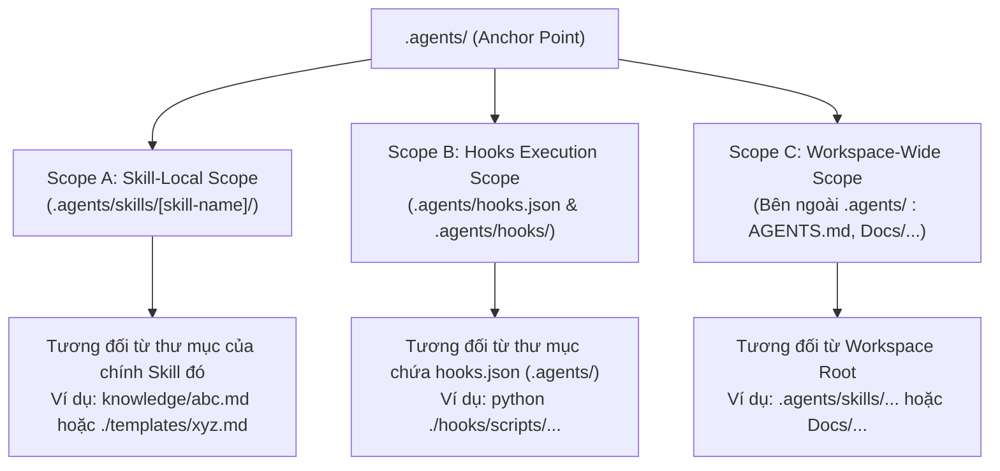

# 🗺️ Ma Trận Quy Tắc Chuẩn Hóa Đường Dẫn (Path Resolution Matrix)

> **Mục tiêu**: Định nghĩa không gian phân giải đường dẫn (Scope Resolution) dựa trên mốc neo trung tâm **`.agents`** tại root của dự án, triệt tiêu hoàn toàn các đường dẫn tuyệt đối mang tính cục bộ (`c:\...`, `file:///c:/...`, `/home/...`).

---

## 1. Mốc Neo Trung Tâm (The Anchor Rule: `.agents`)

Mọi dự án tuân thủ chuẩn Antigravity Architecture đều lấy thư mục **`.agents`** tại cấp root làm mốc neo phả hệ:

- **`WORKSPACE_ROOT`** $\equiv$ Thư mục cha trực tiếp của `.agents/`.
- Nếu công cụ kiểm tra không tìm thấy `.agents/` tại thư mục hiện hành, nó sẽ thực hiện thuật toán **Walk-up Discovery** (leo ngược lên các thư mục cha) cho đến khi gặp `.agents/` hoặc root ổ đĩa.

---

## 2. Phân Định 3 Vùng Không Gian (3-Tier Scope Matrix)

### Bảng Chi Tiết Quy Tắc

| Phân Vùng (Scope) | Vị Trí File Chứa Đường Dẫn | Mốc Chuẩn Hóa (Base Anchor) | Cú Pháp Đúng (Relative) | Cú Pháp Vi Phạm (Cấm Tuyệt Đối) |
| :--- | :--- | :--- | :--- | :--- |
| **Scope A: Skill-Local** | Nằm trong `.agents/skills/<name>/` (ví dụ `SKILL.md`) | Thư mục của chính Skill đó (`.agents/skills/<name>/`) | `knowledge/doc.md` `./knowledge/doc.md` `scripts/run.py` | `file:///c:/Users/...` `c:\Users\...` `.agents/skills/<name>/knowledge/...` |
| **Scope B: Hooks-Config** | Tệp `.agents/hooks.json` | Thư mục chứa `hooks.json` (tức `.agents/`) | `"python ./hooks/scripts/..."` `"python scripts/..."` | `"python ./.agents/hooks/..."` `"python C:/Users/.../hooks/..."` |
| **Scope C: Workspace-Wide** | Tệp nằm ngoài `.agents/` (`AGENTS.md`, `README.md`, `Docs/`) | `WORKSPACE_ROOT` | `.agents/skills/<name>/SKILL.md` `Docs/guide.md` | `file:///c:/Users/...` `c:\Users\...` |

---

## 3. Quy Tắc Xử Lý Link Markdown & URI Schemes

1. **Khử hoàn toàn tiền tố `file:///` trong mã nguồn**:
   - Tiền tố `file:///` chỉ được phép xuất hiện trong tin nhắn Chat UI tạm thời do AI sinh ra cho người dùng click chuột.
   - Tuyệt đối **CẤM** lưu trữ chuỗi `file:///c:` hoặc `file:///C:` vào bất kỳ tệp Markdown hoặc mã nguồn nào trong repository.
2. **Chuẩn hóa dấu gạch chéo**:
   - Tất cả đường dẫn tương đối trong tài liệu Markdown và JSON configuration bắt buộc sử dụng dấu gạch chéo xuôi `/` (POSIX style), không sử dụng dấu gạch chéo ngược `\` của Windows.
3. **Bảo vệ liên kết mạng ngoại vi**:
   - Tuyệt đối không can thiệp vào các đường dẫn bắt đầu bằng `http://`, `https://`, hoặc `mailto:`.

---

## 4. Bảng Tra Cứu Tình Huống & Cách Giải Quyết (Troubleshooting & Anti-patterns)

| Tình Huống | Lỗi Thường Gặp | Nguyên Nhân Gốc Rễ | Cách Sửa Đúng |
| :--- | :--- | :--- | :--- |
| **Hook báo lỗi `Script not found` khi chạy CLI** | Sửa `python ./hooks/...` thành `python ./.agents/hooks/...` | Hiểu nhầm CWD của hook là root dự án. Thực tế CWD của hook là `.agents/`. | Giữ nguyên `python ./hooks/scripts/...` |
| **AI Agent báo `File not found` khi On-Demand Skill** | Link trong `SKILL.md` trỏ về `file:///c:/Users/ADMIN/...` | Clone sang máy tính khác nên ổ đĩa và username bị sai lệch. | Đổi thành `[doc](knowledge/doc.md)` |
| **Script Python trong Hook không đọc được mã nguồn dự án** | Dùng `os.getcwd()` để tìm thư mục `1_Backend/` | CWD của hook là `.agents/`, nên không tìm thấy `1_Backend/` ở ngang hàng. | Dùng `Path(__file__).resolve()` walk-up tìm file `.agents` hoặc đọc `workspacePaths` từ stdin. |
