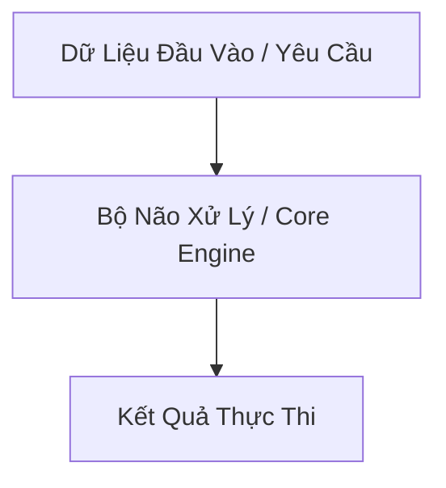

# [Tên Khái Niệm / Công Nghệ / Kiến Trúc] — Giải Phẫu Chiều Sâu

**Chủ đề**: [Tên chủ đề]  
**Mục tiêu bài học**: Hiểu tận gốc nguyên lý vận hành, cơ chế ngầm, các điểm đánh đổi và kịch bản sập nguồn.  
**Độ khó**: [Cơ bản / Nâng cao / Chuyên sâu]

---

## 1. Neo Đậu Nguyên Lý Đầu Tiên (First Principles Anchor)
- **Nỗi đau lịch sử**: [Mô tả chi tiết trước khi công nghệ này ra đời, lập trình viên/hệ thống đã phải chịu đựng bế tắc kỹ thuật nào]
- **Nút thắt vật lý**: [Giới hạn về CPU, RAM, I/O, Network hoặc Mental overhead]
- **Sự ra đời tất yếu**: [Bản chất công nghệ này xuất hiện để giải quyết nút thắt trên như thế nào]

---

## 2. Giải Phẫu Cơ Chế Vận Hành Ngầm (Under-The-Hood Mechanics)



- **Ai đang làm việc?**: [Tiến trình, Thread, Event loop, Kernel socket...]
- **Dữ liệu được lưu trữ và biến đổi ra sao?**: [Stack/Heap memory, Ring buffer, Serialization...]
- **Mã nguồn minh họa (Code chạy thật — Không có TODO)**:
```python
# Đoạn mã tối giản minh họa cơ chế hoạt động cốt lõi
def core_mechanism_demo():
  pass
```

---

## 3. Không Gian Phủ Định, Ma Trận Đánh Đổi & Kịch Bản Sập

### 3.1. Ma Trận Đánh Đổi 6 Chiều
| Trục Đánh Đổi | Cái Đạt Được (Gain) | Cái Giá Phải Trả (Pain / Cost) |
| :--- | :--- | :--- |
| **Độ trễ (Latency)** | ... | ... |
| **Bộ nhớ (Memory)** | ... | ... |
| **Độ phức tạp (Complexity)**| ... | ... |

### 3.2. Không Gian Phủ Định (Negative Space)
- ❌ **TUYỆT ĐỐI CẤM DÙNG KHI**: [Liệt kê 2-3 trường hợp sử dụng sai lầm gây hại nghiêm trọng]

### 3.3. Mổ Xẻ Kịch Bản Sập Nguồn (Failure Modes)
- **Kịch Bản 1**: [Tên kịch bản + Cơ chế gãy + Hậu quả + Cách phòng vệ]
- **Kịch Bản 2**: [Tên kịch bản + Cơ chế gãy + Hậu quả + Cách phòng vệ]

---

## 4. Thử Thách Socratic (The Socratic Probe)
> [!IMPORTANT]
> **Câu hỏi phản biện dành cho bạn**:
> [Đặt ra 1 câu hỏi tình huống biên sâu sắc để người học tự suy ngẫm và trả lời].
