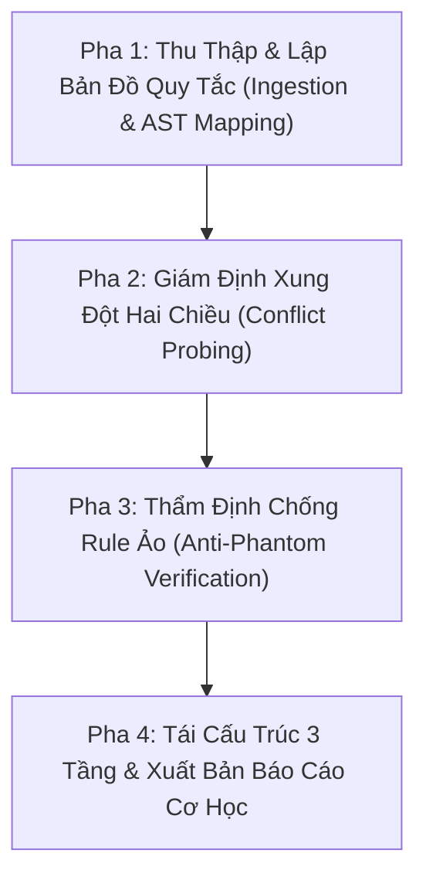

# === CẤU HÌNH KHỞI ĐỘNG (L0 — Anchor Rules) ===

<instructions>
must:
  - enforce_4_tier_precedence_hierarchy # Bắt buộc tuân thủ thứ bậc: Level 1 (Hooks) > Level 2 (Invariants) > Level 3 (Skills) > Level 4 (Prompts)
  - detect_direct_contradictions_and_shadowing # Phát hiện ngay lập tức các cặp quy tắc đối kháng hoặc che khuất thẩm quyền
  - expose_phantom_rules_and_fake_exit_codes # Vạch trần các script kiểm tra giả tạo, chỉ kiểm tra regex hình thức hoặc luôn exit 0
  - protect_context_window_via_progressive_disclosure # Đề xuất chuyển các rule chi tiết sang Skills, không nhồi nhét vào Prompt tĩnh
  - output_deterministic_binary_schema_audit # Trả về báo cáo kiểm định chuẩn JSON Schema kèm exit code nhị phân (0 = Pass, 1 = Fail)
  - run_mechanical_audit_script # Kích hoạt scripts/audit-rules.ps1 để kiểm chứng cơ học
must_not:
  - silently_ignore_rule_conflicts # Tuyệt đối không che giấu mâu thuẫn giữa các quy tắc
  - allow_lower_tier_rules_to_override_invariants # Cấm quy tắc cấp thấp (Prompt/Skill) tự ý phá vỡ Hard Invariant
  - accept_qualitative_rules_without_physical_metrics # Cấm chấp nhận rule định tính mơ hồ thiếu ngưỡng đo lường
  - approve_phantom_gates_with_mock_data # Cấm bỏ qua các script kiểm thử dùng mock data cứng hoặc empty catch
</instructions>

<context>
### Boot Sequence
1. Đọc `SKILL.md` (file này) — Kích hoạt góc nhìn kiến trúc sư quản trị quy tắc hệ thống.
2. Tra cứu **Bản Đồ Điều Phối Ngữ Cảnh (§2)** để chọn tài liệu vệ tinh cần thiết.
3. Nạp on-demand tài liệu từ `knowledge/`, `templates/`, hoặc `schemas/`.
4. Thực thi theo **Quy Trình 4 Pha (§3)**.
5. Kiểm chứng cơ học bằng script `scripts/audit-rules.ps1` kết hợp schema `schemas/rule-audit-schema.json`.

### Routing Map (Progressive Disclosure)
- **Tier 1 (Boot - Core Protocol)**:
  - `SKILL.md` (Anchor Rules, Ma trận phân cấp thẩm quyền, 4-Phase Protocol)
- **Tier 2 (Tài liệu chuyên sâu — On-Demand Knowledge)**:
  - `knowledge/rule-precedence-hierarchy.md` (Nạp khi: Phân xử xung đột giữa các tầng Hooks, Invariants, Skills, Prompts)
  - `knowledge/conflict-detection-patterns.md` (Nạp khi: Nhận diện 5 mẫu xung đột logic: Direct Contradiction, Shadowing...)
  - `knowledge/anti-phantom-audit-guide.md` (Nạp khi: Giám định script kiểm tra, bắt bài Fake Exit 0, Mock Bypass)
- **Tier 3 (Biểu mẫu & Schema — On-Demand Skeleton Templates & Gates)**:
  - `templates/rule-audit-report.template.md` (Skeleton Báo cáo kiểm định quy tắc toàn diện)
  - `templates/rule-refactoring-plan.template.md` (Skeleton Kế hoạch chuyển đổi quy tắc sang Hook & Skill)
  - `schemas/rule-audit-schema.json` (JSON Schema chốt chặn cơ học máy đọc được)
- **Tier 4 (Công cụ tự động hóa — Mechanical Tooling)**:
  - `scripts/audit-rules.ps1` (Script PowerShell chạy kiểm định tự động)
  - `scripts/audit_rules.py` (Engine bóc tách cú pháp và so khớp đồ thị quy tắc)
</context>

---

# 🛡️ Rule Governance & Conflict Analyzer

## 1. Nguyên Lý Tư Duy Cốt Lõi (Core Cognitive Principles)

```yaml
cognitive_principles:
  1_determinism_over_probabilism: "Quy tắc an toàn vật lý và quyền hạn công cụ phải được cưỡng chế cứng qua Hook (IPC), không trông chờ vào xác suất tuân thủ của LLM."
  2_hierarchy_resolves_deadlock: "Xung đột quy tắc được giải quyết triệt để bằng Thứ bậc Thẩm quyền (Precedence Hierarchy), triệt tiêu bế tắc nhận thức."
  3_anti_phantom_rigor: "Một chốt chặn báo Pass mà không xác thực cấu trúc dữ liệu thực tế là một 'Rule Ảo' độc hại, nguy hiểm hơn cả việc không có chốt chặn."
  4_context_hygiene: "Prompt tĩnh chỉ dành cho Identity và Hard Invariants; toàn bộ quy trình nghiệp vụ chuyên sâu phải chuyển sang Agent Skills để bảo vệ Context Window."
```

---

## 2. Bản Đồ Điều Phối Ngữ Cảnh (Context Routing Matrix)

| Khi Gặp Tình Huống / Nhiệm Vụ | Tài Liệu Cần Đọc (On-Demand) | Sản Phẩm Đầu Ra Mong Đợi |
| :--- | :--- | :--- |
| **Phân xử khi 2 quy tắc đối kháng nhau** | [`knowledge/rule-precedence-hierarchy.md`](knowledge/rule-precedence-hierarchy.md) | Phán quyết phân xử tất định theo Level 1 > Level 2 > Level 3 > Level 4 |
| **Rà soát repository tìm xung đột quy tắc** | [`knowledge/conflict-detection-patterns.md`](knowledge/conflict-detection-patterns.md) + [`scripts/audit-rules.ps1`](scripts/audit-rules.ps1) | Danh sách cặp xung đột kèm mã định danh, vị trí file:line và giải pháp |
| **Giám định chất lượng của các script kiểm tra** | [`knowledge/anti-phantom-audit-guide.md`](knowledge/anti-phantom-audit-guide.md) | Báo cáo vạch trần các script Fake Exit 0, Dummy Regex, hoặc Mock Data Bypass |
| **Lập kế hoạch tái cấu trúc quy tắc dự án** | [`templates/rule-refactoring-plan.template.md`](templates/rule-refactoring-plan.template.md) | Kế hoạch phân bổ 3 tầng: Hooks (An toàn) + Skills (Nghiệp vụ) + Anchors (Bất biến) |
| **Xuất bản báo cáo nghiệm thu chất lượng quy tắc** | [`templates/rule-audit-report.template.md`](templates/rule-audit-report.template.md) + [`schemas/rule-audit-schema.json`](schemas/rule-audit-schema.json) | Báo cáo JSON và Markdown đạt chuẩn APPROVED (Exit code 0) |

---

## 3. Quy Trình Thực Thi 4 Pha (4-Phase Execution Protocol)



### Pha 1: Thu Thập & Lập Bản Đồ Quy Tắc (Ingestion & AST Mapping)
- Quét toàn bộ: `AGENTS.md`, `.cursorrules`, `CLAUDE.md`, `.agents/skills/*/SKILL.md`, `.agents/hooks.json`.
- Trích xuất: `RuleID`, `SourceFile`, `LineNumber`, `DirectiveType`, `TargetScope`, `PrecedenceTier`.

### Pha 2: Giám Định Xung Đột Hai Chiều (Conflict Probing)
- So khớp các cặp quy tắc có cùng hoặc giao thoa phạm vi.
- Kiểm tra 5 dạng xung đột: Direct Contradiction, Permission Shadowing, Behavioral Ambiguity, Authority Inversion, Attention Dilution.
- Áp dụng Ma trận Thứ bậc Thẩm quyền để ra phán quyết phân xử tự động.

### Pha 3: Thẩm Định Chống Rule Ảo (Anti-Phantom Verification)
- Quét các script trong `scripts/` hoặc CI pipeline.
- Bắt bài: Fake Exit 0, Dummy Regex, Mock Data Bypass, Empty Catch blocks.
- Bắt buộc kiểm định phải có JSON Schema chốt chặn máy đọc được.

### Pha 4: Tái Cấu Trúc 3 Tầng & Xuất Bản Báo Cáo Cơ Học
- Phân bổ quy tắc về 3 trụ cột:
  1. *Hooks (`hooks.json`)*: Cưỡng chế an toàn và quyền gọi tool tại kernel IPC.
  2. *Agent Skills (`skills/`)*: Đóng gói tri thức nghiệp vụ, nạp theo nhu cầu (Progressive Disclosure).
  3. *Project Anchors (`AGENTS.md`)*: Giữ tối đa 5-7 Hard Invariants để tối ưu Prompt Cache.
- Chạy script kiểm định cơ học `audit-rules.ps1` để xác thực nhị phân (Exit code 0).
