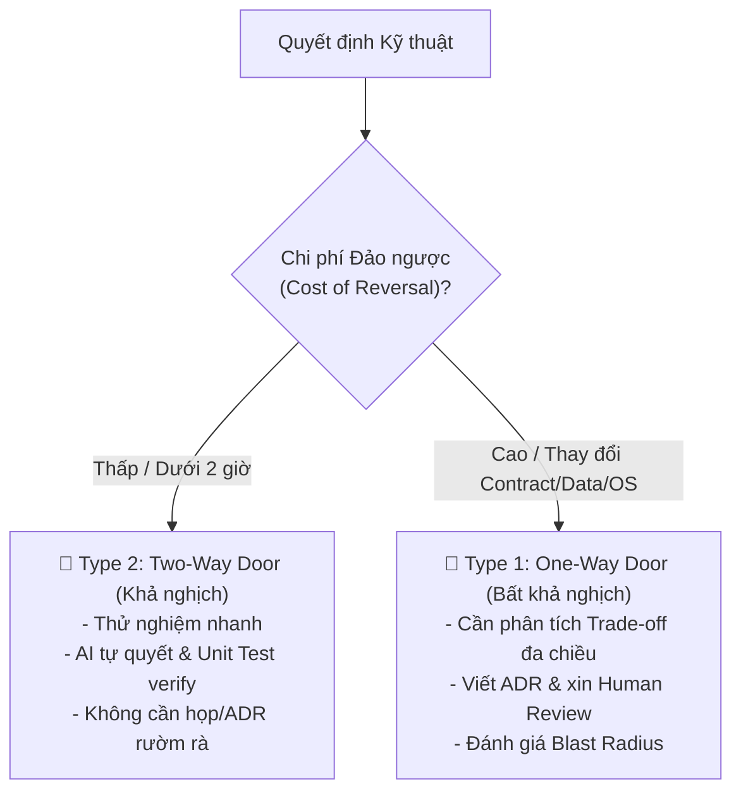
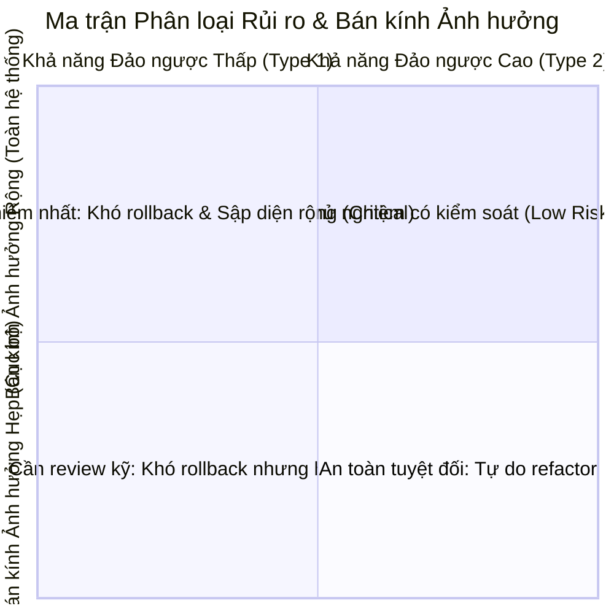

# 🔄 Framework: Decision Reversibility & Blast Radius

> **Vị trí trong hệ thống:** Thuộc nhóm `knowledge/` trong skill `technical-tradeoff-analyzer`. Được nạp on-demand khi chuẩn bị đưa ra quyết định kiến trúc, lựa chọn công nghệ, hoặc đánh giá rủi ro rollback.

---

## 1. Bản Chất của Tính Khả Nghịch (The Concept of Reversibility)

Mọi quyết định kỹ thuật trong phần mềm đều có thể phân loại thành 2 nhóm lớn dựa theo mô hình **Two-Way Door vs. One-Way Door** (Jeff Bezos):

---

## 2. Tiêu Chí Phân Loại Nhị Phân (Type 1 vs. Type 2)

| Đặc Điểm So Sánh | 🚪 Type 1: One-Way Door (Bất khả nghịch) | 🚪 Type 2: Two-Way Door (Khả nghịch) |
| :--- | :--- | :--- |
| **Định nghĩa** | Quyết định nếu sai sẽ tốn chi phí cực lớn, phá vỡ hợp đồng dữ liệu hoặc khó quay lui. | Quyết định có thể hoàn tác (rollback) dễ dàng trong vài phút/giờ mà không để lại hậu quả. |
| **Ví dụ trong dự án C# Native AppForms** | - Đổi cấu trúc `0_Shared` (Types, Enums, LeadModels, Schemas). - Chọn Win32 API Unmanaged thay vì Managed WinForms. - Thay đổi chiến lược lưu trữ dữ liệu sang Database / File persistence. | - Tối ưu biểu thức Regex bóc tách trường thông tin. - Tinh chỉnh thời gian Retry Backoff (10ms -> 20ms). - Định dạng lại cấu trúc chuỗi log hiển thị hoặc màu sắc UI. |
| **Quyền hạn hành động của AI** | ⚠️ **Chặn lại**: Phân tích Trade-off, lập ADR nháp và chờ Human phê duyệt. | ✅ **Chủ động**: Đề xuất giải pháp, viết code và chứng minh bằng `dotnet test`. |
| **Yêu cầu tài liệu** | Bắt buộc có [`templates/adr-trade-off.template.md`](templates/adr-trade-off.template.md). | Chỉ cần commit message rõ ràng và Unit Test bao phủ. |

---

## 3. Bán Kính Ảnh Hưởng (Blast Radius Analysis)

Trước khi thực hiện bất kỳ thay đổi nào, Agent phải ước lượng **Blast Radius** theo 4 cấp độ:

### 4 Cấp độ Bán kính Ảnh hưởng:
1. **Level 1 (Sub-Module Local)**: Lỗi chỉ xảy ra bên trong 1 Component hoặc 1 Regex Parser. Hệ thống vẫn chạy, các màn hình khác vẫn hoạt động bình thường.
2. **Level 2 (Pipeline Engine / Service)**: Lỗi làm treo Service chuyển đổi hoặc mất dữ liệu văn bản khi copy.
3. **Level 3 (Process / App Crash)**: Lỗi ném Unhandled Exception làm tiến trình background biến mất khỏi System Tray hoặc sập Form.
4. **Level 4 (OS System-Wide Freeze)**: Lỗi rò rỉ bộ nhớ Unmanaged (`GlobalAlloc` không `GlobalFree`), hoặc Deadlock giữ Clipboard Lock (`OpenClipboard`) khiến **toàn bộ ứng dụng khác trên máy tính (Word, Excel, Chrome) không thể Copy/Paste được**.

---

## 4. Công Thức Tính Điểm Quyết Định (Decision Scorecard)

$$\text{Risk Index} = \text{Blast Radius Level (1..4)} \times (5 - \text{Reversibility Score (1..4)})$$

- **Risk Index $\ge 8$**: Bắt buộc kích hoạt quy trình Type 1 Decision (lập bảng Trade-off + ADR).
- **Risk Index $< 8$**: Triển khai trực tiếp Type 2 Decision kèm bài test chứng minh.
