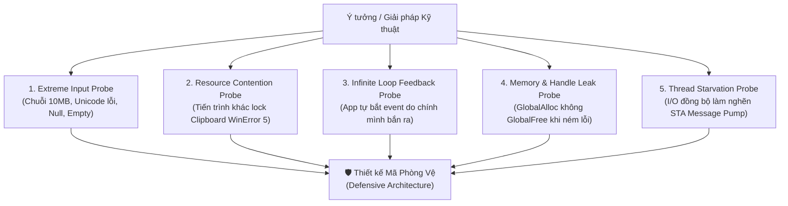

# 🔍 Framework: Reverse Probing & Failure Mode Analysis

> **Vị trí trong hệ thống:** Thuộc nhóm `knowledge/` trong skill `technical-tradeoff-analyzer`. Được nạp on-demand khi chuẩn bị viết code, thiết kế thuật toán mới hoặc kiểm tra lỗ hổng logic.

---

## 1. Bản Chất của Reverse Probing (Tư Duy Đặt Câu Hỏi Ngược)

Thay vì hỏi: *"Làm thế nào để tính năng này hoạt động trên happy path?"*, Reverse Probing bắt buộc Agent phải hỏi:
> **"Giải pháp này sẽ sập, treo máy, hoặc phá hoại hệ thống như thế nào trong điều kiện thực tế khắc nghiệt nhất?"**



---

## 2. Danh Mục 5 Kịch Bản Thất Bại Kinh Điển (The 5 Failure Modes)

### 🔴 Kịch bản 1: Clipboard Lock Contention (`WinError 5` / `CLIPBRD_E_CANT_OPEN`)
- **Tình huống**: Khi người dùng copy trong Microsoft Excel, Word, hoặc Photoshop, tiến trình đó sẽ khóa chặt Clipboard để render nhiều định dạng (HTML, RTF, Bitmap). Nếu app gọi `OpenClipboard` ngay lập tức, API sẽ trả về lỗi `0` (`Access Denied`).
- **Phòng vệ bắt buộc**: Áp dụng **Exponential Backoff Retry** (thử lại tối đa 5 lần: $5\text{ms}, 10\text{ms}, 20\text{ms}, 40\text{ms}, 80\text{ms}$).

### 🔴 Kịch bản 2: Vòng Lặp Phản Hồi Vô Tận (Infinite Feedback Loop)
- **Tình huống**: App bắt sự kiện `WM_CLIPBOARDUPDATE` $\rightarrow$ Lọc chuỗi $\rightarrow$ Gọi `SetClipboardData` $\rightarrow$ Hệ điều hành Windows lại phát tiếp sự kiện `WM_CLIPBOARDUPDATE` $\rightarrow$ App lại bắt và ghi tiếp.
- **Phòng vệ bắt buộc**: Lưu vết nội dung vừa ghi (`_lastProcessedText` hoặc SHA-256 Hash). Khi sự kiện mới tới, nếu trùng với nội dung vừa ghi thì **bỏ qua ngay lập tức**.

### 🔴 Kịch bản 3: Vỡ Ký Tự Unicode Ngoại Bảng (Surrogate Pair Truncation)
- **Tình huống**: Biểu thức Regex hoặc hàm cắt chuỗi xử lý emoji 4-bytes (như icon Zalo $\text{U+1F600}$) bị cắt đôi thành 2 mã UTF-16 riêng biệt $\rightarrow$ Gây lỗi ký tự rác hoặc crash Regex.
- **Phòng vệ bắt buộc**: Luôn xử lý Regex với `RegexOptions.CultureInvariant` và nhận diện đầy đủ cụm Surrogate Pairs (`[\uD800-\uDBFF][\uDC00-\uDFFF]`).

### 🔴 Kịch bản 4: Rò Rỉ Tài Nguyên Unmanaged (Memory/GDI Handle Leak)
- **Tình huống**: Gọi `GlobalAlloc(GMEM_MOVEABLE)` nhưng `SetClipboardData` thất bại hoặc ném Exception ở giữa $\rightarrow$ Con trỏ `hMem` bị bỏ rơi, RAM tăng liên tục mỗi lần người dùng bấm Ctrl+C.
- **Phòng vệ bắt buộc**: Toàn bộ logic P/Invoke phải bọc trong `try...finally`. Nếu `SetClipboardData == IntPtr.Zero`, bắt buộc gọi `GlobalFree(hMem)`.

### 🔴 Kịch bản 5: Nghẽn Luồng Giao Diện STA (STA Thread Starvation)
- **Tình huống**: Ghi file Log bằng `File.AppendAllText` đồng bộ hoặc chạy xử lý Regex chuỗi 5MB ngay trên luồng chính STA.
- **Phòng vệ bắt buộc**: Đẩy việc nặng ra Background Thread (`Task.Run` hoặc `Channel<T>`), bọc cập nhật UI bằng `FormStateObserver.InvokeOnUI` để giữ `WndProc` phản hồi dưới $5\text{ms}$.

---

## 3. Quy Trình Bóc Tách Negative Space (Vùng Cấm Kỹ Thuật)

Khi phân tích bất kỳ bài toán nào, Agent phải ghi rõ tối thiểu **3 điều CẤM LÀM**:

```yaml
negative_space_contract:
  must_not_1: 'CẤM chặn luồng STA bằng Thread.Sleep() hoặc I/O đồng bộ nặng.'
  consequence_1: 'Làm đơ System Tray icon, Windows báo ứng dụng Not Responding.'
  
  must_not_2: 'CẤM import WinForms UI Controls (TextBox, Button, Panel) vào 1_Backend/.'
  consequence_2: 'Phá vỡ kiến trúc Clean 3-layer, không thể viết Unit Test cô lập.'
  
  must_not_3: 'CẤM nuốt ngoại lệ (Empty Catch Block) khi gọi Win32 API hoặc unmanaged interop.'
  consequence_3: 'Che giấu lỗi hệ thống âm thầm, gây rò rỉ tài nguyên OS.'
```
