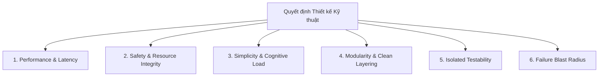

# 📐 Framework: 6 Trục Đánh Đổi Đa Chiều (Multi-Dimensional Trade-off Matrix)

> **Vị trí trong hệ thống:** Thuộc nhóm `knowledge/` trong skill `technical-tradeoff-analyzer`. Được nạp on-demand khi so sánh từ 2 phương án kỹ thuật trở lên.

---

## 1. Nguyên Lý Đánh Đổi Tuyệt Đối (No Free Lunch)

Trong kỹ thuật phần mềm, mọi lựa chọn đều đánh đổi giữa các yếu tố cạnh tranh. Một giải pháp "tối ưu" không phải là giải pháp tốt nhất ở mọi mặt, mà là giải pháp **chấp nhận những điểm yếu (pains) có thể kiểm soát được để đạt được những giá trị (gains) quan trọng nhất** với bài toán hiện tại.

---

## 2. Chi Tiết 6 Trục Đánh Đổi Cốt Lõi

### Trục 1: Hiệu Năng & Độ Trễ (Performance & Latency)
- **Câu hỏi cốt lõi**: Phương án này tốn bao nhiêu chu kỳ CPU, bao nhiêu MB RAM, và độ trễ trên luồng xử lý chính là bao nhiêu ms?
- **Ràng buộc Windows Native / WinForms**:
  - Luồng STA Windows Message Loop yêu cầu phản hồi $< 16\text{ms}$ (lý tưởng $< 5\text{ms}$) để tránh hiện tượng đơ chuột/giao diện và lag icon System Tray.
  - Hạn chế cấp phát liên tục trên Large Object Heap (LOH $> 85,000\text{ bytes}$) gây áp lực lên .NET Garbage Collector Gen 2.

### Trục 2: Độ Tin Cậy & An Toàn Bộ Nhớ (Safety & Resource Integrity)
- **Câu hỏi cốt lõi**: Khả năng xảy ra rò rỉ bộ nhớ (Memory Leak), tranh chấp tài nguyên (Resource Contention), hoặc treo máy (Deadlock) là bao nhiêu?
- **Ràng buộc Windows Native / WinForms**:
  - Mọi con trỏ unmanaged (`IntPtr`) từ `GlobalAlloc`, `GlobalLock` phải được bảo vệ 100% bằng `try...finally` kèm `GlobalFree`.
  - Phải có cơ chế giải phóng phòng ngừa khi tiến trình bị tắt đột ngột (`IDisposable`).

### Trục 3: Độ Phức Tạp Nhận Thức (Simplicity & Cognitive Load)
- **Câu hỏi cốt lõi**: Một lập trình viên mới mất bao lâu để đọc hiểu và sửa đoạn code này một cách an toàn?
- **Nguyên tắc vàng**: Ưu tiên giải pháp đơn giản, rõ ràng, ít ma thuật (zero black-magic). Tránh "Over-Engineering" (thiết kế thừa mô hình khi bài toán chưa cần).

### Trục 4: Tính Mô-đun & Ranh Giới Kiến Trúc (Modularity & Clean Layering)
- **Câu hỏi cốt lõi**: Khi sửa hoặc thêm một tính năng mới, có cần phải chạm vào các file/layer khác không (Open/Closed Principle)?
- **Ràng buộc phân tầng Clean 3-layer (`0_Shared`, `1_Backend`, `2_Frontend`)**:
  - `1_Backend/` tuyệt đối không biết gì về WinForms UI Controls (`TextBox`, `Button`, `Panel`).
  - `0_Shared/` là tầng dùng chung, độc lập và bất biến.
  - `2_Frontend/` chỉ nhận và hiển thị dữ liệu thông qua Data Models và State Hooks.

### Trục 5: Khả Năng Kiểm Thử Cô Lập (Isolated Testability)
- **Câu hỏi cốt lõi**: Có thể viết Unit Test tự động cho logic này trên CI/CD mà không cần chạy trên máy Windows thật hay mở GUI không?
- **Tiêu chuẩn nghiệm thu**: Logic nghiệp vụ cốt lõi phải test được 100% qua `dotnet test` bằng Plain C# Objects / Mock Interfaces.

### Trục 6: Bán Kính Ảnh Hưởng Khi Lỗi (Blast Radius)
- **Câu hỏi cốt lõi**: Nếu dòng code này ném Exception không mong muốn, hậu quả tối đa là gì? (Chỉ bỏ qua 1 trường dữ liệu, sập UI Screen, sập toàn bộ ứng dụng AppForms, hay làm lock Clipboard toàn bộ hệ điều hành Windows?)

---

## 3. Mẫu Bảng Đánh Đổi Chuẩn Hóa

Mọi phân tích so sánh kỹ thuật phải tổng kết bằng bảng ma trận sau:

| Trục Đánh Đổi | Phương Án A (Ví dụ: Pure C# Managed Safe) | Phương Án B (Ví dụ: Win32 P/Invoke Direct) | Lựa Chọn & Lý Do |
| :--- | :--- | :--- | :---: |
| **1. Hiệu Năng & RAM** | 🟡 Trung bình (tốn Garbage Collector) | 🟢 Cực nhanh, zero heap allocation | Tuỳ thuộc tần suất gọi |
| **2. An Toàn Bộ Nhớ** | 🟢 An toàn tuyệt đối (CLR quản lý) | 🔴 Nguy cơ leak nếu thiếu `GlobalFree` | Cần `try...finally` |
| **3. Độ Đơn Giản** | 🟢 Code C# tự nhiên, dễ bảo trì | 🟡 Cần hiểu sâu Win32 P/Invoke | Safe dễ đọc hơn |
| **4. Tính Mô-đun** | 🟢 Đặt thuần túy trong `1_Backend` | 🔴 Phải bọc trong Adapter riêng biệt | Tuân thủ 3 tầng |
| **5. Testability** | 🟢 Test cô lập 100% xUnit / NUnit | 🔴 Cần môi trường Windows OS thật | Safe dễ test hơn |
| **6. Blast Radius** | 🟢 Cục bộ chuỗi văn bản | 🔴 Có thể lock Clipboard toàn máy | Cần Exponential Backoff |
| **TỔNG KẾT** | ✅ **Phù hợp cho Business Logic** | ✅ **Chỉ dùng cho Win32 Adapter** | **Quyết định phân tầng** |
