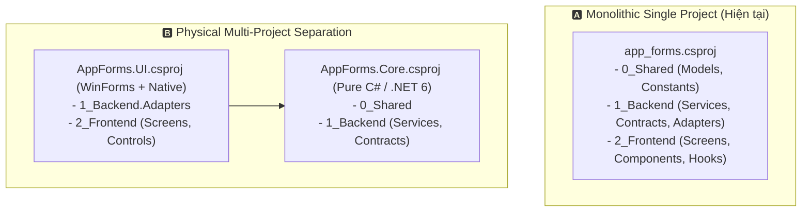

# 🧠 Playbook: Đánh Đổi Monolithic .csproj vs Multi-Project Solution

> **Ngữ cảnh áp dụng:** Khi xem xét cấu trúc Solution, tách gói dự án hoặc phân lập ranh giới vật lý giữa Pure Logic và Windows OS Platform trong `app_forms`.

---

## 1. Bản Chất Bài Toán

Dự án hiện tại tổ chức Clean Architecture 3 tầng (`0_Shared`, `1_Backend`, `2_Frontend`) bên trong **1 file `.csproj` duy nhất** (`app_forms.csproj`) có bật sẵn `<UseWindowsForms>true</UseWindowsForms>` và `<Nullable>enable</Nullable>`.

---

## 2. Bảng Ma Trận Đánh Đổi

| Tiêu Chí | 🅰️ Phương Án A: Single Project Monolith | 🅱️ Phương Án B: Tách 2 Projects (.Core & .UI) |
| :--- | :--- | :--- |
| **Cơ chế** | Toàn bộ 3 tầng nằm trong 1 project; bảo vệ ranh giới bằng thư mục, namespace và quy chuẩn Charter AGENTS.md. | Tách vật lý thành `AppForms.Core` (Pure C#) và `AppForms.UI` (WinForms + Native). |
| **Ưu điểm (Gains)** | • Cấu hình cực kỳ đơn giản, build 1 lệnh `dotnet build` là xong. • Không bị overhead quản lý nhiều file `.csproj`, dễ refactor và điều phối DI Container. | • Trình biên dịch **bảo vệ cơ học 100%**: `1_Backend/Services` không thể vô tình gọi `Windows.Forms` Controls vì không có reference. • `Core` có thể tái sử dụng cho Console/Web API nếu cần. |
| **Nhược điểm (Pains)** | • Trình biên dịch không chặn được nếu dev vô tình import WinForms Controls vào `1_Backend` (phải dựa vào kỷ luật kiến trúc và System Charter). | • Quản lý nhiều project, cấu trúc solution cồng kềnh hơn cho một ứng dụng desktop gọn nhẹ. |
| **Đánh giá phù hợp** | ✅ **Phù hợp tuyệt đối cho giai đoạn hiện tại** (kết hợp với System Charter và Gating Rules). | 🔮 **Cân nhắc cho tương lai** khi mở rộng sang Multi-Platform (WPF/MAUI/Web). |
