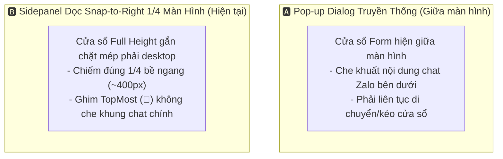

# 🧠 Playbook: Đánh Đổi Sidepanel Snap-to-Right (Full Height) vs Pop-up Modal Dialog

> **Ngữ cảnh áp dụng:** Khi thiết kế giao diện tương tác và trải nghiệm người dùng (UX/UI) cho ứng dụng hỗ trợ sale/chăm sóc khách hàng (**AppForms**).

---

## 1. Bản Chất Bài Toán

Ứng dụng Sale Lead Assistant cần tương tác liên tục trong lúc người dùng đang chat Zalo, Facebook Messenger hoặc lướt web trên trình duyệt.

---

## 2. Bảng Ma Trận Đánh Đổi

| Tiêu Chí | 🅰️ Pop-up Dialog Giữa Màn Hình | 🅱️ Sidepanel Dọc Snap-to-Right (1/4 Desktop) |
| :--- | :--- | :--- |
| **Trải Nghiệm Đa Nhiệm (Multitasking)** | 🔴 **Kém**: Che khuất cửa sổ Zalo/Web, người dùng phải kéo thả liên tục. | 🟢 **Xuất sắc**: Cho phép vừa đọc tin nhắn bên trái vừa chỉnh sửa form bên phải mượt mà. |
| **Độ Phức Tạp Giao Diện (Layout)** | 🟢 Đơn giản, dùng WinForms mặc định `StartPosition = CenterScreen`. | 🟡 Cần tính toán `Screen.PrimaryScreen.WorkingArea` và cập nhật vị trí khi thay đổi độ phân giải màn hình. |
| **Không Gian Hiển Thị (Screen Estate)** | 🟡 Dạng hộp ngang, không tối ưu cho danh sách trường nhập liệu dài (Địa chỉ, Giá, Ghi chú, Output Preview). | 🟢 Dạng cột dọc (Full Height) hiển thị trọn vẹn toàn bộ luồng từ Input $\rightarrow$ Chỉnh sửa $\rightarrow$ Output Preview. |
| **Quyết Định Kiến Trúc** | ❌ Không phù hợp cho trợ lý tác nghiệp liên tục. | ✅ **Lựa chọn chuẩn mực (Áp dụng cho MainForm & Screen Scaffolds)**. |
