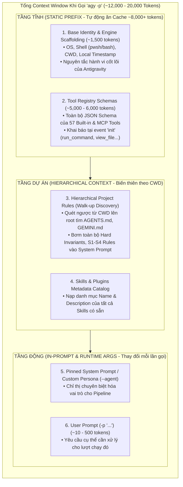
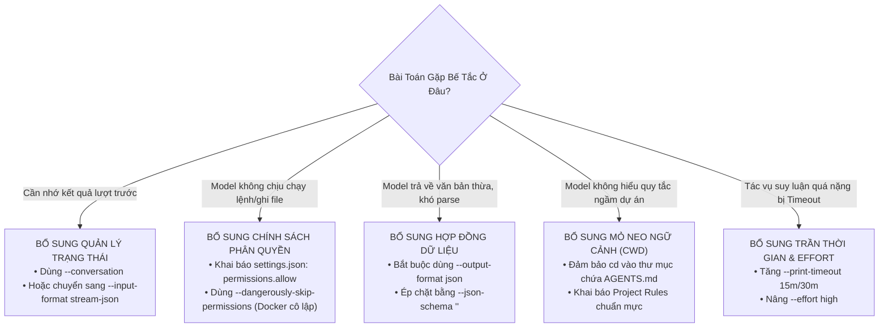

# 🧠 Cơ Chế Context Window & Sổ Tay Vận Hành One-Shot Prompt (`-p`) Trong Pipeline Tự Động Hóa

> **Mục tiêu tài liệu**: Bóc tách bản chất cơ chế nạp ngữ cảnh (Context Ingestion), phân định ranh giới khả năng (Capabilities vs Limitations), và hướng dẫn thiết lập System Prompt chuẩn mực cho các pipeline tự động hóa (CI/CD, cronjobs, background workers) sử dụng Antigravity CLI (`agy`).

---

## 1. Bản Chất Giải Phẫu Context Window Khi Gọi `-p` (Anatomy of One-Shot)

Khi thực thi một câu lệnh one-shot đơn giản như:
```bash
agy -p "In exactly 3 words, reply: PING SUCCESS TEST" --output-format json
```

Dữ liệu đo lường thực nghiệm thu được từ engine:
* **Prompt người dùng gõ vào**: ~10 tokens (~8 từ).
* **Tổng `input_tokens` gửi lên Model**: **12,339 tokens**.
* **Tỷ lệ ngữ cảnh ngầm (Underground Context)**: **99.92%**.
* **Cache Read Tokens**: **8,142 tokens** (được nạp sẵn từ bộ nhớ đệm máy chủ).



---

## 2. Ma Trận Năng Lực Của One-Shot (`-p`): Khả Năng & Giới Hạn Cấm Kỵ

Để thiết kế pipeline vững chắc, kỹ sư phải hiểu rõ **Negative Space** (những điều `-p` KHÔNG THỂ LÀM) thay vì chỉ nhìn vào những gì nó làm được.

| Trục Phân Tích | Khả Năng Vượt Trội Của One-Shot (`-p`) | Giới Hạn Tuyệt Đối Của One-Shot (Hard Invariants / Anti-Patterns) |
| :--- | :--- | :--- |
| **Tính Trạng Thái (Statefulness)** | **Xử lý Stateless hoàn hảo**: Mỗi lần gọi là một tiến trình cô lập, không lưu rác bộ nhớ, không sợ rò rỉ biến trạng thái giữa các job. | **Mất trí nhớ hoàn toàn (Zero Continuity)**: Không nhớ gì về lệnh trước đó trừ khi truyền cờ `--continue` hoặc `--conversation <UUID>`. |
| **Độ Xác Định (Determinism)** | **Ép chuẩn Schema tuyệt đối**: Kết hợp với `--json-schema` để cưỡng chế model trả về đúng cấu trúc dữ liệu máy đọc được. | **Không có cơ hội đính chính (No Clarification)**: Nếu prompt bị mập mờ ngữ nghĩa, model sẽ tự suy diễn hoặc fail thay vì dừng lại hỏi làm rõ. |
| **Thực Thi Công Cụ (Tool Execution)** | **Tự động đọc hiểu file trong Workspace**: Đọc tài liệu, phân tích mã nguồn cực nhanh mà không cần user paste code. | **Bị Soft-Denied nếu cần quyền nhạy cảm**: Mặc định CLI sẽ từ chối chạy lệnh shell hoặc ghi đè file nếu không có cấu hình `permissions.allow`. |
| **Tối Ưu Chi Phí & Tốc Độ (FinOps & Latency)** | **Tận dụng Prompt Cache tối đa**: Nhờ Prefix cố định (Tools + Rules), >65% tokens được đọc từ cache, giảm độ trễ xuống ~3-5s. | **Lãng phí Cold-Start nếu chạy vòng lặp**: Chạy 100 câu lệnh `-p` liên tiếp sẽ tốn 100 lần khởi động tiến trình (thay vì dùng `--input-format stream-json`). |

---

## 3. Bản Đồ Bù Đắp Kiến Trúc: "Khi One-Shot Không Làm Được Thì Bổ Sung Gì?"



### Bảng Chỉ Dẫn Chi Tiết

| Vấn Đề Gặp Phải | Nguyên Nhân Gốc Rễ | Thành Phần Bắt Buộc Bổ Sung |
| :--- | :--- | :--- |
| **Exit code 0 nhưng lệnh không chạy** | Cơ chế **Soft-Denial** trong headless mode: tool bị chặn nhưng CLI vẫn coi là hoàn thành. | Thêm whitelist vào `~/.gemini/antigravity-cli/settings.json`:<br>`"permissions": { "allow": ["command(npm test)", "write_file(src/)"] }` |
| **Model trả lời chung chung, sai chuẩn dự án** | Script chạy ở thư mục khác (ví dụ `/tmp`), CLI không tìm thấy file `AGENTS.md` của repo. | Thêm bước `cd "$PROJECT_ROOT"` trước khi gọi `agy -p`. |
| **Dữ liệu đầu ra làm vỡ parser của Bash/CI** | Dùng `--output-format text` khiến model tự ý thêm lời chào (`Sure! Here is the result:`). | Bắt buộc chuyển sang: `--output-format json --json-schema '{"type":"object",...}'` và parse bằng `jq -r '.structured_output'`. |
| **Hội thoại cần đối soát 2-3 bước liên hoàn** | One-shot `-p` không lưu context. | Bóc tách `conversation_id` ở Bước 1, sau đó truyền vào cờ `--conversation <UUID>` ở Bước 2. |
| **Tác vụ phân tích phức tạp bị ngắt nửa chừng** | Timeout trần mặc định của CLI là `5m`. | Bổ sung cờ `--print-timeout 20m` và `--effort high`. |

---

## 4. Hướng Dẫn Thiết Kế Hard System Prompt Cho Pipeline Tự Động Hóa

Khi xây dựng pipeline, việc "nhồi" toàn bộ hướng dẫn vào câu lệnh `-p` là một sai lầm kiến trúc (anti-pattern) làm loãng context và tốn token. Dưới đây là mô hình thiết kế chuẩn mực 3 tầng:

### Nguyên Tắc Thiết Kế: Cố Định Tiền Tố (Prefix Invariance)
Để tận dụng tối đa cơ chế **Prompt Caching (`cache_read_tokens`)**, phần hướng dẫn cố định phải luôn nằm ở đầu, phần biến thiên (dữ liệu đầu vào cần xử lý) phải nằm ở cuối cùng.

```
[System Invariants / Project Rules] (Tự động nạp qua AGENTS.md - ĐƯỢC CACHE)
                ↓
[Task Instructions / Constraint Schema] (Cố định trong Script Runner - ĐƯỢC CACHE)
                ↓
[Dynamic Payload / Git Diff / Log Content] (Biến thiên mỗi lần chạy)
```

### Khuôn Mẫu (Template) Chuẩn Mực Cho Script CI/CD

Dưới đây là kịch bản mẫu hoàn chỉnh (Production-Ready) tích hợp toàn bộ các nguyên tắc phòng vệ:

```bash
#!/usr/bin/env bash
# ==============================================================================
# Script: pipeline-quality-gate.sh
# Mục tiêu: Review git diff và kiểm tra vi phạm bảo mật theo chuẩn One-Shot
# ==============================================================================
set -euo pipefail

# 1. MỎ NEO THƯ MỤC LÀM VIỆC (Đảm bảo nạp đúng AGENTS.md)
REPO_ROOT="$(cd "$(dirname "${BASH_SOURCE[0]}")/../.." && pwd)"
cd "$REPO_ROOT"

# 2. KHAI BÁO HỢP ĐỒNG DỮ LIỆU (JSON SCHEMA)
REVIEW_SCHEMA='{
  "type": "object",
  "properties": {
    "verdict": { "type": "string", "enum": ["APPROVED", "REJECTED"] },
    "security_risk_score": { "type": "integer" },
    "violations": {
      "type": "array",
      "items": {
        "type": "object",
        "properties": {
          "file": { "type": "string" },
          "rule_violated": { "type": "string" },
          "explanation": { "type": "string" }
        },
        "required": ["file", "rule_violated", "explanation"]
      }
    },
    "summary": { "type": "string" }
  },
  "required": ["verdict", "security_risk_score", "violations", "summary"]
}'

# 3. CHUẨN BỊ PAYLOAD ĐỘNG (Lấy diff của commit hiện tại)
GIT_DIFF=$(git diff HEAD~1 HEAD --stat -p || echo "No git diff available")

# 4. HARD SYSTEM INSTRUCTIONS (Ngắn gọn, dứt khoát, không gọi tool)
TASK_PROMPT="Bạn là Quality & Security Gatekeeper tự động trong pipeline CI/CD.
Nhiệm vụ: Phân tích git diff dưới đây và đối chiếu với các nguyên tắc phòng vệ của dự án trong AGENTS.md.
Ràng buộc:
1. Đánh giá tính an toàn, bảo mật và chất lượng mã nguồn.
2. Trả lời trực tiếp vào schema, TUYỆT ĐỐI KHÔNG gọi thêm bất kỳ công cụ ngoài nào.
3. Không tự ý bịa đặt thông tin; nếu không có vi phạm, trả về danh sách violations rỗng.

[DỮ LIỆU CẦN ĐÁNH GIÁ]:
$GIT_DIFF"

# 5. THỰC THI ONE-SHOT VỚI ĐẦY ĐỦ CỜ PHÒNG VỆ
echo "==> Đang kích hoạt Antigravity Gatekeeper qua One-Shot CLI..."
RESPONSE=$(agy -p "$TASK_PROMPT" \
  --output-format json \
  --json-schema "$REVIEW_SCHEMA" \
  --effort medium \
  --print-timeout 10m \
  --sandbox)

# 6. PHÂN TÍCH KẾT QUẢ VÀ XỬ LÝ EXIT CODE CHO PIPELINE
STATUS=$(echo "$RESPONSE" | jq -r '.status')

if [[ "$STATUS" != "SUCCESS" ]]; then
  echo "❌ Lỗi: Agent kết thúc bất thường với trạng thái: $STATUS" >&2
  echo "Chi tiết: $(echo "$RESPONSE" | jq -r '.error // "Không có chi tiết lỗi"')" >&2
  exit 1
fi

VERDICT=$(echo "$RESPONSE" | jq -r '.structured_output.verdict')
SCORE=$(echo "$RESPONSE" | jq -r '.structured_output.security_risk_score')
SUMMARY=$(echo "$RESPONSE" | jq -r '.structured_output.summary')

echo "--------------------------------------------------------"
echo "KẾT QUẢ REVIEW: $VERDICT | Điểm rủi ro: $SCORE/10"
echo "Tóm tắt: $SUMMARY"
echo "Token Cache Hit: $(echo "$RESPONSE" | jq -r '.usage.cache_read_tokens') / $(echo "$RESPONSE" | jq -r '.usage.input_tokens') tokens"
echo "--------------------------------------------------------"

if [[ "$VERDICT" == "REJECTED" ]]; then
  echo "❌ Phá hiện các vi phạm quy chuẩn nghiêm trọng:"
  echo "$RESPONSE" | jq -r '.structured_output.violations[] | "• [\(.file)] Lỗi \(.rule_violated): \(.explanation)"'
  exit 2
fi

echo "✅ Tất cả kiểm tra chất lượng đã vượt qua thành công!"
exit 0
```

---

## 5. Danh Mục Kiểm Tra Nhanh Trước Khi Đưa One-Shot Script Lên Production (Checklist)

Trước khi kích hoạt script chạy trong cronjob hoặc CI/CD, hãy kiểm tra 6 tiêu chí nhị phân sau:

* [ ] **1. Mỏ neo CWD**: Script có lệnh `cd` vào thư mục gốc dự án trước khi gọi `agy` chưa?
* [ ] **2. Phân tách kênh I/O**: `stdout` chỉ chứa payload JSON sạch; không gộp `2>&1` vào biến chứa JSON?
* [ ] **3. Hợp đồng dữ liệu**: Đã cấu hình `--output-format json` kết hợp `--json-schema` chưa?
* [ ] **4. Trần thời gian**: Đã định cấu hình `--print-timeout` (ví dụ `10m`) để tránh nghẽn runner chưa?
* [ ] **5. Chính sách quyền**: Các tool cần thiết đã được cấu hình trong `settings.json` để tránh dính bẫy Soft-Denial chưa?
* [ ] **6. Định tuyến thất bại**: Script có bắt kiểm tra `.status != "SUCCESS"` để kích hoạt exit code khác 0 cho pipeline chưa?
