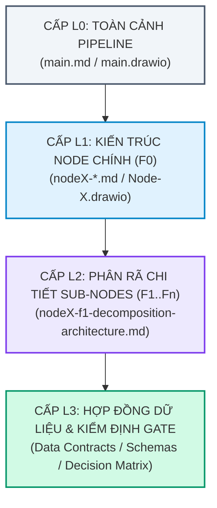
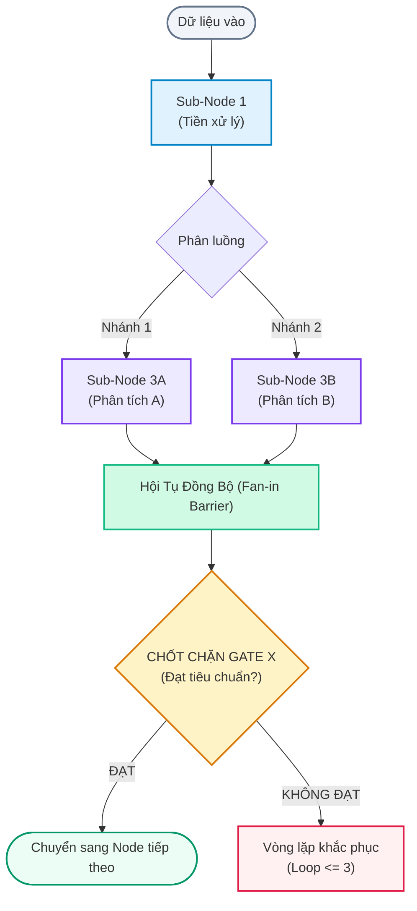
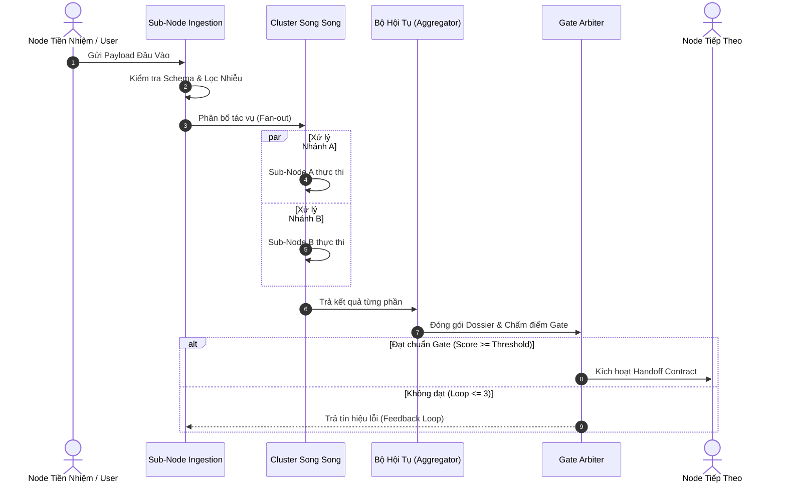
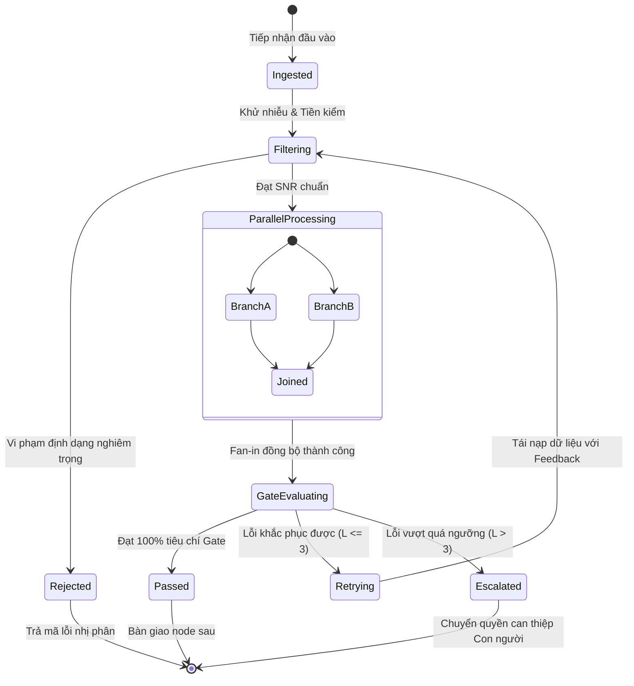

# BỘ KHUNG QUY CHUẨN TÀI LIỆU & SƠ ĐỒ THIẾT KẾ PIPELINE AI AGENT
> **Mã định danh**: `SPEC-DOC-ARCHITECTURE-FRAMEWORK-001`  
> **Phiên bản**: `1.0.0` | **Trạng thái**: `ACTIVE BASELINE`  
> **Mục tiêu**: Chuẩn hóa cấu trúc tài liệu kiến trúc, danh mục sơ đồ kỹ thuật và loại bỏ hoàn toàn các thông tin gây nhiễu ("rác ngữ nghĩa", triết lý trừu tượng dài dòng) trong quá trình phân tích thiết kế hệ thống phần mềm pipeline AI Agent.  
> **Tài liệu tham chiếu hạt nhân**:
> - Tổng quan Pipeline: [`main.md`](file:///home/stveve/Documents/workspace/Steve/Steves-Test-agent-agy/Docs/Diagrams/Didagram-AI-Agent_workflows/main.md) & [`main.drawio`](file:///home/stveve/Documents/workspace/Steve/Steves-Test-agent-agy/Docs/Diagrams/Didagram-AI-Agent_workflows/main.drawio)
> - Tham chiếu phân rã Node 1: [`node1-f1-decomposition-architecture.md`](file:///home/stveve/Documents/workspace/Steve/Steves-Test-agent-agy/Docs/Diagrams/Didagram-AI-Agent_workflows/Node-1/node1-f1-decomposition-architecture.md) & [`Node-1.drawio`](file:///home/stveve/Documents/workspace/Steve/Steves-Test-agent-agy/Docs/Diagrams/Didagram-AI-Agent_workflows/Node-1/Node-1.drawio)

---

## PHẦN 1: MA TRẬN DANH MỤC TÀI LIỆU KIẾN TRÚC TOÀN HỆ THỐNG

Để hoàn thiện bộ hồ sơ thiết kế kỹ thuật cho toàn bộ Pipeline AI Agent SDLC, hệ thống tài liệu được tổ chức theo 4 cấp độ (Level 0 đến Level 3):



### 1.1. Bản Đồ Danh Sách Tài Liệu Cần Triển Khai (Progress Tracking)

| Cấp | Mã Tài Liệu | Tên Tài Liệu & Phạm Vi | Tệp Markdown Phụ Trợ | Sơ Đồ Đi Kèm (Draw.io / Mermaid) | Trạng Thái |
| :--- | :--- | :--- | :--- | :--- | :--- |
| **L0** | `SPEC-AI-PIPELINE-001` | **Tổng Quan Toàn Bộ AI Pipeline** | [`main.md`](file:///home/stveve/Documents/workspace/Steve/Steves-Test-agent-agy/Docs/Diagrams/Didagram-AI-Agent_workflows/main.md) | [`main.drawio`](file:///home/stveve/Documents/workspace/Steve/Steves-Test-agent-agy/Docs/Diagrams/Didagram-AI-Agent_workflows/main.drawio) | `ACTIVE BASELINE` |
| **L1** | `SPEC-NODE1-001` | **Node 1: Problem Discovery & Scoping Gate** | [`node1-problem-discovery.md`](file:///home/stveve/Documents/workspace/Steve/Steves-Test-agent-agy/Docs/Diagrams/Didagram-AI-Agent_workflows/Node-1/node1-problem-discovery.md) | [`Node-1.drawio`](file:///home/stveve/Documents/workspace/Steve/Steves-Test-agent-agy/Docs/Diagrams/Didagram-AI-Agent_workflows/Node-1/Node-1.drawio) | `ACTIVE BASELINE` |
| **L2** | `SPEC-NODE1-F1-001` | **Node 1: Sub-Nodes F1 Decomposition Spec** | [`node1-f1-decomposition-architecture.md`](file:///home/stveve/Documents/workspace/Steve/Steves-Test-agent-agy/Docs/Diagrams/Didagram-AI-Agent_workflows/Node-1/node1-f1-decomposition-architecture.md) | [`Node-1.drawio`](file:///home/stveve/Documents/workspace/Steve/Steves-Test-agent-agy/Docs/Diagrams/Didagram-AI-Agent_workflows/Node-1/Node-1.drawio) (Page F1) | `ACTIVE BASELINE` |
| **L1** | `SPEC-NODE2-001` | **Node 2: Business Analysis (BABOK)** | `Node-2/node2-business-analysis.md` | `Node-2/Node-2.drawio` | `CHƯA KHỞI TẠO` |
| **L1** | `SPEC-NODE3-001` | **Node 3: Architecture & Trade-Off Engine** | `Node-3/node3-architecture-tradeoff.md` | `Node-3/Node-3.drawio` | `CHƯA KHỞI TẠO` |
| **L1** | `SPEC-NODE4-001` | **Node 4: Data Contract & Security Sandbox** | `Node-4/node4-contract-and-sandbox.md` | `Node-4/Node-4.drawio` | `CHƯA KHỞI TẠO` |
| **L1** | `SPEC-NODE5-001` | **Node 5: Defensive Build & Test Engine** | `Node-5/node5-defensive-build.md` | `Node-5/Node-5.drawio` | `CHƯA KHỞI TẠO` |
| **L1** | `SPEC-NODE6-001` | **Node 6: Telemetry & Continuous Release** | `Node-6/node6-telemetry-release.md` | `Node-6/Node-6.drawio` | `CHƯA KHỞI TẠO` |
| **L0** | `SPEC-LATERAL-001`| **Lateral: Wide Event Logging & Observability** | `Lateral/lateral-telemetry.md` | `Lateral/telemetry.drawio` | `CHƯA KHỞI TẠO` |

---

## PHẦN 2: QUY CHUẨN 5 DẠNG SƠ ĐỒ BẮT BUỘC TRONG TỪNG TÀI LIỆU

Mỗi tài liệu đặc tả kiến trúc (từ Level 1 trở xuống) **tuyệt đối không dùng văn xuôi dài dòng**, thay vào đó bắt buộc phải cung cấp đủ **5 lăng kính sơ đồ trực quan**:

### 1. Sơ Đồ Cấu Trúc Khối & Luồng Xử Lý (Component & Pipeline Topology)
* **Ý nghĩa**: Định hình cấu trúc phân rã của Node (bao gồm các sub-nodes, ranh giới tuần tự Serial, song song Parallel/Fan-out, và điểm chốt hội tụ Fan-in Barrier).
* **Công cụ thể hiện**: Mermaid `flowchart TD / LR` kết hợp sơ đồ vector trực quan trên file `.drawio`.

### 2. Sơ Đồ Trình Tự Tương Tác (Sequence Diagram)
* **Ý nghĩa**: Thể hiện dòng thời gian, thứ tự truyền nhận bản tin giữa User, Orchestrator, Sub-agents, LLM Prompts, Tools/Sandbox, và Validator.
* **Công cụ thể hiện**: Mermaid `sequenceDiagram`.

### 3. Sơ Đồ Vòng Đời & Máy Trạng Thái (State Machine Diagram)
* **Ý nghĩa**: Thể hiện các trạng thái của dữ liệu/task khi di chuyển qua Node (kèm các transition event, retry conditions, error states).
* **Công cụ thể hiện**: Mermaid `stateDiagram-v2`.

### 4. Sơ Đồ Hợp Đồng Dữ Liệu (Data Contract Transformation & Flow)
* **Ý nghĩa**: Bóc tách hình thái payload: Input Schema đi vào là gì, biến đổi qua các sub-nodes ra sao và Output Schema đẩy sang node kế tiếp thế nào.
* **Công cụ thể hiện**: Mermaid `classDiagram` hoặc sơ đồ Flowchart dạng Record/Payload.

### 5. Sơ Đồ Quyết Định Chốt Chặn (Gate Arbiter & Circuit Breaker Logic)
* **Ý nghĩa**: Thuật toán đánh giá nhị phân của Gate (Chỉ số chấm điểm, Rule cứng cấm vi phạm, Số lần loop tối đa $L \le 3$, kịch bản Escalation sang Human).
* **Công cụ thể hiện**: Mermaid `flowchart TD` (Decision Tree).

---

## PHẦN 3: TEMPLATE CHUẨN ĐẶC TẢ KIẾN TRÚC NODE / SUB-NODE (ZERO-SLOP)

*(Sử dụng template này cho tất cả các tài liệu đặc tả kiến trúc Node mới hoặc refactor các tài liệu cũ)*

````markdown
# [TÊN NODE]: [ĐẶC TẢ KIẾN TRÚC & PHÂN RÃ KỸ THUẬT] (SPEC-NODE[X]-[STT])

> **Mã đặc tả**: `SPEC-NODE[X]-[TÊN]-001`  
> **Phiên bản**: `1.0.0` | **Trạng thái**: `DRAFT / REVIEW / APPROVED`  
> **Thuộc Node Cha**: [`nodeX-parent.md`](file:///...)  
> **Sơ đồ hạt nhân**: [`Node-X.drawio`](file:///...) (Trang: `[Tên trang]`)  
> **Chủ quản (Owner)**: AI Pipeline Architecture Team  

---

## 1. TỔNG QUAN & RANH GIỚI BẢN CHẤT (BOUNDARY & SCOPE)

### 1.1. Bảng Thông Số Hạt Nhân (Node Manifest)
| Thuộc Tính | Đặc Tả Kỹ Thuật |
| :--- | :--- |
| **Input tiếp nhận** | [Định dạng dữ liệu đầu vào: Raw Text / JSON / Event / File Path] |
| **Output chuyển giao** | [Định dạng dữ liệu đầu ra: Normalized JSON / Dossier / Interface] |
| **Mô hình thực thi** | [Tuần tự (Serial) / Phân tán Song song (Fan-out / Fan-in) / Event Loop] |
| **Mục tiêu SMART** | [Thời gian xử lý: <= X ms; SNR >= Y dB; Tỷ lệ nén token: Z%] |
| **Gate đích (Chốt chặn)** | [Gate X: Tiêu chí nhị phân 0-exit code để chuyển node tiếp theo] |

### 1.2. Không Gian Phủ Định (Negative Space - Ranh Giới Bất Biến)
Liệt kê tối thiểu 3 điều hệ thống **TUYỆT ĐỐI CẤM LÀM** tại Node này:
1. **CẤM 1**: [Ví dụ: Cấm tự ý sinh giải pháp kỹ thuật / code khi chưa qua Gate 1]
2. **CẤM 2**: [Ví dụ: Cấm để rò rỉ dữ liệu chưa khử nhiễu vào luồng phân tích song song]
3. **CẤM 3**: [Ví dụ: Cấm chạy vòng lặp retry quá 3 lần mà không kích hoạt Human Escalation]

---

## 2. BỘ SƠ ĐỒ THIẾT KẾ KIẾN TRÚC (ARCHITECTURAL DIAGRAMS)

### 2.1. Sơ Đồ Cấu Trúc Phân Rã & Dòng Chảy (Component & Data Flow)


### 2.2. Sơ Đồ Trình Tự Thực Thi (Execution Sequence)


### 2.3. Sơ Đồ Máy Trạng Thái (Task Lifecycle / State Machine)


---

## 3. HỢP ĐỒNG DỮ LIỆU & SCHEMA CHUẨN (DATA CONTRACTS)

### 3.1. Input Contract (Dữ liệu đầu vào bắt buộc)
```typescript
interface NodeInputContract {
  taskId: string;
  timestamp: string; // ISO 8601
  sourceNode: string;
  rawPayload: {
    // Chi tiết payload
    content: string;
    metadata?: Record<string, any>;
  };
}
```

### 3.2. Output Contract (Dữ liệu bàn giao đầu ra)
```typescript
interface NodeOutputContract {
  taskId: string;
  status: "SUCCESS" | "PROVISIONAL" | "ESCALATED";
  gateScore: number;
  dossier: {
    // Dữ liệu phân tích đã chuẩn hóa
    structuredOutput: Record<string, any>;
    traceabilityIds: string[];
  };
  telemetry: {
    executionTimeMs: number;
    tokensUsed: number;
  };
}
```

---

## 4. LOGIC CHỐT CHẶN & XỬ TRÍ SỰ CỐ (GATE ARBITER & RESILIENCE)

### 4.1. Ma Trận Tiêu Chí Chấm Điểm Gate (Binary Gate Decision Matrix)
| ID Tiêu Chí | Trọng Số | Điều Kiện Đạt (Pass Rule) | Hành Động Khi Thất Bại |
| :--- | :--- | :--- | :--- |
| **RULE-01** | Bắt buộc (Hard) | Không vi phạm Negative Space (Zero Violation) | REJECT ngay lập tức |
| **RULE-02** | 40% | Độ đo định lượng SMART đầy đủ (100% NFR có metric) | Feedback bổ sung thông số |
| **RULE-03** | 30% | Tính nhất quán dữ liệu (Không mâu thuẫn đối kháng) | Kích hoạt bộ phân xử mâu thuẫn |
| **RULE-04** | 30% | Tỷ lệ tín hiệu trên nhiễu SNR đạt chuẩn | Lọc lại nội dung ngữ nghĩa |

### 4.2. Cơ Chế Tự Phục Hồi & Ngắt Mạch (Fail-Safe & Circuit Breaker)
* **Ngưỡng Vòng Lặp Lỗi (Loop Limit)**: $L \le 3$. Mỗi lần thất bại, phản hồi đúng sai lệch về sub-node chịu trách nhiệm.
* **Cơ chế Ngắt (Circuit Breaker)**: Khi $L > 3$, lập tức khóa trạng thái `PROVISIONAL_PASS` (nếu rủi ro thấp) hoặc ngắt chuyển giao `HUMAN_ESCALATION` (nếu vi phạm ràng buộc an toàn/kiến trúc Type 1).
* **Wide-Event Logging**: Mỗi lần thực thi phát sinh đúng 1 bản ghi sự kiện mở rộng Canonical Log Line đẩy về cụm Telemetry với tải phụ trội $\le 5\text{ms}$.
````

---

## PHẦN 4: HƯỚNG DẪN QUY TRÌNH ĐỒNG BỘ ĐỊNH KỲ (SYNC PROTOCOL)

Để tài liệu không bị "lỗi thời" so với sơ đồ hình vẽ trên Draw.io:

1. **Nguyên tắc "Sơ đồ là Chân lý" (Diagram as Source of Truth)**:
   - Các file `.drawio` (như [`main.drawio`](file:///home/stveve/Documents/workspace/Steve/Steves-Test-agent-agy/Docs/Diagrams/Didagram-AI-Agent_workflows/main.drawio), [`Node-1.drawio`](file:///home/stveve/Documents/workspace/Steve/Steves-Test-agent-agy/Docs/Diagrams/Didagram-AI-Agent_workflows/Node-1/Node-1.drawio)) đại diện cho bố cục thị giác trực quan chuẩn.
   - Các file `.md` đại diện cho phần chú giải kỹ thuật, schema và thuật toán chốt chặn.
2. **Quy trình cập nhật đồng bộ sau mỗi thay đổi**:
   - **Bước 1**: Khi thay đổi logic flow ➔ Cập nhật hình khối trên file `.drawio`.
   - **Bước 2**: Đồng bộ lại các Mermaid block tương ứng trong tài liệu `.md`.
   - **Bước 3**: Rà soát cập nhật lại bảng tiến độ tại **Phần 1.1** của file template này.
   - **Bước 4**: Kiểm tra quy tắc **Zero Slop**: Loại bỏ mọi đoạn văn triết lý lan man không phục vụ trực tiếp cho việc code, test hoặc vận hành hệ thống.
