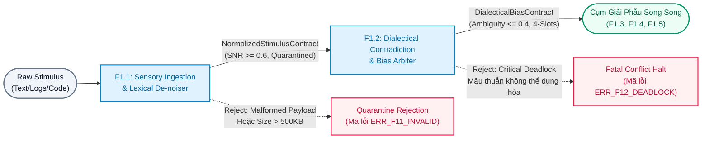
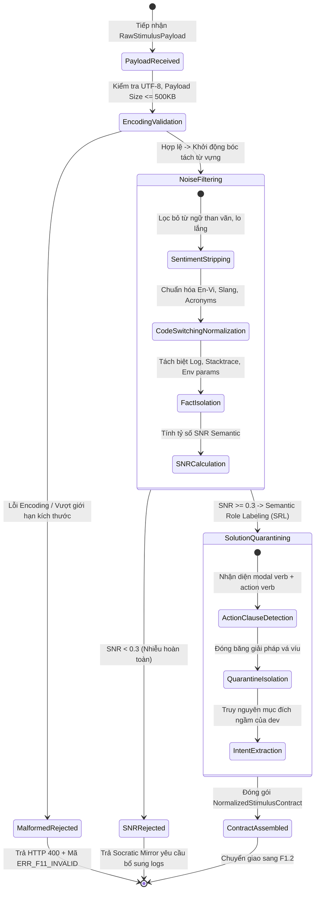
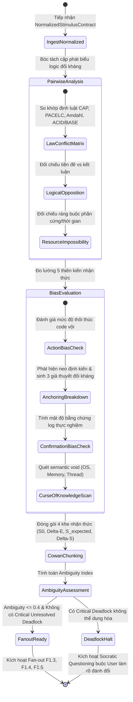
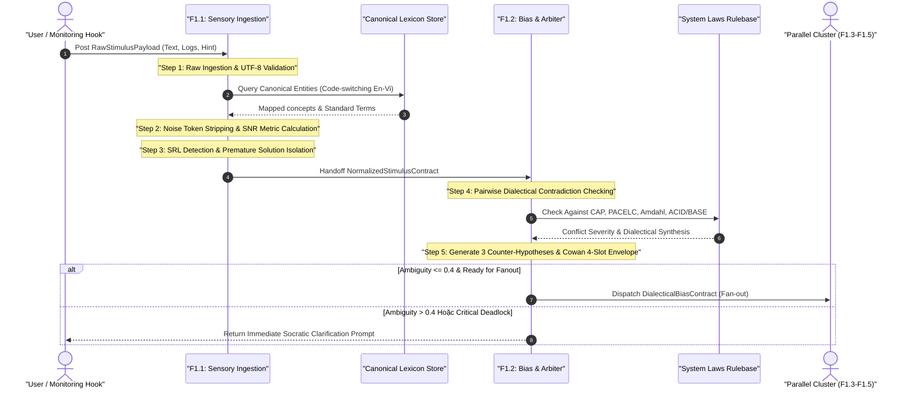

# QUY TRÌNH PHÂN RÃ LUỒNG TIỀN TRẠM: INGESTION & ARBITRATION FLOW (F1.1 & F1.2)

> **Mã quy trình**: `FLOW-NODE1-INGESTION-ARBITRATION-001`  
> **Phiên bản**: `1.0.0` | **Trạng thái**: `ACTIVE BASELINE`  
> **Tài liệu cha**: [`node1-f1-decomposition-architecture.md`](file:///home/stveve/Documents/workspace/Steve/Steves-Test-agent-agy/Docs/Diagrams/Didagram-AI-Agent_workflows/Node-1/node1-f1-decomposition-architecture.md)  
> **Phân hệ phụ trách**: `F1.1: Cognitive Sensory Ingestion & Lexical De-noiser` & `F1.2: Dialectical Contradiction & Bias Arbiter`  
> **Mô hình thực thi**: Tuần tự Tiền trạm Chặn trên (Strict Serial Ingestion Gate)  
> **Ngân sách Latency (SLA)**: $\le 4.0\text{s}$ ($F1.1 \le 2.0\text{s} + F1.2 \le 2.0\text{s}$)

---

## 1. TỔNG QUAN RANH GIỚI & MỤC TIÊU CỦA CỤM TIỀN TRẠM

Cụm tiền trạm chịu trách nhiệm giải mã kích thích thô (`Raw Stimulus`) từ người dùng/hệ thống giám sát, loại bỏ nhiễu tâm lý/cảm xúc, ức chế phản xạ vá víu (Inhibitory Control), phát hiện các mâu thuẫn hệ thống đối kháng nội tại, và chuẩn hóa thành cấu trúc nhận thức Cowan 4-Slot Envelope trước khi phân bổ vào cụm giải phẫu song song.



### 1.1. Quy Tắc Bất Biến (Negative Space Invariants)
1. **CẤM cho phép giải pháp kỹ thuật do người dùng tự đề xuất lọt vào định nghĩa bài toán**: Mọi mệnh đề hành động mang tính vá víu (*"restart pod"*, *"viết script watchdog"*, *"thêm cache"*) bắt buộc phải bị đóng băng vào `isolated_premature_solution` với trạng thái `is_isolated_successfully = true`.
2. **CẤM truyền dữ liệu có tỷ số $\text{SNR} < 0.3$ sang F1.2**: Nếu nội dung toàn từ cảm xúc, than vãn hoặc không chứa bất kỳ fact kỹ thuật nào, hệ thống phải ngắt mạch ngay tại F1.1 và yêu cầu bổ sung thông số thực nghiệm.
3. **CẤM để sót vi phạm định luật vật lý/hệ thống**: Nếu một input yêu cầu đồng thời Strong Consistency và High Availability trên môi trường mạng rớt gói (vi phạm CAP), F1.2 bắt buộc phải gắn cờ `SYSTEM_LAW_VIOLATION` mức `CRITICAL_DEADLOCK` kèm phương án dung hòa biện chứng (`dialectical_synthesis`).

---

## 2. STATE MACHINE CỦA SUB-NODES TIỀN TRẠM

### 2.1. State Machine F1.1: Cognitive Sensory Ingestion & Lexical De-noiser


### 2.2. State Machine F1.2: Dialectical Contradiction & Bias Arbiter


---

## 3. QUY TRÌNH BÓC TÁCH CHI TIẾT TỪNG BƯỚC (STEP-BY-STEP ALGORITHMS)



### Bước 1: Raw Ingestion & Encoding Validation
- **Mục tiêu**: Đảm bảo payload toàn vẹn, bảo vệ pipeline khỏi DoS dữ liệu rác.
- **Ràng buộc vật lý**: Payload size $\le 512\text{ KB}$, encoding bắt buộc UTF-8, số lượng file đính kèm $\le 5$.
- **Xử lý**:
  1. Kiểm tra magic bytes và MIME type của file đính kèm (`text/plain`, `text/x-log`, `application/json`, `text/markdown`).
  2. Normalize Unicode (NFC), khử các control character ẩn (`\x00-\x08`, `\x0B-\x0C`, `\x0E-\x1F`).
  3. Gán định danh duy nhất `stimulus_id = "STIM-" + YYYYMMDD + "-" + nanoid(8)`.

### Bước 2: Noise Token Stripping & Semantic SNR Calculation
- **Mục tiêu**: Loại bỏ triệt để từ ngữ cảm xúc, đo lường tỷ lệ thông tin kỹ thuật thực tế.
- **Thuật toán**:
  1. Tách văn bản thành 3 tập hợp token ngữ nghĩa:
     - $\mathcal{S}_{\text{fact}}$: Stack trace, mã lỗi HTTP/OS, tên file, hàm, metrics tài nguyên, timestamps.
     - $\mathcal{S}_{\text{noise}}$: Từ ngữ kích động cảm xúc (*"gấp lắm"*, *"sắp cháy nhà"*, *"bực mình ghê"*, *"toang rồi"*), hư từ đệm.
     - $\mathcal{S}_{\text{func}}$: Các từ nối ngữ pháp.
  2. Tính tỷ số Tín hiệu trên Nhiễu dựa trên Shannon Entropy:
     $$\text{SNR}_{\text{semantic}} = \frac{H(\mathcal{S}_{\text{fact}})}{H(\mathcal{S}_{\text{noise}}) + \epsilon}$$
     Trong đó $H(S) = -\sum p_i \log_2 p_i$, $\epsilon = 10^{-6}$. Chuẩn hóa về khoảng $[0.0, 1.0]$.
  3. Ánh xạ từ lóng, code-switching Anh-Việt về Canonical Concepts:
     - *"đơ cứng"*, *"bị treo"* $\rightarrow$ `PROCESS_DEADLOCK_OR_UNRESPONSIVE`
     - *"nuốt lỗi"* $\rightarrow$ `SILENT_EXCEPTION_SWALLOWING`
     - *"sập pod"* $\rightarrow$ `CONTAINER_OOM_KILLED_OR_CRASH`

### Bước 3: Premature Solution Isolation (Ức Chế Phản Xạ Vá Víu)
- **Mục tiêu**: Ngăn chặn tình trạng áp đặt giải pháp chắp vá làm lệch định nghĩa vấn đề gốc rễ.
- **Cơ chế**:
  1. Sử dụng Semantic Role Labeling (SRL) để quét cấu trúc vị ngữ hành động:
     $$\text{Pattern: } [\text{Agent: User}] + [\text{Modal: định / muốn / sẽ}] + [\text{Action: viết script / kill / restart / thêm cache / sửa tay}] + [\text{Target}]$$
  2. Bóc tách mệnh đề giải pháp này ra khỏi mô tả hiện tượng, đóng gói vào cấu trúc `isolated_premature_solution`:
     - `quarantined_proposals`: Lưu nguyên văn giải pháp bị cách ly.
     - `is_isolated_successfully`: Đánh dấu `true`.
     - `underlying_intent`: Phân tích ý đồ kỹ thuật ẩn sâu (Ví dụ: *"Script watchdog restart"* $\rightarrow$ Ý đồ thực tế: *"Giải phóng tài nguyên rò rỉ hoặc phục hồi tiến trình sau khi bị deadlock"*).

### Bước 4: CDM Conflict Matrix & System Law Verification
- **Mục tiêu**: Phát hiện mâu thuẫn đối kháng nội tại trước khi chuyển vào cụm phân tích sâu.
- **Ma trận Đối kháng (Contradiction Matrix)**:
  - So khớp từng cặp khẳng định $(A, B)$ trong input với 4 định luật hệ thống:
    1. **CAP Theorem**: Yêu cầu $A$ đòi Strong Consistency ($C$) đồng thời $B$ đòi Zero-Latency Availability ($A$) trên kênh mạng không tin cậy ($P$).
    2. **PACELC Theorem**: Đòi hỏi hệ thống vừa không trễ khi hoạt động bình thường, vừa nhất quán tuyệt đối khi có phân vùng mạng.
    3. **Amdahl's Law**: Kỳ vọng tăng tốc tuyến tính bằng cách thêm luồng CPU cho một giải thuật tuần tự có điểm nghẽn khóa đơn (Single Lock).
    4. **ACID vs BASE**: Lưu trữ giao dịch tài chính đa bảng trên NoSQL eventual-consistency mà không có phân tán 2PC/Saga bù trừ.
  - Xếp hạng Severity:
    - `CRITICAL_DEADLOCK`: Xung đột không thể cùng tồn tại về mặt vật lý. Bắt buộc tạo đề xuất dung hòa biện chứng (`dialectical_synthesis`).
    - `NEGOTIABLE_TRADEOFF`: Đánh đổi chấp nhận được (ví dụ: đánh đổi RAM lấy tốc độ query).

### Bước 5: Cowan 4-Slot Working Memory & Ambiguity Scoring
- **Mục tiêu**: Chuẩn hóa toàn bộ bài toán vào 4 khe nhận thức bất biến và đo lường độ mơ hồ còn lại.
- **4 Khe Nhận Thức Cowan**:
  1. **Slot 1 ($S_0$ - Initial Known State)**: Môi trường và trạng thái hệ thống trước khi biến cố phát sinh.
  2. **Slot 2 ($\Delta E$ - Triggering Stimulus)**: Tác nhân kích hoạt (tải tăng đột biến, deployment mới, đứt cáp mạng, cron job kích hoạt).
  3. **Slot 3 ($S_{\text{expected}}$ - Expected Standard State)**: Trạng thái đúng kỳ vọng theo đặc tả (thời gian phản hồi $< 200\text{ms}$, ghi nhận transaction thành công).
  4. **Slot 4 ($\Delta S$ - Observed Deviation)**: Độ lệch đo lường được giữa thực tế và kỳ vọng ($\Delta S = S_{\text{observed}} - S_{\text{expected}}$).
- **Ambiguity Index Formula**:
  $$\text{Ambiguity} = 1.0 - \left( 0.3 \times M_{\text{env}} + 0.3 \times M_{\text{metric}} + 0.2 \times M_{\text{repro}} + 0.2 \times (1 - \text{Penalty}_{\text{void}}) \right)$$
  Nếu $\text{Ambiguity} > 0.4$, hệ thống kích hoạt cảnh báo mơ hồ cao.

---

## 4. HỢP ĐỒNG DỮ LIỆU ĐẦY ĐỦ (DATA CONTRACT SCHEMAS)

```typescript
// ============================================================================
// F1.1 INPUT: Kích thích thô ban đầu
// ============================================================================
export interface RawStimulusPayload {
  session_id: string;                    // UUID v4 theo dõi phiên
  source_channel: "SLACK" | "JIRA" | "TERMINAL" | "GRAFANA_ALERT" | "MANUAL_PROMPT";
  raw_text: string;                      // Văn bản mô tả thô từ người dùng
  environment_hint?: string;            // Gợi ý sơ bộ về môi trường (nếu có)
  attachments?: Array<{
    filename: string;
    mime_type: "text/plain" | "text/x-log" | "application/json" | "text/markdown";
    content_bytes_b64?: string;
    content_text?: string;
    size_bytes: number;
  }>;
}

// ============================================================================
// F1.1 OUTPUT / F1.2 INPUT: Dữ liệu kích thích đã làm sạch & cách ly
// ============================================================================
export interface NormalizedStimulusContract {
  stimulus_id: string;                   // Mã định danh STIM-YYYYMMDD-UUID
  session_id: string;
  timestamp: string;                     // ISO 8601 UTC
  snr_score: number;                     // 0.0 -> 1.0 (Ngưỡng yêu cầu >= 0.3, mục tiêu >= 0.6)
  stripped_noise_tokens: string[];       // Danh sách token cảm xúc/than vãn đã lọc
  
  empirical_facts: {
    reported_symptoms: string[];         // Hiện tượng quan sát khách quan
    error_signatures: string[];          // Exception stack, Error Code, HTTP Status
    environment_facts: {
      os_family?: "LINUX" | "WINDOWS" | "DARWIN";
      runtime?: string;                  // Ví dụ: Node.js 20 LTS, .NET 8, JVM 21
      infrastructure?: string;           // Docker, K8s, Bare-metal, AWS Lambda
      resource_limits?: string;          // 2 vCPU, 4GB RAM
    };
    code_artifacts: Array<{
      file_path?: string;
      symbol_name?: string;
      line_reference?: number;
    }>;
  };
  
  isolated_premature_solution: {
    is_present: boolean;
    is_isolated_successfully: boolean;   // BẮT BUỘC true nếu is_present = true
    quarantined_proposals: string[];     // Các hành vi vá víu dev tự đề xuất
    underlying_intent: string;           // Ý đồ kỹ thuật bản chất đằng sau giải pháp
  };
  
  canonical_entities: Array<{
    raw_term: string;
    canonical_concept: string;           // Ví dụ: "đơ" -> "THREAD_BLOCK_OR_HANG"
    confidence: number;                  // 0.0 - 1.0
  }>;
}

// ============================================================================
// F1.2 OUTPUT / PARALLEL INPUT: Hợp đồng phân xử mâu thuẫn & đóng gói nhận thức
// ============================================================================
export interface ContradictionRecord {
  conflict_id: string;
  statement_a: string;
  statement_b: string;
  conflict_nature: "SYSTEM_LAW_VIOLATION" | "DIRECT_LOGICAL_OPPOSITION" | "RESOURCE_IMPOSSIBILITY";
  law_referenced?: "CAP_THEOREM" | "AMDAHLS_LAW" | "PACELC" | "ACID_BASE_COLLISION";
  severity: "CRITICAL_DEADLOCK" | "NEGOTIABLE_TRADEOFF";
  dialectical_synthesis: string;         // Phương án giải quyết mâu thuẫn biện chứng
}

export interface DialecticalBiasContract {
  arbitration_id: string;                // ARB-YYYYMMDD-UUID
  stimulus_id: string;
  timestamp: string;
  ambiguity_index: number;               // 0.0 (rõ ràng hoàn hảo) -> 1.0 (mơ hồ tối đa)
  
  contradictions_detected: ContradictionRecord[];
  
  cognitive_biases: {
    action_bias: {
      severity: "NONE" | "LOW" | "HIGH";
      detected_urges: string[];
    };
    anchoring_bias: {
      is_anchored: boolean;
      anchoring_target?: string;
      counter_hypotheses: [string, string, string]; // BẮT BUỘC đúng 3 giả thuyết đối kháng
    };
    confirmation_bias: {
      detected: boolean;
      evidence_density_score: number;    // LogProofCount / AssertionCount (Mục tiêu >= 0.3)
      unsupported_assertions: string[];
    };
    curse_of_knowledge: {
      void_flags_detected: string[];     // Ví dụ: "MISSING_CONCURRENCY_LEVEL", "MISSING_OS_TYPE"
    };
  };
  
  cowan_4_slots: {
    slot1_initial_state: string;         // S0
    slot2_trigger_stimulus: string;      // ΔE
    slot3_expected_valid_state: string;  // S_expected
    slot4_observed_deviation: string;    // ΔS
  };
  
  is_ready_for_fanout: boolean;          // True nếu đạt chuẩn để Fan-out song song F1.3-F1.5
}
```

---

## 5. XỬ LÝ SỰ CỐ, CIRCUIT BREAKER & CANONICAL TELEMETRY

### 5.1. Bảng Mã Lỗi & Kịch Bản Phục Hồi
| Mã Lỗi | Nguyên Nhân Gây Lỗi | Trạng Thái Phục Hồi | Hành Động Khắc Phục |
| :--- | :--- | :--- | :--- |
| `ERR_F11_PAYLOAD_EXCEEDED` | Kích thước payload $> 512\text{ KB}$ | Không thể phục hồi (Fast-Fail) | Trả lỗi HTTP 413 Payload Too Large, yêu cầu cắt bớt logs. |
| `ERR_F11_SNR_TOO_LOW` | SNR $< 0.3$, toàn bộ input chỉ là cảm xúc | Chuyển Socratic Mirror | Yêu cầu user cung cấp log thực nghiệm cụ thể (Stacktrace/Error message). |
| `ERR_F11_LEAKED_SOLUTION` | SRL phát hiện giải pháp nhưng không cô lập được | Tự phục hồi nội bộ | Buộc chạy lại bộ lọc với strict heuristic dictionary. |
| `ERR_F12_CRITICAL_DEADLOCK` | Mâu thuẫn định luật vật lý không có giải pháp | Chuyển Socratic Mirror | Buộc người dùng chọn 1 trong 2 thuộc tính đối kháng (CAP tradeoff). |
| `ERR_F12_INSUFFICIENT_HYPOTHESES` | Sub-node chỉ sinh được $< 3$ giả thuyết đối kháng | Tự phục hồi nội bộ | Kích hoạt Fallback Rulebase để tự động chèn generic hypotheses. |

### 5.2. Canonical Log Line (Wide-Event Ingestion & Arbitration)
Mỗi chu kỳ thực thi của F1.1 và F1.2 phát sinh **đúng 1 Canonical Log Line JSON** đẩy về bộ thu thập Lateral Telemetry:

```json
{
  "trace_id": "trace-f1-ingest-883921",
  "timestamp": "2026-09-15T15:21:40.120Z",
  "pipeline_node": "Node-1",
  "sub_nodes_executed": ["F1.1", "F1.2"],
  "stimulus_id": "STIM-20260915-a7b29f",
  "arbitration_id": "ARB-20260915-c392aa",
  "raw_bytes_received": 14382,
  "snr_semantic_score": 0.74,
  "noise_tokens_stripped_count": 28,
  "premature_solution_quarantined": true,
  "contradictions_count": 1,
  "critical_deadlock_present": false,
  "counter_hypotheses_generated": 3,
  "ambiguity_index": 0.28,
  "cowan_slots_extracted": true,
  "is_ready_for_fanout": true,
  "execution_time_ms": 2840,
  "circuit_breaker_status": "CLOSED"
}
```
