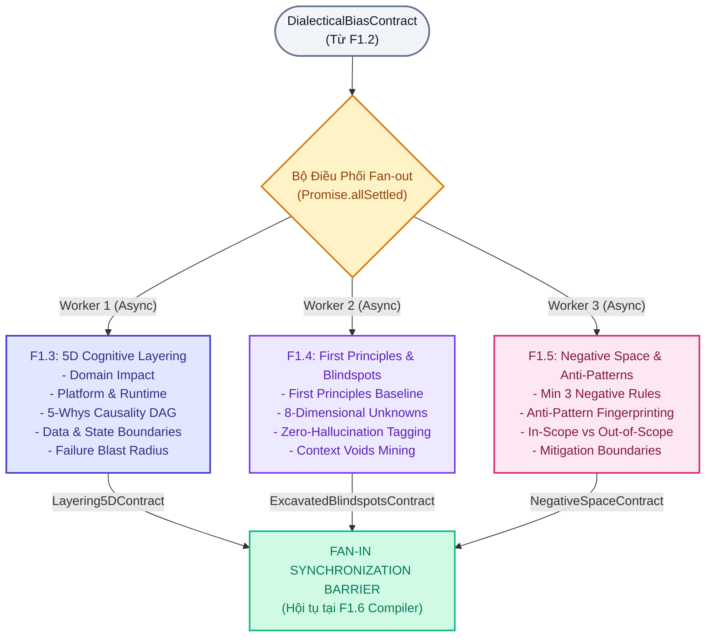
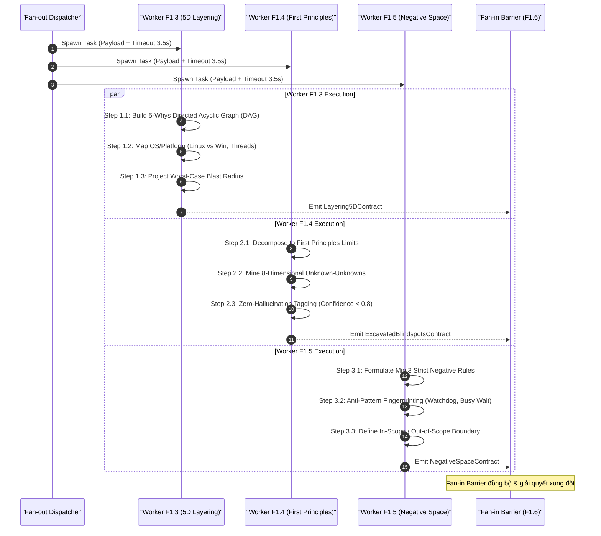
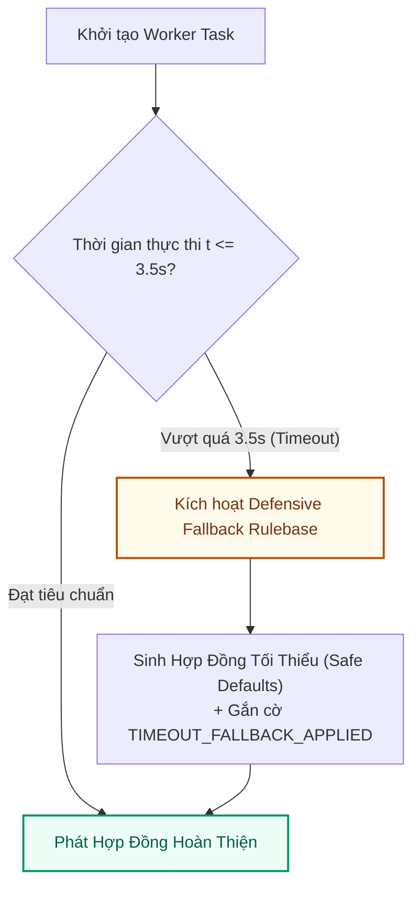

# QUY TRÌNH PHÂN RÃ CỤM GIẢI PHẪU NHẬN THỨC SONG SONG: PARALLEL CLUSTER FLOW (F1.3, F1.4 & F1.5)

> **Mã quy trình**: `FLOW-NODE1-PARALLEL-CLUSTER-001`  
> **Phiên bản**: `1.0.0` | **Trạng thái**: `ACTIVE BASELINE`  
> **Tài liệu cha**: [`node1-f1-decomposition-architecture.md`](file:///home/stveve/Documents/workspace/Steve/Steves-Test-agent-agy/Docs/Diagrams/Didagram-AI-Agent_workflows/Node-1/node1-f1-decomposition-architecture.md)  
> **Phân hệ phụ trách**:  
>   - `F1.3: 5-Dimensional Cognitive Layering Engine`  
>   - `F1.4: First Principles & Blindspot Excavator`  
>   - `F1.5: Negative Space & Anti-Pattern Grounder`  
> **Mô hình thực thi**: Phân tán Song song Bất đồng bộ (Async Fan-out Parallelism)  
> **Ngân sách Latency (SLA)**: $\text{Max}(F1.3, F1.4, F1.5) \le 3.5\text{s}$ (Tổng trễ cụm không vượt quá thời gian worker chậm nhất)

---

## 1. TỔNG QUAN KIẾN TRÚC FAN-OUT PHÂN TÁN

Sau khi `F1.2` chuẩn hóa bản hợp đồng `DialecticalBiasContract` và xác nhận cờ `is_ready_for_fanout = true`, hệ thống lập tức khởi tạo **3 Worker nơ-ron chạy song song độc lập**. Mô hình này triệt tiêu tình trạng nghẽn cổ chai tuần tự, đảm bảo thời gian xử lý toàn trình $p95 \le 10-12\text{s}$.



### 1.1. Ranh Giới Độc Lập Giữa Các Worker
1. **Không chia sẻ bộ nhớ (Shared-Nothing Architecture)**: Mỗi worker chạy trên ngữ cảnh độc lập, chỉ đọc bản copy bất biến của `DialecticalBiasContract`.
2. **Không có phụ thuộc chéo (No Inter-Worker Dependency)**: Worker F1.4 không được chờ kết quả của F1.3; Worker F1.5 độc lập hoàn toàn với F1.4. Mọi điểm giao thoa sẽ được F1.6 phân xử tại điểm Fan-in Barrier.
3. **Cơ chế Timeout Cô Lập**: Mỗi worker có hard timeout là $3.5\text{s}$. Nếu 1 worker quá hạn, chỉ worker đó bị gán trạng thái fallback phòng thủ mà không làm treo toàn cụm.

---

## 2. QUY TRÌNH THỰC THI CHI TIẾT CỦA TỪNG WORKER



---

### 2.1. Worker F1.3: 5-Dimensional Cognitive Layering Engine
- **Mục tiêu**: Bóc tách vấn đề theo chiều thẳng đứng qua 5 lăng kính kỹ thuật cốt lõi:
  1. **Domain Dimension**:
     - Định lượng tác động nghiệp vụ: Doanh thu thất thoát, tỷ lệ hủy đơn, độ trễ trải nghiệm khách hàng (Customer Latency degradation).
     - Định danh nhóm đối tượng chịu thiệt hại: End-users, Internal Operators, API Consumers.
  2. **Platform & Runtime Dimension**:
     - Kiểm tra ranh giới hệ điều hành: Ràng buộc Linux (epoll, cgroups, OOM killer, file descriptors `ulimit -n`) đối ứng Windows (STA vs MTA threading, P-Invoke, registry handles).
     - Mô hình tương tranh: Single-threaded event loop vs Multi-threaded worker pool, async/await synchronization context.
  3. **Causality Dimension (5-Whys DAG)**:
     - Dựng đồ thị nguyên nhân - kết quả có hướng (Directed Acyclic Graph): Bắt đầu từ triệu chứng đo lường được ($S_{\text{observed}}$) lùi dần qua các tầng trung gian đến căn nguyên gốc rễ (Root Cause Hypothesis).
     - Bắt buộc kiểm tra: Triệu chứng bề mặt và Căn nguyên giả thuyết không được phép đồng nhất ngữ nghĩa.
  4. **Data & State Dimension**:
     - Ranh giới Aggregate Domain, vòng đời đối tượng và tính bất biến (Immutability).
     - Mô hình giao dịch: ACID (Local Transaction) đối ứng BASE (Eventual Consistency qua Outbox/Saga).
  5. **Failure Blast Radius Dimension**:
     - Mô phỏng kịch bản sập nguồn tồi tệ nhất (Worst-Case Cascade Failure).
     - Phân cấp bán kính nổ theo 5 mức: `THREAD` $\rightarrow$ `PROCESS` $\rightarrow$ `NODE` $\rightarrow$ `CLUSTER` $\rightarrow$ `DATA_CORRUPTION`.

---

### 2.2. Worker F1.4: First Principles & Blindspot Excavator
- **Mục tiêu**: Bóc trần các giả định chủ quan, quy bài toán về các giới hạn vật lý và đào sâu 8 chiều kích ẩn số.
- **Phương pháp First Principles**:
  - Tách bài toán thành các đại lượng vật lý bất biến: Băng thông mạng (Network Bandwidth), Độ trễ khứ hồi (RTT), Tốc độ I/O đĩa cục bộ (SSD NVMe IOPS), Chu kỳ CPU (Cycles), Bộ nhớ ảo (Virtual Memory paging).
  - So sánh yêu cầu đề bài với giới hạn vật lý để xác định tính khả thi cơ học.
- **Ma Trận 8 Chiều Kích Ẩn Số (Unknown-Unknowns)**:
  | Chiều Kích Ẩn Số | Nguy Cơ Kỹ Thuật Ngầm | Kịch Bản Thảm Họa | Chốt Chặn Khắc Phục F1.4 |
  | :--- | :--- | :--- | :--- |
  | **1. Temporal & Lifecycle Mismatch** | Lệch tốc độ Producer - Consumer; Clock drift. | OOM tràn RAM; Distributed lock hết hạn giữa chừng. | Ép buộc xác định Max Ingestion Rate & Backpressure. |
  | **2. Concurrency Blast Radius** | Thundering herd, Cache stampede, Lock contention. | 1 key cache hết hạn làm sập cụm DB trong 3s. | Cảnh báo thiếu Mutex Lock trên Cache Read-through. |
  | **3. Multi-Tenant Contamination** | Noisy neighbor, rò rỉ dữ liệu chéo tenant. | 1 tenant chạy report chiếm 99% CPU làm treo 999 tenants. | Định nghĩa ranh giới Tenant Isolation Boundary. |
  | **4. Economic & Compute Throttling** | Cạn credit IOPS AWS gp2/gp3; bùng nổ token LLM. | Latency ghi đĩa vọt lên 3000ms làm gateway 504. | Khóa trần Token $\le 3,500$ & cảnh báo Cloud Quota. |
  | **5. Reversibility & Rollback Asymmetry**| Migration DB 1 chiều mang tính phá hủy. | Đổi tên cột DB trực tiếp làm crash toàn bộ code cũ. | Ép dùng Expand-and-Contract Migration pattern. |
  | **6. Regulatory & PII Contamination** | Dữ liệu PII lọt vào log, prompt bên thứ 3. | Lộ CCCD/Credit card vi phạm GDPR/Nghị định 13. | Bóc tách và gán nhãn MASKING cho token nhạy cảm. |
  | **7. Dark Debt & Silent Degradation** | Nuốt ngoại lệ (`catch(Exception) {}`); poisoned message. | Lỗi rớt vào DLQ không alert, thất thoát tài chính ngầm. | CẤM empty catch block; bắt buộc có DLQ monitoring. |
  | **8. Human Cognitive Anchoring** | Hội chứng tiếc công (Sunk Cost), cố chấp vá víu. | Dev mất 3 tuần viết watchdog vá lỗi leak RAM. | Cách ly giải pháp vá, đưa dev về First Principles. |

- **Zero-Hallucination Tagging Rule**:
  - Mọi nhận định kỹ thuật không có log/metrics thực nghiệm đi kèm bắt buộc phải được dán nhãn:
    - `UNVERIFIED_ASSUMPTION` nếu có cơ sở suy luận hợp lý ($Confidence \ge 0.5$ nhưng $< 0.8$).
    - `CRITICAL_CONTEXT_VOID` nếu khuyết thiếu thông số sống còn để thiết kế ($Confidence < 0.5$).
  - Nếu `CRITICAL_CONTEXT_VOID` ảnh hưởng trực tiếp đến kiến trúc cốt lõi, worker gán nhãn `Urgency: BLOCKING`.

---

### 2.3. Worker F1.5: Negative Space & Anti-Pattern Grounder
- **Mục tiêu**: Xây dựng hàng rào kỹ thuật đảo ngược ("Hệ thống KHÔNG ĐƯỢC PHÉP làm gì") và nhận diện các mẫu thiết kế phản diện (Anti-Patterns).
- **Quy Tắc Thiết Lập Negative Space**:
  - Bắt buộc định nghĩa tối thiểu **3 đến 5 quy tắc CẤM TUYỆT ĐỐI**.
  - Mỗi quy tắc bắt buộc bao gồm 4 thành tố: `rule_id`, `forbidden_action`, `technical_rationale`, `violation_consequence`.
- **Anti-Pattern Fingerprinting**:
  - So khớp hiện tượng bài toán với danh mục các bẫy thiết kế phổ biến:
    1. *Watchdog Restart Trap*: Dùng tiến trình ngoài kill/restart service để giấu lỗi rò rỉ tài nguyên $\rightarrow$ Hỏng cơ chế phục hồi giao dịch dở dang.
    2. *Busy Waiting Loop*: Thăm dò trạng thái liên tục trong vòng `while(true)` không backoff $\rightarrow$ Chiếm dụng 100% 1 lõi CPU.
    3. *Distributed Monolith*: Chia tách microservices nhưng gọi HTTP đồng bộ phụ thuộc lẫn nhau $\rightarrow$ Khuếch đại độ trễ và mất khả năng chịu lỗi.
    4. *Cache as Source of Truth*: Dùng Redis làm nơi lưu trữ dữ liệu chính mà không có bền vững đĩa an toàn.

---

## 3. SCHEMAS HỢP ĐỒNG CỦA TỪNG WORKER SONG SONG

```typescript
// ============================================================================
// WORKER F1.3 OUTPUT: Hợp đồng phân giải 5 chiều nhận thức
// ============================================================================
export interface Layering5DContract {
  worker_id: "F1.3-LAYER-5D";
  arbitration_id: string;
  timestamp: string;
  execution_time_ms: number;

  domain_layer: {
    business_impact_summary: string;
    affected_stakeholders: string[];
    quantifiable_cost_of_delay?: string;
  };

  platform_layer: {
    os_target: "LINUX" | "WINDOWS" | "CROSS_PLATFORM";
    runtime_environment: string;         // Ví dụ: .NET 8 Kestrel / Node.js 20 / JVM 21
    concurrency_model: "THREADPOOL" | "EVENT_LOOP" | "ACTOR" | "GOROUTINE";
    hardware_constraints: {
      memory_ceiling_mb?: number;
      cpu_cores_limit?: number;
      io_bandwidth_limit?: string;
    };
  };

  causality_dag: {
    observed_symptom: string;            // Triệu chứng gốc
    root_cause_hypothesis: string;       // Căn nguyên gốc rễ giả thuyết
    dag_nodes: Array<{
      node_id: string;
      level: number;                     // 1 (bề mặt) -> 5 (gốc rễ)
      assertion: string;
      deduced_from_node?: string;
      evidence_ref?: string;
    }>;
  };

  data_state_layer: {
    affected_aggregates: string[];
    consistency_requirement: "STRONG_ACID" | "EVENTUAL_BASE" | "READ_COMMITTED";
    persistence_model: "RELATIONAL" | "DOCUMENT" | "IN_MEMORY_KV" | "FILE_POSIX";
  };

  blast_radius_layer: {
    worst_case_level: "THREAD" | "PROCESS" | "NODE" | "CLUSTER" | "DATA_CORRUPTION";
    cascade_path: string[];              // Đường lan truyền sập nguồn
    containment_strategy: string;        // Chiến lược khoanh vùng nổ
  };
}

// ============================================================================
// WORKER F1.4 OUTPUT: Hợp đồng First Principles & Khai quật điểm mù
// ============================================================================
export interface ExcavatedBlindspotsContract {
  worker_id: "F1.4-BLINDSPOT-MINER";
  arbitration_id: string;
  timestamp: string;
  execution_time_ms: number;

  first_principles_baseline: {
    physical_limits_identified: string[];// Ví dụ: "Local SSD random write <= 80MB/s on sync"
    theoretical_minimum_latency_ms: number;
    resource_bottleneck: "CPU_CYCLES" | "MEMORY_BANDWIDTH" | "DISK_IOPS" | "NETWORK_RTT";
  };

  unknown_unknowns_matrix: Array<{
    dimension: 
      | "TEMPORAL_LIFECYCLE"
      | "CONCURRENCY_BLAST"
      | "MULTI_TENANT"
      | "ECONOMIC_COMPUTE"
      | "REVERSIBILITY_ROLLBACK"
      | "REGULATORY_PII"
      | "DARK_DEBT"
      | "HUMAN_COGNITIVE";
    identified_risk: string;
    disaster_scenario: string;
    prevention_invariant: string;
  }>;

  tagged_assumptions_and_voids: Array<{
    id: string;
    statement: string;
    tag: "UNVERIFIED_ASSUMPTION" | "CRITICAL_CONTEXT_VOID";
    confidence_score: number;            // < 0.8 bắt buộc gắn tag
    urgency: "BLOCKING" | "DEFERRED";    // BLOCKING sẽ trừ 25đ tại Gate 1 nếu không xử lý
    suggested_investigation: string;
  }>;
}

// ============================================================================
// WORKER F1.5 OUTPUT: Hợp đồng Không Gian Phủ Định & Chống Mẫu Thiết Kế
// ============================================================================
export interface NegativeSpaceContract {
  worker_id: "F1.5-NEGATIVE-GROUNDER";
  arbitration_id: string;
  timestamp: string;
  execution_time_ms: number;

  scope_boundary: {
    in_scope_responsibilities: string[];
    out_of_scope_deferred: string[];
  };

  negative_space_rules: Array<{          // BẮT BUỘC >= 3 quy tắc
    rule_id: string;
    forbidden_action: string;
    technical_rationale: string;
    violation_consequence: string;
  }>;

  anti_patterns_detected: Array<{
    pattern_name: string;                // Ví dụ: "Watchdog Restart Trap"
    presence_probability: "SUSPECTED" | "CONFIRMED";
    danger_analysis: string;
    recommended_pattern_alternative: string; // Mẫu kiến trúc chuẩn đối ứng
  }>;
}
```

---

## 4. XỬ LÝ SỰ CỐ WORKER, PHỤC HỒI & CANONICAL TELEMETRY

### 4.1. Cơ Chế Worker Timeout & Fallback Phòng Thủ


- **Khi Worker F1.3 Timeout**: Tự động áp dụng kịch bản phòng thủ: Gán OS = `LINUX`, Blast Radius = `CLUSTER`, tạo Causality DAG 3 tầng tiêu chuẩn.
- **Khi Worker F1.4 Timeout**: Gán toàn bộ giả thuyết chưa rõ thành `CRITICAL_CONTEXT_VOID` mức `DEFERRED` kèm cảnh báo rủi ro cao.
- **Khi Worker F1.5 Timeout**: Sử dụng tập **3 Default Negative Space Invariants**:
  1. *CẤM dùng Watchdog kill/restart tiến trình tự động*.
  2. *CẤM nuốt ngoại lệ không có cơ chế log structured*.
  3. *CẤM triển khai database migration 1 chiều không thể rollback*.

### 4.2. Canonical Log Line (Wide-Event Parallel Execution)
Mỗi lần phân rã song song kết thúc, router phát hành log telemetry mở rộng:

```json
{
  "trace_id": "trace-f1-parallel-449102",
  "timestamp": "2026-09-15T15:21:43.205Z",
  "pipeline_node": "Node-1",
  "sub_nodes_executed": ["F1.3", "F1.4", "F1.5"],
  "arbitration_id": "ARB-20260915-c392aa",
  "fanout_workers_count": 3,
  "f13_duration_ms": 3120,
  "f14_duration_ms": 2850,
  "f15_duration_ms": 1940,
  "max_worker_duration_ms": 3120,
  "all_workers_completed_successfully": true,
  "causality_dag_depth": 4,
  "worst_case_blast_radius": "PROCESS",
  "mined_unknowns_count": 8,
  "tagged_blocking_voids_count": 0,
  "negative_rules_established_count": 3,
  "anti_patterns_flagged": ["WATCHDOG_RESTART_TRAP"],
  "circuit_breaker_state": "CLOSED"
}
```
