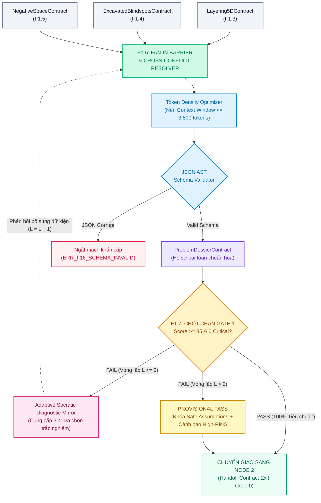
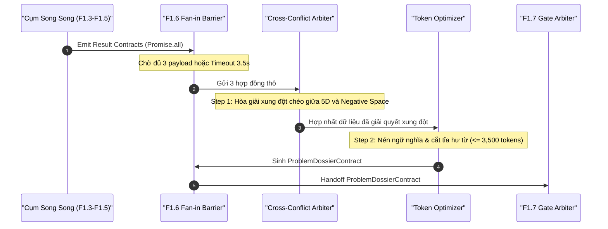
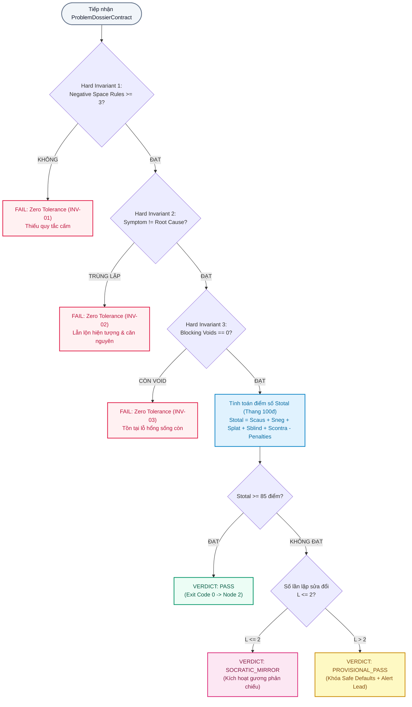
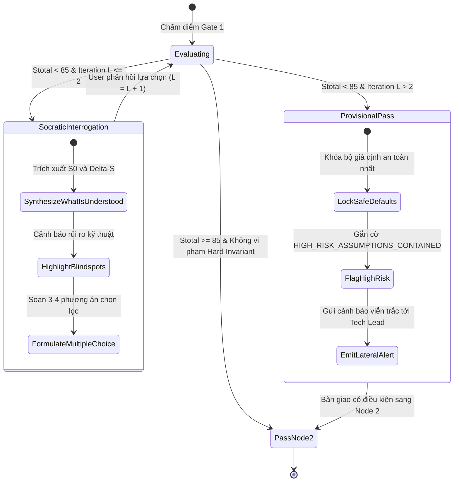

# QUY TRÌNH HỘI TỤ, ĐÓNG GÓI HỒ SƠ & CHỐT CHẶN GATE 1: SYNTHESIS & GATE RESILIENCE FLOW (F1.6 & F1.7)

> **Mã quy trình**: `FLOW-NODE1-SYNTHESIS-GATE-001`  
> **Phiên bản**: `1.0.0` | **Trạng thái**: `ACTIVE BASELINE`  
> **Tài liệu cha**: [`node1-f1-decomposition-architecture.md`](file:///home/stveve/Documents/workspace/Steve/Steves-Test-agent-agy/Docs/Diagrams/Didagram-AI-Agent_workflows/Node-1/node1-f1-decomposition-architecture.md)  
> **Phân hệ phụ trách**:  
>   - `F1.6: Problem Dossier Compiler & Token Optimizer` (Fan-in Barrier)  
>   - `F1.7: Gate 1 Scoping Arbiter & Adaptive Socratic Mirror` (Binary Quality Gate)  
> **Mô hình thực thi**: Hội tụ Đồng bộ hóa (Fan-in Barrier) ➔ Chốt chặn Nhị phân (Binary Exit Gate)  
> **Ngân sách Latency (SLA)**: $\le 2.5\text{s}$ ($F1.6 \le 1.5\text{s} + F1.7 \le 1.0\text{s}$)

---

## 1. TỔNG QUAN VỊ TRÍ VÀ VAI TRÒ CHỐT HẠ

Hai sub-nodes F1.6 và F1.7 là trạm kiểm soát cuối cùng của Node 1, bảo đảm nguyên tắc: **"Tuyệt đối không đẩy rác ngữ nghĩa, thông số mơ hồ hoặc giải pháp vá víu sang Node 2 (Business Analysis)"**.



---

## 2. QUY TRÌNH HỘI TỤ FAN-IN & TỐI ƯU HÓA TOKEN (F1.6)



### Bước 1: Fan-in Synchronization & Cross-Conflict Resolution
- **Rào cản đồng bộ**: `Promise.allSettled([f13Promise, f14Promise, f15Promise])`.
- **Quy tắc giải quyết xung đột chéo (Precedence Rules)**:
  1. *Xung đột giữa Blast Radius (F1.3) và In-Scope (F1.5)*: Nếu F1.3 đánh giá bán kính nổ là `DATA_CORRUPTION` nhưng F1.5 loại trừ module cơ sở dữ liệu ra `Out-of-Scope`, quy tắc F1.3 có quyền ưu tiên cao hơn $\rightarrow$ F1.6 bắt buộc kéo module dữ liệu vào `In-Scope`.
  2. *Xung đột giữa First Principles (F1.4) và Safe Assumptions*: Các giới hạn vật lý (băng thông SSD, RTT mạng) của F1.4 là bất biến, ghi đè lên bất kỳ giả định lạc quan nào của F1.3.
  3. *Loại bỏ trùng lặp ngữ nghĩa (Semantic Deduplication)*: Nếu F1.4 gắn tag `CRITICAL_CONTEXT_VOID` trùng với 1 điểm đã có trong `causality_dag` của F1.3, hệ thống gộp thành 1 thực thể truy vết duy nhất.

### Bước 2: Context Density Compression (Giới hạn $\le 3,500$ Tokens)
- **Mục tiêu**: Bảo tồn tối đa cửa sổ ngữ cảnh (Context Window) cho Node 2 (BABOK) và Node 3 (Architecture).
- **Thuật toán nén**:
  1. Cắt bỏ hoàn toàn các câu nối mang tính văn phong giao tiếp, quy toàn bộ phát biểu thành cấu trúc danh từ hóa (Nominalized Technical Fact).
  2. Mã hóa các mảng quan hệ thành JSON AST gọn nhẹ (Compact JSON).
  3. Đo lường kích thước Token bằng BPE Tokenizer (tiktoken `cl100k_base`). Nếu vượt quá 3,500 tokens, tự động cắt tỉa phần giải thích phụ của các node cấp thấp trong 5-Whys DAG (chỉ giữ lại Root Cause và Top-level symptom).

---

## 3. LOGIC CHỐT CHẶN GATE 1, BẢNG ĐIỂM & SỰ CỐ (F1.7)

### 3.1. Sơ Đồ Cây Quyết Định Chấm Điểm Nhị Phân (Binary Gate Decision Tree)



### 3.2. Công Thức Chấm Điểm Cơ Học
$$S_{\text{total}} = S_{\text{causality}} (25đ) + S_{\text{negative}} (20đ) + S_{\text{platform}} (20đ) + S_{\text{blindspot}} (20đ) + S_{\text{contradiction}} (15đ) - \sum P_{\text{penalties}}$$

| Thành Phần Điểm | Điểm Tối Đa | Tiêu Chí Đạt Chuẩn Kỹ Thuật |
| :--- | :---: | :--- |
| **$S_{\text{causality}}$** | 25đ | Đồ thị 5-Whys DAG có chiều sâu $\ge 3$ cấp, phân tách tuyệt đối giữa hiện tượng và căn nguyên. |
| **$S_{\text{negative}}$** | 20đ | Định nghĩa $\ge 3$ Negative Space Rules khép kín kèm lý do kỹ thuật và hậu quả vi phạm. |
| **$S_{\text{platform}}$** | 20đ | Xác định rõ ràng ràng buộc OS (Linux/Windows), mô hình Concurrency, giới hạn RAM/CPU. |
| **$S_{\text{blindspot}}$** | 20đ | Rà soát đầy đủ 8 chiều kích ẩn số và dán nhãn Zero-Hallucination minh bạch. |
| **$S_{\text{contradiction}}$**| 15đ | Giải quyết trọn vẹn các mâu thuẫn hệ thống (CAP/Amdahl) qua giải pháp biện chứng. |

**Bảng Phạt Điểm (Penalties & Deductions)**:
- $P_1$ (**-30đ**): Để rò rỉ giải pháp chắp vá của dev vào định nghĩa bài toán cốt lõi (chỉ phạt khi cờ `premature_solution_status == 'UNCONTROLLED_LEAK'`; không phạt nếu đã cách ly thành công vào `quarantined_solutions`).
- $P_2$ (**-25đ**): Tồn tại ít nhất 1 `CRITICAL_CONTEXT_VOID` ở mức `BLOCKING` chưa được xử lý.
- $P_3$ (**-15đ**): Chỉ số mơ hồ sau xử lý $\text{Ambiguity Index} > 0.4$.

---

## 4. CƠ CHẾ CHỐNG BẾ TẮC (SOCRATIC MIRROR & PROVISIONAL PASS)



### 4.1. Cấu Trúc Gương Phản Chiếu Socratic (Khi $L \le 2$)
Khi hồ sơ bị đánh rớt, F1.7 **tuyệt đối không hỏi các câu hỏi mở chung chung** (*"Bạn có thể nói rõ hơn không?"*). Thay vào đó, nó cấu trúc thành bộ phản chiếu 3 phần:
1. **Phần 1 - Hệ thống đã hiểu gì**: Tóm tắt trạng thái gốc ($S_0$) và độ lệch đo được ($\Delta S$) dưới dạng fact khách quan.
2. **Phần 2 - Điểm mù sống còn**: Chỉ ra nghịch lý kỹ thuật hoặc nguy cơ sập nguồn nếu làm theo suy đoán hiện tại.
3. **Phần 3 - Trắc nghiệm định hướng (Multiple-Choice Dilemma)**: Đưa ra 3 phương án kỹ thuật khả dĩ kèm phân tích trade-off để lập trình viên bấm chọn trực tiếp:
   - *Lựa chọn A*: Đổi sang kiến trúc Client-Server (ví dụ: PostgreSQL).
   - *Lựa chọn B*: Chuyển file về ổ đĩa Local NVMe SSD độc quyền tiến trình.
   - *Lựa chọn C*: Chấp nhận rủi ro Read-Only qua mạng và tắt hoàn toàn tính năng ghi.

### 4.2. Chế Độ Chuyển Giao Có Điều Kiện (Provisional Pass khi $L > 2$)
Nếu sau 2 vòng đối thoại dev vẫn không thể cung cấp dữ kiện sống còn:
- Hệ thống áp dụng **Bộ Giả Định Phòng Thủ Tối Thiểu (Safe Default Assumptions)**:
  - Nếu thiếu tham số Concurrency $\rightarrow$ Mặc định an toàn: Thiết kế chịu tải đa luồng cao (High Concurrency Multi-threaded).
  - Nếu thiếu thông số mạng $\rightarrow$ Mặc định an toàn: Kênh truyền thông không tin cậy, có thể rớt gói (Unreliable Network).
- Gắn cờ `HIGH_RISK_ASSUMPTIONS_CONTAINED = true` vào Dossier.
- Cấp quyền `PROVISIONAL_PASS` chuyển giao sang Node 2, đồng thời đẩy cảnh báo khẩn cấp sang kênh Lateral Channel cho Solution Architect. Toàn bộ dây chuyền SDLC không bị đình trệ.

---

## 5. SCHEMAS HỢP ĐỒNG ĐẦY ĐỦ CỦA F1.6 VÀ F1.7

```typescript
// ============================================================================
// F1.6 OUTPUT / F1.7 INPUT: Hồ sơ bài toán tối thượng (Problem Dossier)
// ============================================================================
export interface ProblemDossierContract {
  dossier_id: string;                    // DOS-YYYYMMDD-UUID
  timestamp: string;
  source_hash: string;                   // SHA-256 của Raw Input để truy vết
  token_count: number;                   // BẮT BUỘC <= 3,500 tokens
  
  problem_definition: {
    clean_statement: string;             // Định nghĩa thuần khiết (0% giải pháp ép buộc)
    symptom_observed: string;            // Hiện tượng bề mặt quan sát được
    hypothesized_root_cause: string;     // Căn nguyên giả thuyết (KHÔNG TRÙNG symptom)
    causality_5whys_chain: Array<{
      level: number;
      why: string;
      deduced_cause: string;
    }>;
  };
  
  deconstructed_dimensions: {
    domain_impact: string;
    platform_constraints: {
      os_family: "LINUX" | "WINDOWS" | "CROSS_PLATFORM";
      runtime: string;
      concurrency_model: string;
      memory_ceiling_mb?: number;
    };
    data_state_boundaries: {
      aggregates: string[];
      transaction_mode: "STRONG_ACID" | "EVENTUAL_BASE";
    };
    worst_case_blast_radius: "THREAD" | "PROCESS" | "NODE" | "CLUSTER" | "DATA_CORRUPTION";
  };
  
  cognitive_and_dialectical_state: {
    quarantined_user_solutions: string[];
    counter_hypotheses_explored: [string, string, string];
    resolved_contradictions: string[];
  };
  
  blindspots_and_assumptions: Array<{
    id: string;
    statement: string;
    status: "UNVERIFIED_ASSUMPTION" | "CRITICAL_CONTEXT_VOID";
    urgency: "BLOCKING" | "DEFERRED";
  }>;
  
  scope_boundaries: {
    in_scope: string[];
    out_of_scope: string[];
    negative_space_rules: Array<{        // BẮT BUỘC >= 3 quy tắc
      rule_id: string;
      forbidden_action: string;
      technical_rationale: string;
      violation_consequence: string;
    }>;
  };
}

// ============================================================================
// F1.7 OUTPUT: Hợp đồng kết luận chốt chặn Gate 1
// ============================================================================
export interface Gate1VerdictContract {
  verdict_id: string;                    // G1V-YYYYMMDD-UUID
  dossier_id: string;
  timestamp: string;
  iteration_round: number;               // Vòng lặp hiện tại L (1, 2, 3...)
  
  verdict: "PASS" | "SOCRATIC_MIRROR" | "PROVISIONAL_PASS";
  total_score: number;                   // 0 -> 100 điểm
  
  scoring_breakdown: {
    causality_score: number;             // max 25
    negative_space_score: number;        // max 20
    platform_constraints_score: number;  // max 20
    blindspot_mining_score: number;      // max 20
    contradiction_resolution_score: number; // max 15
    penalties_applied: number;           // Tổng điểm trừ
  };
  
  hard_invariants_check: {
    negative_space_fulfilled: boolean;   // >= 3 rules
    symptom_distinct_from_root_cause: boolean;
    zero_blocking_voids: boolean;
    zero_premature_leakage: boolean;
  };

  socratic_payload?: {                   // Hiện diện nếu verdict == "SOCRATIC_MIRROR"
    what_is_understood: string;
    identified_paradox_or_danger: string;
    curated_options: Array<{
      option_id: string;
      title: string;
      architectural_tradeoff: string;
      recommended: boolean;
    }>;
  };

  provisional_pass_metadata?: {          // Hiện diện nếu verdict == "PROVISIONAL_PASS"
    safe_assumptions_locked: string[];
    risk_level: "HIGH" | "CRITICAL";
    escalation_ticket_id: string;
  };
}
```

---

## 6. CANONICAL LOG LINE & ĐO LƯỜNG VIỄN TRẮC (LATERAL OBSERVABILITY)

Khi F1.6 và F1.7 kết thúc chu trình, **đúng 1 Canonical Log Line JSON** được gửi sang cụm Lateral Telemetry với tải phụ trội $\le 5\text{ms}$:

```json
{
  "trace_id": "trace-f1-synthesis-992011",
  "timestamp": "2026-09-15T15:21:44.850Z",
  "pipeline_node": "Node-1",
  "sub_nodes_executed": ["F1.6", "F1.7"],
  "dossier_id": "DOS-20260915-a7b29f",
  "verdict_id": "G1V-20260915-9921e1",
  "token_count": 2150,
  "token_budget_ratio": 0.614,
  "fanin_conflicts_resolved_count": 1,
  "gate1_total_score": 92,
  "hard_invariants_satisfied": true,
  "verdict": "PASS",
  "iteration_round": 1,
  "penalties_total": 0,
  "f16_execution_ms": 1180,
  "f17_execution_ms": 720,
  "cumulative_node1_latency_ms": 8860,
  "sla_threshold_ms": 15000,
  "sla_status": "WITHIN_BUDGET",
  "circuit_breaker_status": "CLOSED"
}
```
