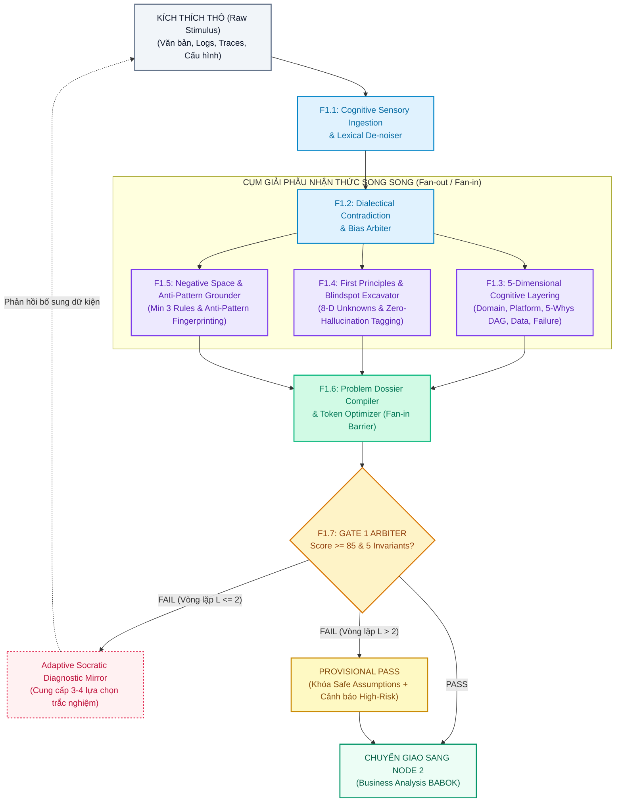
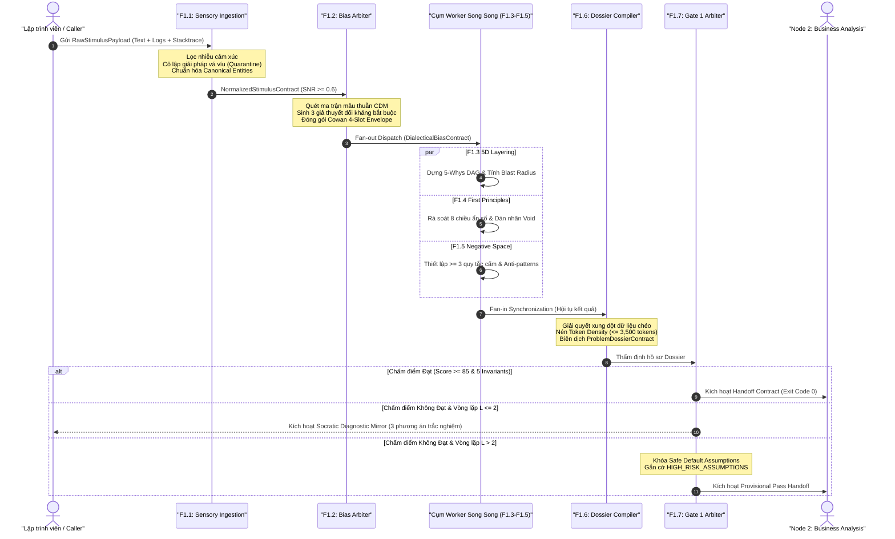
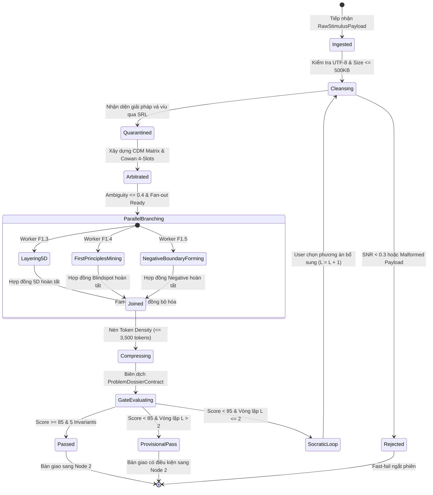
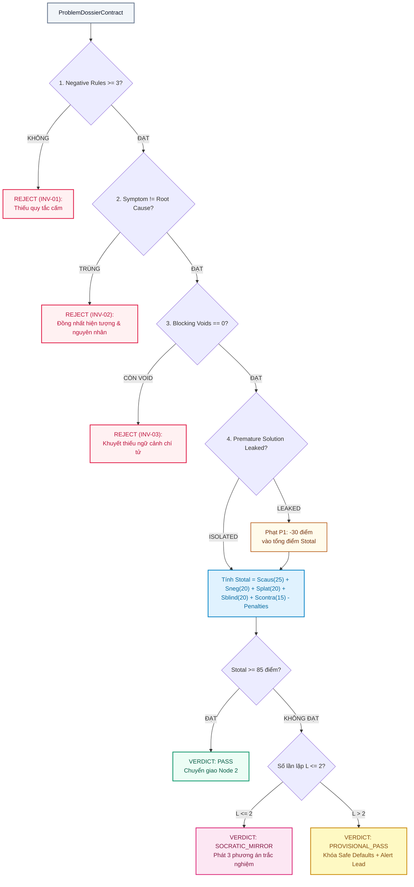

# ĐẶC TẢ KIẾN TRÚC PHÂN RÃ SUB-NODES F1: PROBLEM DISCOVERY & GATE 1 ENGINE

> **Mã đặc tả**: `SPEC-NODE1-F1-001`  
> **Phiên bản**: `3.0.0` | **Trạng thái**: `ACTIVE BASELINE`  
> **Thuộc Node Cha**: [`node1-problem-discovery.md`](file:///home/stveve/Documents/workspace/Steve/Steves-Test-agent-agy/Docs/Diagrams/Didagram-AI-Agent_workflows/Node-1/node1-problem-discovery.md) (`SPEC-NODE1-001`)  
> **Thuộc Pipeline**: [`main.md`](file:///home/stveve/Documents/workspace/Steve/Steves-Test-agent-agy/Docs/Diagrams/Didagram-AI-Agent_workflows/main.md) (`SPEC-AI-PIPELINE-001`)  
> **Sơ đồ hạt nhân**: [`Node-1.drawio`](file:///home/stveve/Documents/workspace/Steve/Steves-Test-agent-agy/Docs/Diagrams/Didagram-AI-Agent_workflows/Node-1/Node-1.drawio) (Page: `F1-Decomposition`)  
> **Quy chuẩn tài liệu**: [`ARCHITECTURE-DOC-FRAMEWORK.md`](file:///home/stveve/Documents/workspace/Steve/Steves-Test-agent-agy/Docs/Diagrams/Didagram-AI-Agent_workflows/ARCHITECTURE-DOC-FRAMEWORK.md)  
> **Tài liệu quy trình con (Flows)**:
> - [`flows/01-ingestion-arbitration-flow.md`](file:///home/stveve/Documents/workspace/Steve/Steves-Test-agent-agy/Docs/Diagrams/Didagram-AI-Agent_workflows/Node-1/flows/01-ingestion-arbitration-flow.md)
> - [`flows/02-parallel-cognitive-cluster-flow.md`](file:///home/stveve/Documents/workspace/Steve/Steves-Test-agent-agy/Docs/Diagrams/Didagram-AI-Agent_workflows/Node-1/flows/02-parallel-cognitive-cluster-flow.md)
> - [`flows/03-synthesis-gate-resilience-flow.md`](file:///home/stveve/Documents/workspace/Steve/Steves-Test-agent-agy/Docs/Diagrams/Didagram-AI-Agent_workflows/Node-1/flows/03-synthesis-gate-resilience-flow.md)

---

## 1. TỔNG QUAN & RANH GIỚI BẢN CHẤT (BOUNDARY & SCOPE)

### 1.1. Bảng Thông Số Hạt Nhân (Node Manifest)
| Thuộc Tính | Đặc Tả Kỹ Thuật |
| :--- | :--- |
| **Mục đích hạt nhân** | Tiếp nhận kích thích thô, khử nhiễu cảm xúc, cô lập giải pháp chắp vá, bóc tách bài toán qua 5 lăng kính, khai quật điểm mù và thẩm định Gate 1 trước khi sang Node 2. |
| **Input tiếp nhận** | `RawStimulusPayload` (Văn bản tự nhiên thô, logs, stack traces, cấu hình hệ thống, độ lớn $\le 512\text{ KB}$). |
| **Output chuyển giao** | `ProblemDossierContract` (Hồ sơ bài toán đã chuẩn hóa $\le 3,500$ tokens) & `Gate1VerdictContract` (Exit code nhị phân). |
| **Mô hình thực thi** | Lai ghép Tuần tự Tiền trạm (Serial F1.1 $\rightarrow$ F1.2) $\rightarrow$ Phân tán Song song (Fan-out F1.3, F1.4, F1.5) $\rightarrow$ Hội tụ Đồng bộ (Fan-in Barrier F1.6) $\rightarrow$ Chốt chặn (F1.7 Gate). |
| **Ngân sách Latency (SLA)** | Toàn trình $p95 \le 10.0\text{s}$ (Trần tối đa NFR cho phép $15.0\text{s}$). |
| **Chốt chặn Gate đích** | **Gate 1 Arbiter**: Điểm số $S_{\text{total}} \ge 85/100$, thỏa mãn 5 Hard Invariants, không còn tồn tại blocking context void. |

### 1.2. Không Gian Phủ Định (Negative Space - Ranh Giới Bất Biến)
Nhằm bảo vệ hệ sinh thái khỏi hiện tượng trôi dạt phạm vi và sinh mã ảo giác, Node 1 tuân thủ nghiêm ngặt 4 điều cấm cốt tử:
1. **CẤM 1 (INV-01: No Premature Solutioning)**: CẤM đề xuất kiến trúc, chọn thư viện cụ thể hoặc sinh mã thực thi (code/script). Mọi giải pháp chắp vá do dev đề xuất sớm ở input phải lập tức bị cô lập vào vùng kiểm dịch `quarantined_solutions`.
2. **CẤM 2 (INV-02: No Raw Noise Leakage)**: CẤM đẩy dữ liệu chưa qua khử nhiễu từ vựng ($\text{SNR} < 0.3$) hoặc chưa bóc tách cấu trúc Cowan 4-Slots sang cụm worker song song.
3. **CẤM 3 (INV-03: Zero Silent Swallowing)**: CẤM nuốt các mâu thuẫn hệ thống (CAP, PACELC, Amdahl) hoặc các điểm mù sống còn (`CRITICAL_CONTEXT_VOID`). Mọi xung đột chưa giải quyết đều phải xuất hiện trong Dossier hoặc chuyển sang gương phản chiếu Socratic.
4. **CẤM 4 (INV-04: No Endless Ping-Pong)**: CẤM lặp đối thoại hỏi đáp với người dùng quá 2 vòng ($L \le 2$). Khi $L > 2$, bắt buộc kích hoạt cơ chế `PROVISIONAL_PASS` có điều kiện kèm cảnh báo rủi ro cao.

---

## 2. BỘ SƠ ĐỒ THIẾT KẾ KIẾN TRÚC (ARCHITECTURAL DIAGRAMS)

### 2.1. Sơ Đồ Cấu Trúc Khối & Luồng Xử Lý (Component & Pipeline Topology)



---

### 2.2. Sơ Đồ Trình Tự Thực Thi Toàn Trình (Execution Sequence)



---

### 2.3. Sơ Đồ Máy Trạng Thái (Task Lifecycle & State Machine)



---

### 2.4. Sơ Đồ Biến Đổi Hợp Đồng Dữ Liệu (Data Contract Flow)

```mermaid
flowchart LR
    P1["RawStimulusPayload\n(Raw text, logs, channel)"]:::c1 --> F11_P["F1.1 Engine"]
    F11_P --> P2["NormalizedStimulusContract\n(Clean facts, Quarantined solution)"]:::c2
    P2 --> F12_P["F1.2 Engine"]
    F12_P --> P3["DialecticalBiasContract\n(CDM conflicts, 3 Hypotheses, 4-Slots)"]:::c3

    P3 --> Parallel_P["Cụm Worker Song Song"]
    Parallel_P --> P4A["Layering5DContract"]:::c4
    Parallel_P --> P4B["ExcavatedBlindspotsContract"]:::c4
    Parallel_P --> P4C["NegativeSpaceContract"]:::c4

    P4A & P4B & P4C --> F16_P["F1.6 Compiler"]
    F16_P --> P5["ProblemDossierContract\n(AST verified, <= 3,500 tokens)"]:::c5
    P5 --> F17_P["F1.7 Gate"]
    F17_P --> P6["Gate1VerdictContract\n(PASS / SOCRATIC / PROVISIONAL)"]:::c6

    classDef c1 fill:#f1f5f9,stroke:#64748b,stroke-width:1.5px;
    classDef c2 fill:#e0f2fe,stroke:#0284c7,stroke-width:1.5px;
    classDef c3 fill:#ede9fe,stroke:#7c3aed,stroke-width:1.5px;
    classDef c4 fill:#fdf4ff,stroke:#c026d3,stroke-width:1.5px;
    classDef c5 fill:#d1fae5,stroke:#059669,stroke-width:2px;
    classDef c6 fill:#fef3c7,stroke:#d97706,stroke-width:2px;
```



---

### 2.5. Sơ Đồ Cây Quyết Định Chốt Chặn Gate 1 (Gate Arbiter Decision Tree)



---

## 3. HỢP ĐỒNG DỮ LIỆU CỐT LÕI (DATA CONTRACTS)

### 3.1. Hợp Đồng Đầu Vào Tiếp Nhận (`RawStimulusPayload`)
Chi tiết cấu trúc xem tại: [`flows/01-ingestion-arbitration-flow.md#4-hợp-đồng-dữ-liệu-đầy-đủ-data-contract-schemas`](file:///home/stveve/Documents/workspace/Steve/Steves-Test-agent-agy/Docs/Diagrams/Didagram-AI-Agent_workflows/Node-1/flows/01-ingestion-arbitration-flow.md#4-hợp-đồng-dữ-liệu-đầy-đủ-data-contract-schemas).

```typescript
export interface RawStimulusPayload {
  session_id: string;                    // UUID v4 theo dõi phiên
  source_channel: "SLACK" | "JIRA" | "TERMINAL" | "GRAFANA_ALERT" | "MANUAL_PROMPT";
  raw_text: string;                      // Mô tả thô từ người dùng
  environment_hint?: string;            // Gợi ý sơ bộ về môi trường (nếu có)
  attachments?: Array<{
    filename: string;
    mime_type: "text/plain" | "text/x-log" | "application/json" | "text/markdown";
    content_text?: string;
    size_bytes: number;
  }>;
}
```

### 3.2. Hợp Đồng Đầu Ra Bàn Giao (`ProblemDossierContract`)
Chi tiết cấu trúc xem tại: [`flows/03-synthesis-gate-resilience-flow.md#5-schemas-hợp-đồng-đầy-đủ-của-f16-và-f17`](file:///home/stveve/Documents/workspace/Steve/Steves-Test-agent-agy/Docs/Diagrams/Didagram-AI-Agent_workflows/Node-1/flows/03-synthesis-gate-resilience-flow.md#5-schemas-hợp-đồng-đầy-đủ-của-f16-và-f17).

```typescript
export interface ProblemDossierContract {
  dossier_id: string;                    // DOS-YYYYMMDD-UUID
  timestamp: string;
  source_hash: string;                   // SHA-256 đối chiếu
  token_count: number;                   // BẮT BUỘC <= 3,500 tokens
  
  problem_definition: {
    clean_statement: string;             // 0% giải pháp ép buộc
    symptom_observed: string;            // Hiện tượng bề mặt quan sát được
    hypothesized_root_cause: string;     // Căn nguyên giả thuyết (KHÔNG TRÙNG symptom)
    causality_5whys_chain: Array<{
      level: number;
      why: string;
      deduced_cause: string;
    }>;
  };
  
  deconstructed_dimensions: {
    domain_impact: string;
    platform_constraints: {
      os_family: "LINUX" | "WINDOWS" | "CROSS_PLATFORM";
      runtime: string;
      concurrency_model: string;
      memory_ceiling_mb?: number;
    };
    data_state_boundaries: {
      aggregates: string[];
      transaction_mode: "STRONG_ACID" | "EVENTUAL_BASE";
    };
    worst_case_blast_radius: "THREAD" | "PROCESS" | "NODE" | "CLUSTER" | "DATA_CORRUPTION";
  };
  
  cognitive_and_dialectical_state: {
    quarantined_user_solutions: string[];
    counter_hypotheses_explored: [string, string, string];
    resolved_contradictions: string[];
  };
  
  blindspots_and_assumptions: Array<{
    id: string;
    statement: string;
    status: "UNVERIFIED_ASSUMPTION" | "CRITICAL_CONTEXT_VOID";
    urgency: "BLOCKING" | "DEFERRED";
  }>;
  
  scope_boundaries: {
    in_scope: string[];
    out_of_scope: string[];
    negative_space_rules: Array<{        // BẮT BUỘC >= 3 quy tắc cấm
      rule_id: string;
      forbidden_action: string;
      technical_rationale: string;
      violation_consequence: string;
    }>;
  };
}
```

### 3.3. Hợp Đồng Quyết Định Chốt Chặn (`Gate1VerdictContract`)
```typescript
export interface Gate1VerdictContract {
  verdict_id: string;                    // G1V-YYYYMMDD-UUID
  dossier_id: string;
  timestamp: string;
  iteration_round: number;               // L <= 2 (hoặc > 2 nếu provisional)
  
  verdict: "PASS" | "SOCRATIC_MIRROR" | "PROVISIONAL_PASS";
  total_score: number;                   // Thang 100 điểm
  
  scoring_breakdown: {
    causality_score: number;             // Max 25
    negative_space_score: number;        // Max 20
    platform_constraints_score: number;  // Max 20
    blindspot_mining_score: number;      // Max 20
    contradiction_resolution_score: number; // Max 15
    penalties_applied: number;           // Điểm trừ
  };
  
  hard_invariants_check: {
    negative_space_fulfilled: boolean;   // >= 3 rules
    symptom_distinct_from_root_cause: boolean;
    zero_blocking_voids: boolean;
    zero_premature_leakage: boolean;
  };
}
```

---

## 4. MA TRẬN PHÂN RÃ KỸ THUẬT 7 SUB-NODES & LIÊN KẾT LUỒNG

Bảng điều hướng kỹ thuật của 7 Sub-nodes F1, ánh xạ trực tiếp sang các tài liệu phân rã chuyên sâu:

| Sub-Node | Tên Chức Năng Phân Hệ | Chế Độ Thực Thi | SLA Trễ | Đầu Ra Cốt Lõi | Đặc Tả Chi Tiết (Deep-dive Doc) |
| :--- | :--- | :---: | :---: | :--- | :--- |
| **F1.1** | Cognitive Sensory Ingestion & Lexical De-noiser | Tuần tự | $\le 2.0\text{s}$ | `NormalizedStimulusContract` | [`flows/01-ingestion-arbitration-flow.md`](file:///home/stveve/Documents/workspace/Steve/Steves-Test-agent-agy/Docs/Diagrams/Didagram-AI-Agent_workflows/Node-1/flows/01-ingestion-arbitration-flow.md) |
| **F1.2** | Dialectical Contradiction & Bias Arbiter | Tuần tự | $\le 2.0\text{s}$ | `DialecticalBiasContract` | [`flows/01-ingestion-arbitration-flow.md`](file:///home/stveve/Documents/workspace/Steve/Steves-Test-agent-agy/Docs/Diagrams/Didagram-AI-Agent_workflows/Node-1/flows/01-ingestion-arbitration-flow.md) |
| **F1.3** | 5-Dimensional Cognitive Layering Engine | Song song | $\le 3.5\text{s}$ | `Layering5DContract` | [`flows/02-parallel-cognitive-cluster-flow.md`](file:///home/stveve/Documents/workspace/Steve/Steves-Test-agent-agy/Docs/Diagrams/Didagram-AI-Agent_workflows/Node-1/flows/02-parallel-cognitive-cluster-flow.md) |
| **F1.4** | First Principles & Blindspot Excavator | Song song | $\le 3.0\text{s}$ | `ExcavatedBlindspotsContract` | [`flows/02-parallel-cognitive-cluster-flow.md`](file:///home/stveve/Documents/workspace/Steve/Steves-Test-agent-agy/Docs/Diagrams/Didagram-AI-Agent_workflows/Node-1/flows/02-parallel-cognitive-cluster-flow.md) |
| **F1.5** | Negative Space & Anti-Pattern Grounder | Song song | $\le 2.5\text{s}$ | `NegativeSpaceContract` | [`flows/02-parallel-cognitive-cluster-flow.md`](file:///home/stveve/Documents/workspace/Steve/Steves-Test-agent-agy/Docs/Diagrams/Didagram-AI-Agent_workflows/Node-1/flows/02-parallel-cognitive-cluster-flow.md) |
| **F1.6** | Problem Dossier Compiler & Token Optimizer | Hội tụ Fan-in | $\le 1.5\text{s}$ | `ProblemDossierContract` | [`flows/03-synthesis-gate-resilience-flow.md`](file:///home/stveve/Documents/workspace/Steve/Steves-Test-agent-agy/Docs/Diagrams/Didagram-AI-Agent_workflows/Node-1/flows/03-synthesis-gate-resilience-flow.md) |
| **F1.7** | Gate 1 Scoping Arbiter & Adaptive Socratic Mirror | Chốt chặn | $\le 1.0\text{s}$ | `Gate1VerdictContract` | [`flows/03-synthesis-gate-resilience-flow.md`](file:///home/stveve/Documents/workspace/Steve/Steves-Test-agent-agy/Docs/Diagrams/Didagram-AI-Agent_workflows/Node-1/flows/03-synthesis-gate-resilience-flow.md) |

---

## 5. MA TRẬN 8 CHIỀU KÍCH ẨN SỐ & WALKTHROUGH THỰC CHIẾN

### 5.1. Ma Trận 8 Chiều Kích Ẩn Số Toàn Diện (Unknown-Unknowns Mining Matrix)
Rà soát bắt buộc tại F1.4 nhằm triệt tiêu hoàn toàn các rủi ro vận hành ngầm:

| Chiều Kích Ẩn Số | Nguy Cơ Kỹ Thuật Ngầm | Kịch Bản Thảm Họa Thực Tế | Chốt Chặn Khắc Phục Node 1 |
| :--- | :--- | :--- | :--- |
| **1. Temporal & Lifecycle Mismatch** | Lệch tốc độ Producer - Consumer; Trôi lệch đồng hồ (Clock drift). | Producer đẩy 50k msg/s, Consumer nuốt 1k msg/s $\rightarrow$ Tràn RAM OOM; Distributed lock hết hạn giữa chừng. | F1.3 Data Layer ép xác định Max Ingestion Rate và cơ chế Backpressure. |
| **2. Concurrency Blast Radius** | Thundering herd, Cache stampede, Threadpool starvation gián tiếp. | 1 key cache triệu hit hết hạn $\rightarrow$ 10k request đâm thẳng DB làm sập Database cluster trong 3 giây. | F1.3 Failure Dimension mô phỏng nổ dây chuyền; F1.5 cấm cache-aside thiếu mutex lock. |
| **3. Multi-Tenant Contamination** | Noisy neighbor, rò rỉ cách ly dữ liệu giữa các khách hàng. | 1 tenant chạy báo cáo nặng chiếm 99% CPU $\rightarrow$ 999 tenants khác bị timeout toàn diện. | F1.4 bóc tách ranh giới Tenant Boundary; F1.5 ép Negative Rule về cô lập tài nguyên. |
| **4. Economic & Compute Throttling** | Cạn kiệt IOPS credit (AWS gp2/gp3); bùng nổ token LLM context window. | Đĩa cứng cạn burst credit $\rightarrow$ Latency ghi tăng từ 1ms lên 3000ms $\rightarrow$ API gateways đồng loạt 504. | F1.4 đưa quota vào Platform Dimension; F1.6 nén ngân sách Token $\le 3,500$. |
| **5. Reversibility & Rollback Asymmetry**| Di cư dữ liệu một chiều mang tính phá hủy (Destructive Migration). | Đổi tên cột DB trực tiếp trên production $\rightarrow$ Code cũ crash ngay, rollback code cũng thất bại. | F1.5 Negative Space: CẤM migration phá vỡ tương thích (bắt buộc Expand-and-Contract). |
| **6. Regulatory & PII Contamination** | Dữ liệu định danh người dùng lọt vào log/prompt gửi sang LLM cloud. | Tên, CCCD và số thẻ lọt vào prompt gửi bên thứ 3 $\rightarrow$ Vi phạm GDPR/Nghị định 13. | F1.1 Sensory Gating bóc tách và che mặt nạ (Masking) token nhạy cảm. |
| **7. Dark Debt & Silent Degradation** | Nuốt ngoại lệ (`_ = Task.Run(...)`); tin nhắn độc (Poison Pill) trong queue. | Message lỗi rớt vào Dead Letter Queue bị nuốt âm thầm, kế toán lệch tích lũy hàng triệu USD. | F1.3 Failure Layer cấm empty catch block; bắt buộc thiết lập DLQ Alerting. |
| **8. Human Cognitive Anchoring** | Hội chứng tiếc công (Sunk Cost), cố chấp vá víu một module tồi. | Dev mất 3 tuần viết script watchdog vá memory leak thay vì sửa 1 dòng giải phóng tài nguyên. | F1.2 cô lập giải pháp chắp vá; sinh 3 giả thuyết đối kháng đưa dev về First Principles. |

---

### 5.2. Kịch Bản Walkthrough Thực Chiến: "SQLite Over SMB/NFS Trap"

#### A. Input Thô Của Lập Trình Viên (`RawStimulusPayload`)
> *"Hệ thống service xử lý giao dịch thỉnh thoảng bị lỗi 'database is locked' và tiến trình bị đơ cứng. Mình nghĩ là do SQLite bị nghẽn ghi. Mình định viết một script PowerShell watchdog chạy nền, cứ 30 giây check nếu thấy tiến trình treo thì kill -9 tiến trình cũ rồi start lại service."*

#### B. Diễn Tiến Cơ Học Qua 7 Sub-Nodes F1
1. **Qua F1.1**:
   - Khử nhiễu: Loại bỏ từ ngữ cảm xúc (*"mình nghĩ là"*, *"thỉnh thoảng"*).
   - Ức chế phản xạ: Bóc tách giải pháp *"viết script PowerShell watchdog kill -9"* đưa vào `quarantined_proposals` với `is_isolated_successfully = true`.
   - Giữ lại thực nghiệm: `reported_symptoms: ["database is locked", "process hang"]`, `assumed_db: "SQLite"`.
2. **Qua F1.2**:
   - Nhận diện `Action Bias` (thôi thúc kill tiến trình) và `Anchoring Bias` (đinh ninh do SQLite nghẽn ghi).
   - Tự động sinh **3 Giả thuyết Đối kháng Biện chứng**:
     - $H_1$: File SQLite đang đặt trên Network Share (NFS/SMB) có cơ chế byte-range lock không an toàn.
     - $H_2$: Có transaction dạng `EXCLUSIVE` mở ra nhưng không commit do exception unhandled ở luồng phụ.
     - $H_3$: ThreadPool bị cạn kiệt do sync-over-async blocking trên I/O.
   - Đóng gói Cowan 4-Slots: $S_0$ (Service chạy ghi DB) $\rightarrow \Delta E$ (Tăng tải giao dịch) $\rightarrow S_{\text{expected}}$ (Giao dịch ghi hoàn tất) $\rightarrow \Delta S$ (Lỗi locked và treo tiến trình).
3. **Qua Cụm Worker Song Song (F1.3, F1.4, F1.5)**:
   - **F1.3 (5-Whys DAG)**: *Tại sao locked?* $\rightarrow$ Do OS file lock không giải phóng $\rightarrow$ *Tại sao không giải phóng?* $\rightarrow$ Do client giữ lock qua giao thức mạng SMB $\rightarrow$ *Tại sao qua mạng?* $\rightarrow$ Dev mount thư mục chung để 2 máy cùng đọc file SQLite!
   - **F1.4 (First Principles)**: SQLite thiết kế cho local I/O in-process. Chạy SQLite qua share mạng là vi phạm trực tiếp định luật toàn vẹn POSIX lock, tất yếu sinh deadlock và hỏng dữ liệu.
   - **F1.5 (Negative Space Rules)**:
     - *CẤM 1*: CẤM đặt file SQLite trên network share (NFS/SMB/CIFS).
     - *CẤM 2*: CẤM kill -9 watchdog tự động vì sẽ làm hỏng file WAL (`-wal` journal) đang ghi dở.
     - *CẤM 3*: CẤM nuốt ngoại lệ locking bằng vòng lặp retry vô hạn thiếu exponential backoff.
4. **Qua F1.6 & F1.7**:
   - Biên dịch Dossier `DOS-20260915-SQLITE01` (1,850 tokens, thỏa mãn $\le 3,500$).
   - Chấm điểm Gate 1: $S_{\text{causality}} = 25$, $S_{\text{negative}} = 20$, $S_{\text{platform}} = 20$, $S_{\text{blindspot}} = 15$, $S_{\text{contradiction}} = 13 \rightarrow S_{\text{total}} = 93/100$.
   - Vì giải pháp watchdog của dev đã được cách ly thành công ngay tại F1.1, hệ thống không áp dụng hình phạt $P_1$ ($P_1 = 0$).
   - **Kết Luận**: `PASS` chuyển giao sang Node 2. Cứu hệ thống khỏi thảm họa hỏng dữ liệu hàng loạt do watchdog kill -9 gây ra!

---

## 6. 4 TÍN HIỆU TƯ DUY CHIỀU SÂU (ADVANCED ARCHITECTURAL SIGNALS)

### 6.1. S1: Negative Space Invariants (Ranh Giới Bất Biến)
- Node 1 không chỉ định nghĩa những gì cần phân tích, mà quan trọng hơn, thiết lập **hàng rào thép ngăn chặn những hành vi tự hoại**:
  - Không sinh mã chắp vá.
  - Không để rò rỉ rác ngữ nghĩa.
  - Không cho phép các quyết định dựa trên giả định mơ hồ mà không dán nhãn phòng thủ.

### 6.2. S2: Reverse Probing (Kịch Bản Sập Nguồn & Cách Ly)
- **Kịch bản sự cố xấu nhất**: Khi người dùng cố tình cung cấp input đối nghịch (Adversarial Prompt Injection) hoặc một kịch bản mâu thuẫn triệt để (ví dụ: đòi hỏi $100\%$ availability trên mạng rớt gói hoàn toàn):
  - F1.2 lập tức phát hiện `CRITICAL_DEADLOCK`.
  - Nếu F1.2 thất bại, F1.7 tại chốt chặn cuối cùng sẽ kích hoạt Circuit Breaker, từ chối cấp phép `PASS`, kích hoạt Socratic Diagnostic Mirror để phản chiếu nghịch lý, chặn đứng nguy cơ thảm họa kiến trúc lan truyền sang các Node sau.

### 6.3. S3: Multi-Stakeholder Impact (4 Chiều Tác Động)
Mỗi quyết định phân rã tại Node 1 tác động trực tiếp đến 4 nhóm chủ thể:
1. **Lập Trình Viên (Developer)**: Được giải phóng khỏi áp lực vá víu mù quáng; nhận được câu hỏi định hướng rõ ràng thay vì bế tắc trong việc phỏng đoán nguyên nhân.
2. **Kiến Trúc Sư Hệ Thống (Architect)**: Tiếp nhận `ProblemDossierContract` sạch sẽ, chuẩn xác, đầy đủ các ràng buộc OS, Concurrency và Không gian phủ định, rút ngắn $80\%$ thời gian thiết kế trade-off tại Node 3.
3. **Chủ Sản Phẩm / Kinh Doanh (Product Owner / Business)**: Nhìn thấy tác động định lượng thực sự (Cost of Delay, Doanh thu thất thoát) thay vì chỉ nhìn thấy các thuật ngữ kỹ thuật khó hiểu.
4. **Vận Hành Hệ Thống (DevOps / SRE)**: Hệ thống được bảo vệ khỏi các giải pháp tự hoại (như watchdog kill -9), tránh được thảm họa hỏng database và sự cố sập nguồn dây chuyền trên production.

### 6.4. S4: Constraint Anchoring (Ràng Buộc Vật Lý, OS & Token Limits)
- **Ràng buộc Hệ điều hành & Concurrency**: Phân biệt rạch ròi giữa Linux epoll (non-blocking I/O) và Windows STA Threading / IOCP, tránh áp đặt các giả định sai lầm về luồng.
- **Ràng buộc Phần cứng**: Đối chiếu thông lượng lý thuyết của NVMe SSD, giới hạn CPU Cycles và RTT mạng trước khi đưa ra bất kỳ giả định nào về hiệu năng.
- **Ngân sách Ngữ cảnh (Token Budget Limit)**: Khóa cứng trần $\le 3,500$ tokens cho `ProblemDossierContract`, bảo đảm Node 2 và Node 3 có đủ không gian ngữ cảnh (Context Window) để phân tích chuyên sâu mà không bị suy hao chú ý (Attention Degradation).

---

## 7. QUY TRÌNH ĐỒNG BỘ ĐỊNH KỲ & PROGRESS TRACKING

### 7.1. Giao Thức Đồng Bộ (Sync Protocol)
Mỗi khi có cập nhật trong logic của các Sub-nodes:
1. Cập nhật mã nguồn hoặc thuật toán tương ứng tại các file con: `flows/01-*.md`, `flows/02-*.md`, hoặc `flows/03-*.md`.
2. Kiểm tra tính toàn vẹn của 5 sơ đồ Mermaid trong tài liệu này (không lỗi render cú pháp).
3. Đồng bộ các hình khối trực quan trên file `Node-1.drawio` (Page: `F1-Decomposition`).
4. Cập nhật mã phiên bản và ghi nhận trạng thái tại Progress Matrix trong `ARCHITECTURE-DOC-FRAMEWORK.md`.

### 7.2. Tuyên Bố Baseline
Tài liệu này được công nhận là **ACTIVE BASELINE** cho phân hệ phân rã Sub-nodes F1 thuộc Node 1. Mọi thiết kế chi tiết tiếp theo của Node 2 (Business Analysis) và Node 3 (Architecture Trade-off Engine) phải lấy các hợp đồng dữ liệu trong tài liệu này làm căn cứ phụ thuộc bất biến.
