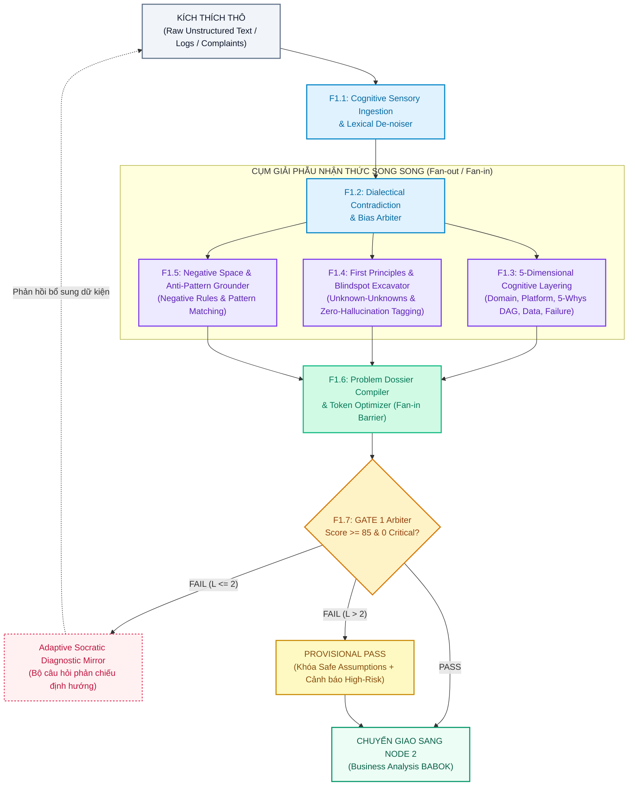
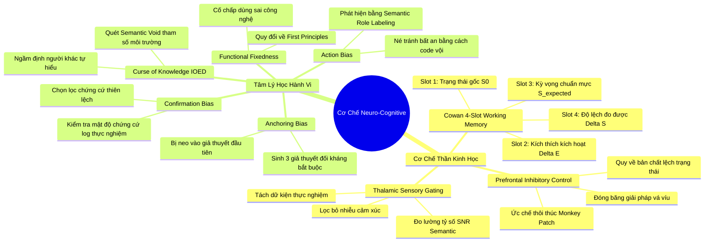
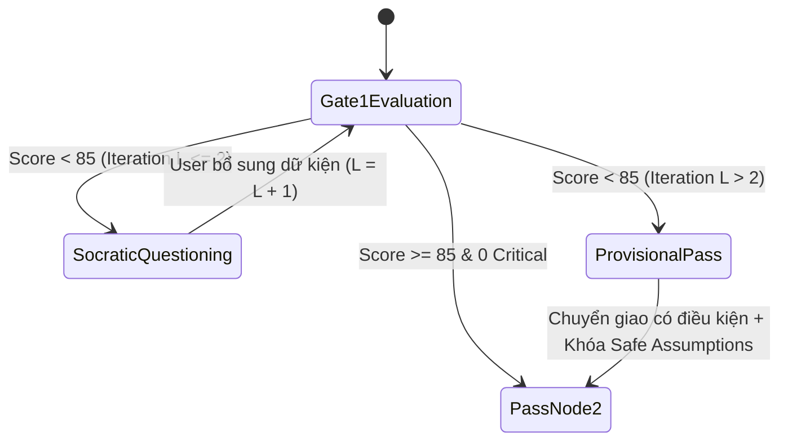
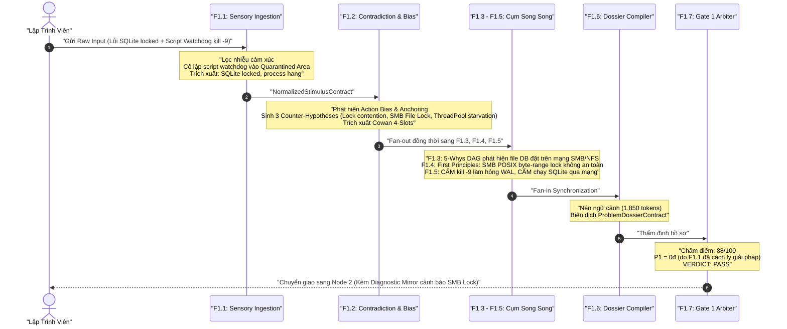

# Đặc Tả Kiến Trúc Phân Rã Sub-Nodes F1 Của Node 1: Problem Discovery & Gate 1 Engine (SPEC-NODE1-F1-001)

> **Mã đặc tả**: `SPEC-NODE1-F1-DECOMPOSITION-001`  
> **Phiên bản**: `2.1.0` | **Trạng thái**: `APPROVED & ACTIVE BASELINE`  
> **Thuộc Node F0**: [`node1-problem-discovery.md`](file:///home/stveve/Documents/workspace/Steve/Steves-Test-agent-agy/Docs/Diagrams/Didagram-AI-Agent_workflows/node1-problem-discovery.md) (`SPEC-NODE1-PROBLEM-DISCOVERY-001`)  
> **Thuộc Pipeline**: [`main.md`](file:///home/stveve/Documents/workspace/Steve/Steves-Test-agent-agy/Docs/Diagrams/Didagram-AI-Agent_workflows/main.md) (Mạng Nơ-ron AI Agent SDLC)  
> **Sơ đồ hạt nhân**: [`main.drawio`](file:///home/stveve/Documents/workspace/Steve/Steves-Test-agent-agy/Docs/Diagrams/Didagram-AI-Agent_workflows/main.drawio) (Vị trí: `n_input` ➔ `node1` ➔ `gate1`)  
> **Phương pháp luận**: Cognitive Neuro-Psychology, First Principles Decomposition, IIBA BABOK v3 & Adversarial Red-Team Verification.

---

## 1. Bối Cảnh & Thách Thức Bản Chất Của Đầu Vào (Problem Space)

### 1.1. Thực Trạng Kích Thích Thô (Raw Input Dilemma)
Giai đoạn khởi tạo bài toán (SDLC Inception) luôn là vùng có độ entropy cao nhất. Input gửi vào Node 1 phần lớn là văn bản tự nhiên thô (`Raw Stimulus`), chứa đầy các đặc tính gây nhiễu:
- **Tính mơ hồ & Đa nghĩa (Ambiguity)**: Mô tả chung chung (*"hệ thống bị chậm"*, *"cần tối ưu hóa API"*), thiếu hoàn toàn các biến số đo lường vật lý.
- **Mâu thuẫn nội tại (Internal Contradictions)**: Yêu cầu đồng thời các thuộc tính xung đột (ví dụ: đòi hỏi Zero-Latency nhưng chạy trên hạ tầng phân tán nhất quán nghiêm ngặt; đòi hỏi tính năng realtime nhưng dùng cron job).
- **Lẫn lộn Triệu chứng & Giải pháp vá víu (Symptom-Solution Conflation)**: Thay vì mô tả hiện tượng sai lệch, kỹ sư thường nhảy vội vào áp đặt giải pháp chắp vá (*"hãy viết script watchdog restart tiến trình khi bị đơ"*, *"hãy thêm cache Redis"*).
- **Khuyết thiếu Ngữ cảnh Sống còn (Critical Context Voids)**: Lời nguyền tri thức khiến người viết bỏ quên các tham số môi trường cốt lõi (OS Windows STA vs Linux Container, Concurrency Model, Database Isolation Level).

### 1.2. Sứ Mệnh Nhận Thức Của Chuỗi Nơ-ron F1
Node 1 (F0) không phải là một LLM prompt đơn lẻ, mà là một **Chuỗi Nơ-ron Nhận Thức Tự Trị Phân Rã (Autonomous Decomposed Cognitive Neural Mesh)** gồm 7 Sub-nodes F1:
- Giải mã tâm lý hành vi và khử nhiễu cảm xúc của người cung cấp input.
- Phát hiện và phân xử các mâu thuẫn đối kháng nội tại.
- Mổ xẻ bài toán đồng thời qua 5 lăng kính nhận thức và khai quật điểm mù ẩn số.
- Đóng gói hợp đồng dữ liệu chuẩn mực và kiểm duyệt qua chốt chặn Gate 1 cơ học trước khi chuyển giao cho Node 2 (Business Analysis).



---

## 2. Nền Tảng Khoa Học Thần Kinh & Tâm Lý Học Nhận Thức (Neuro-Cognitive Foundations)

Để không rơi vào cái bẫy mượn danh từ sinh học hoa mỹ (AI Slop), toàn bộ các nguyên lý Thần kinh học và Tâm lý học được ánh xạ trực tiếp thành các **cơ chế xử lý thông tin cơ học**:



### 2.1. Thalamic Sensory Gating (Cửa ngõ Thụ cảm Đồi thị)
- **Bản chất Thần kinh**: Đồi thị (Thalamus) là trạm trung chuyển cảm giác, có nhiệm vụ triệt tiêu các kích thích không liên quan trước khi tín hiệu đến vỏ não.
- **Cơ chế Cơ học trong Pipeline**:
  - Tách token thành 3 không gian ngữ nghĩa độc lập: $\mathcal{S}_{\text{fact}}$ (log, stack trace, status code), $\mathcal{S}_{\text{noise}}$ (than phiền, từ ngữ sốt ruột), $\mathcal{S}_{\text{func}}$ (hư từ).
  - Đo lường tỷ số Tín hiệu trên Nhiễu dựa trên Entropy thông tin:
    $$\text{SNR}_{\text{semantic}} = \frac{H(\mathcal{S}_{\text{fact}})}{H(\mathcal{S}_{\text{noise}}) + \epsilon}$$
  - Loại bỏ hoàn toàn các câu từ than phiền chủ quan, xuất xưởng chuỗi trần thuật sự kiện khách quan $S_{\text{clean}}$.

### 2.2. Prefrontal Inhibitory Control (Ức chế Phản xạ Vội vã)
- **Bản chất Thần kinh**: Vỏ não trước trán (PFC) thực hiện chức năng ức chế các thôi thúc hành động bản năng từ Hạch hạnh nhân (Amygdala) khi bị stress do lỗi hệ thống.
- **Cơ chế Cơ học trong Pipeline**:
  - Áp dụng luật bất biến **INV-01 (No Premature Solutioning)**.
  - Sử dụng Semantic Role Labeling (SRL) để nhận diện các mệnh đề hành động mang tính vá víu: `[Subject] + [Modal: cần/muốn] + [Action: viết script/restart/catch]`.
  - Đóng băng giải pháp này vào ngăn kiểm dịch `quarantined_solutions` với cờ `is_isolated_successfully = true`. Tuyệt đối không cho phép giải pháp này trở thành định nghĩa bài toán.

### 2.3. Cowan 4-Slot Working Memory Envelope
Chuẩn hóa mọi mô tả bài toán phức tạp thành phong bì dữ liệu 4 khe nhận thức bất biến (Cowan $4 \pm 1$ limit):
1. **Khe 1 ($S_0$)**: Trạng thái hệ thống trước biến cố (Current Known State).
2. **Khe 2 ($\Delta E$)**: Tác nhân kích hoạt (Triggering Stimulus / Event).
3. **Khe 3 ($S_{\text{expected}}$)**: Trạng thái kỳ vọng chuẩn mực (Expected Valid State).
4. **Khe 4 ($\Delta S = S_{\text{observed}} - S_{\text{expected}}$)**: Độ lệch bất thường đo lường được (Observed Deviation).

### 2.4. Khử Thiên Kiến Ngữ Nghĩa Đa Ngôn Ngữ (Code-switching En-Vi)
Không dùng regex từ khóa tiếng Việt đơn điệu dễ vỡ. Hệ thống sử dụng mô hình trích xuất ngữ nghĩa (Few-shot Constrained Decoding Pattern) để phát hiện và trung hòa 5 bẫy tâm lý:
1. **Action Bias**: Phát hiện thôi thúc viết code vá víu chữa cháy ➔ Chuyển thành câu hỏi truy vấn căn nguyên.
2. **Anchoring Bias**: Phát hiện sự cố chấp bám vào 1 đối tượng duy nhất (*"chắc chắn do HttpClient"*) ➔ Bắt buộc sinh **3 giả thuyết đối kháng độc lập (Dialectical Counter-Hypotheses)**.
3. **Confirmation Bias**: Phát hiện nhận định chủ quan thiếu căn cứ (*"code mình bình thường"*) ➔ Đo lường tỷ lệ chứng cứ `EmpiricalEvidenceDensity = LogProofCount / AssertionCount`. Nếu $< 0.3$, từ chối và yêu cầu dump/log.
4. **Curse of Knowledge**: Phát hiện các đại từ mơ hồ (*"nó bị lỗi"*, *"service đó bị chậm"*) ➔ Kích hoạt cờ `CRITICAL_CONTEXT_VOID`, yêu cầu điền khuyết 4 tham số: OS, Runtime, Concurrency rate, và Data Schema.
5. **Functional Fixedness**: Phát hiện sự khập khiễng giữa công nghệ được chọn và NFR (ví dụ: dùng Cron job giải bài toán Realtime) ➔ Quy về First Principles để đề xuất mẫu kiến trúc chuẩn.

---

## 3. Đặc Tả Chi Tiết 7 Sub-Nodes F1 (Architectural Blueprint)

### 3.1. F1.1 — Cognitive Sensory Ingestion & Lexical De-noiser
- **Mã phân hệ**: `F1.1` | **Loại**: Tuần tự Tiền trạm (Serial Ingestion).
- **Nhiệm vụ**:
  - Tiếp nhận input đa thức (text, logs, stack traces, cấu hình).
  - Phân tích cú pháp, lọc sạch nhiễu cảm xúc và đo lường $\text{SNR}_{\text{semantic}}$.
  - Nhận diện và cách ly giải pháp kỹ thuật do dev đề xuất sớm (`Premature Solution Quarantine`).
  - Chuẩn hóa thuật ngữ cục bộ, tiếng lóng, từ ngữ hỗn hợp Anh-Việt (Code-switching) thành các Khái niệm Chuẩn (Canonical Concepts).

```typescript
export interface RawStimulusPayload {
  session_id: string;
  raw_text: string;
  environment_hint?: string;
  attachments?: Array<{
    filename: string;
    mime_type: string;
    content: string;
  }>;
}

export interface NormalizedStimulusContract {
  stimulus_id: string;
  timestamp: string;
  snr_score: number;                     // Tỷ số Tín hiệu / Nhiễu (0.0 - 1.0)
  stripped_noise_tokens: string[];       // Token cảm xúc đã loại bỏ
  
  empirical_facts: {
    reported_symptoms: string[];         // Triệu chứng khách quan ghi nhận
    error_signatures: string[];          // Exception, mã lỗi, HTTP status
    environment_facts: string[];         // OS, CPU, RAM, framework nếu có
    code_artifacts: string[];            // File path, tên method, stack frame
  };
  
  isolated_premature_solution: {
    is_present: boolean;
    is_isolated_successfully: boolean;   // Luôn là true nếu bóc tách thành công
    quarantined_proposals: string[];     // Các hành động vá víu dev tự đề xuất
    underlying_intent: string;           // Mục đích sâu xa của giải pháp vá víu đó
  };
  
  canonical_entities: Array<{
    raw_term: string;
    canonical_concept: string;
    confidence: number;
  }>;
}
```

---

### 3.2. F1.2 — Dialectical Contradiction & Bias Arbiter
- **Mã phân hệ**: `F1.2` | **Loại**: Tuần tự Phân xử (Serial Arbiter).
- **Nhiệm vụ**:
  - Xây dựng **Ma trận Xung đột Nhận thức (Contradiction Detection Matrix - CDM)**: Đối chiếu từng cặp phát biểu trong input thô để tìm các mâu thuẫn đối kháng nội tại.
  - Kiểm tra đối kháng định luật: CAP Theorem (vừa đòi $P$ vừa đòi $C$ trên mạng rớt gói), PACELC, Amdahl's Law, Low-Latency vs Strong-Consistency.
  - Phân loại và định lượng 5 Thiên kiến Nhận thức (Cognitive Biases), đóng gói Cowan 4-Slot Envelope.
  - Đo lường Chỉ số Mơ hồ (`Ambiguity Index`).

```typescript
export interface ContradictionPair {
  statement_a: string;
  statement_b: string;
  conflict_nature: "SYSTEM_LAW_VIOLATION" | "DIRECT_LOGICAL_OPPOSITION" | "RESOURCE_IMPOSSIBILITY";
  law_referenced?: "CAP_THEOREM" | "AMDAHLS_LAW" | "PACELC" | "ACID_BASE_COLLISION";
  severity: "CRITICAL_DEADLOCK" | "NEGOTIABLE_TRADEOFF";
  dialectical_synthesis: string;         // Phương án giải quyết mâu thuẫn
}

export interface DialecticalBiasContract {
  arbitration_id: string;
  ambiguity_index: number;               // 0.0 (rõ tuyệt đối) -> 1.0 (cực kỳ mơ hồ)
  contradictions_detected: ContradictionPair[];
  
  cognitive_biases: {
    action_bias_severity: "NONE" | "LOW" | "HIGH";
    anchoring_target?: string;
    counter_hypotheses: string[];        // 3 giả thuyết đối lập độc lập bắt buộc
    confirmation_bias_warning: boolean;
    curse_of_knowledge_flags: string[];  // Các biến ngữ cảnh bị bỏ quên
  };
  
  cowan_4_slots: {
    slot1_initial_state: string;         // S0
    slot2_trigger_stimulus: string;      // ΔE
    slot3_expected_valid_state: string;  // S_expected
    slot4_observed_deviation: string;    // ΔS
  };
  
  is_ready_for_fanout: boolean;          // True nếu giải quyết được mâu thuẫn cấp 1
}
```

---

### 3.3. Cụm Giải Phẫu Nhận Thức Chạy Song Song (Fan-out Cluster: F1.3 - F1.5)
Sau khi `F1.2` chuẩn hóa dữ liệu, hệ thống kích hoạt **đồng thời 3 Worker** để giảm triệt để độ trễ (Latency $p95 \le 10-12\text{s}$):

```
                       [F1.2 Output]
                             │ (Fan-out)
             ┌───────────────┼───────────────┐
             ▼               ▼               ▼
          [F1.3]          [F1.4]          [F1.5]
       (5D Layering)   (Blindspots)   (Negative Space)
             │               │               │
             └───────────────┼───────────────┘
                             │ (Fan-in Barrier)
                             ▼
                       [F1.6 Compiler]
```

#### A. F1.3 — 5-Dimensional Cognitive Layering Engine
- **Nhiệm vụ**: Phân rã bài toán đồng thời qua 5 lăng kính nhận thức:
  1. *Domain Dimension*: Mục tiêu kinh doanh, đối tượng hưởng lợi, giá trị đo lường.
  2. *Platform & Runtime Dimension*: Ràng buộc OS (Linux epoll vs Windows STA/P-Invoke), Concurrency Model, Memory/CPU limits.
  3. *Causality Dimension (5-Whys DAG)*: Xây dựng đồ thị có hướng truy vết từ Hiện tượng bề mặt qua các trạng thái trung gian đến Căn nguyên gốc rễ.
  4. *Data & State Dimension*: Thực thể dữ liệu, ranh giới Aggregate, tính bất biến, ACID vs BASE.
  5. *Failure Blast Radius Dimension*: Kịch bản sập nguồn tồi tệ nhất, bán kính nổ (`LOCAL_THREAD` ➔ `DATA_CORRUPTION`).

#### B. F1.4 — First Principles & Blindspot Excavator
- **Nhiệm vụ**:
  - Phân tách bài toán về các chân lý nền tảng (First Principles Baseline): Băng thông vật lý, CPU cycles, Network RTT, Memory footprint.
  - Khai quật **Unknown-Unknowns (Điểm mù tuyệt đối)**: Các giả định ngầm dev chưa kiểm chứng.
  - **Zero-Hallucination Tagging**: Mọi suy đoán không có log/dữ kiện chứng minh đều bắt buộc gán nhãn `UNVERIFIED_ASSUMPTION` ($Confidence < 0.8$) hoặc `CRITICAL_CONTEXT_VOID` ($Urgency = BLOCKING$).

#### C. F1.5 — Negative Space & Anti-Pattern Grounder
- **Nhiệm vụ**:
  - Thiết lập **Không Gian Phủ Định (Negative Space Rules)**: Xác định tối thiểu **3-5 điều hệ thống CẤM LÀM** kèm lý do kỹ thuật và hậu quả.
  - Phân định ranh giới phạm vi nghiêm ngặt: `In-Scope` vs `Out-of-Scope`.
  - Đối chứng mẫu hình kiến trúc chuẩn (Architectural Patterns) và cảnh báo Anti-Patterns phổ biến (Watchdog Restart Trap, Busy Waiting, Distributed Monolith).

---

### 3.4. F1.6 — Problem Dossier Compiler & Token Optimizer
- **Mã phân hệ**: `F1.6` | **Loại**: Nơ-ron Đồng bộ Hội tụ (Fan-in Synchronization Barrier).
- **Nhiệm vụ**:
  - Thu thập kết quả từ 3 nhánh song song F1.3, F1.4, F1.5.
  - Giải quyết các xung đột chéo giữa các nhánh (nếu có).
  - Tối ưu hóa mật độ ngữ cảnh: Nén bản tóm tắt xuống **dưới 3,500 tokens**, loại bỏ hoàn toàn từ ngữ dư thừa để bảo tồn Context Window cho Node 2 và Node 3.
  - Đóng gói toàn bộ thành bản hợp đồng máy đọc được `ProblemDossierContract` và kiểm chứng JSON Schema với exit code 0.

```typescript
export interface ProblemDossierContract {
  dossier_id: string;                    // DOS-YYYYMMDD-UUID
  timestamp: string;
  source_hash: string;
  
  problem_definition: {
    clean_statement: string;             // Phát biểu thuần khiết (0% giải pháp ép buộc)
    symptom_observed: string;
    hypothesized_root_cause: string;
    causality_5whys_chain: Array<{
      level: number;
      why: string;
      deduced_cause: string;
    }>;
  };
  
  deconstructed_dimensions: {
    domain_impact: string;
    platform_constraints: string[];
    data_state_boundaries: string[];
    worst_case_blast_radius: "THREAD" | "PROCESS" | "NODE" | "CLUSTER" | "DATA_CORRUPTION";
  };
  
  cognitive_and_dialectical_state: {
    quarantined_user_solutions: string[];
    counter_hypotheses_explored: string[];
    resolved_contradictions: string[];
  };
  
  blindspots_and_assumptions: Array<{
    id: string;
    statement: string;
    status: "UNVERIFIED_ASSUMPTION" | "CRITICAL_CONTEXT_VOID";
    urgency: "BLOCKING" | "DEFERRED";
  }>;
  
  scope_boundaries: {
    in_scope: string[];
    out_of_scope: string[];
    negative_space_rules: Array<{        // Tối thiểu 3 điều cấm
      rule_id: string;
      forbidden_action: string;
      technical_rationale: string;
      violation_consequence: string;
    }>;
  };
}
```

---

### 3.5. F1.7 — Gate 1 Scoping Arbiter & Adaptive Socratic Mirror
- **Mã phân hệ**: `F1.7` | **Loại**: Chốt chặn Nhị phân & Phản hồi (Binary Quality Gate).
- **Nhiệm vụ**:
  - Thẩm định cơ học bản hợp đồng `ProblemDossierContract` theo thang điểm 100 và 5 Hard Invariants.
  - Phân luồng nhị phân: `PASS` ➔ Chuyển giao sang Node 2; `FAIL` ➔ Kích hoạt Gương Phản Chiếu Socratic (Adaptive Socratic Diagnostic Mirror).

---

## 4. Cơ Chế Thẩm Định Gate 1 Cơ Học & Chống Bế Tắc

### 4.1. Thang Điểm Cơ Học (Scoping Score Formula)
$$S_{\text{total}} = S_{\text{causality}} (25đ) + S_{\text{negative}} (20đ) + S_{\text{platform}} (20đ) + S_{\text{blindspot}} (20đ) + S_{\text{contradiction}} (15đ) - \sum P_{\text{penalties}}$$

```yaml
gate1_scoring_breakdown:
  S_causality:
    max_points: 25
    criteria: "5-Whys DAG phân tách rạch ròi Triệu chứng và Căn nguyên gốc rễ."
  S_negative:
    max_points: 20
    criteria: "Thiết lập tối thiểu 3 quy tắc CẤM TUYỆT ĐỐI kèm hệ quả kỹ thuật."
  S_platform:
    max_points: 20
    criteria: "Xác định rõ ràng ràng buộc OS, Concurrency model, CPU/Memory limits."
  S_blindspot:
    max_points: 20
    criteria: "Liệt kê các điểm mù và gắn nhãn Zero-Hallucination Tagging nghiêm ngặt."
  S_contradiction:
    max_points: 15
    criteria: "Giải quyết triệt để các mâu thuẫn nội tại phát hiện qua ma trận CDM."

penalties_and_deductions:
  P1_Premature_Solution_Leakage:
    points: -30
    condition: "Hồ sơ Dossier để lọt giải pháp kỹ thuật chưa kiểm chứng vào định nghĩa bài toán cốt lõi (chỉ phạt khi cờ premature_solution_status == 'UNCONTROLLED_LEAK')."
    exemption: "KHÔNG PHẠT nếu giải pháp của dev đã được F1.1/F1.2 nhận diện và cách ly thành công vào quarantined_solutions."
  P2_Unresolved_Blocking_Void:
    points: -25
    condition: "Tồn tại ít nhất 1 khuyết thiếu ngữ cảnh sống còn (CRITICAL_CONTEXT_VOID) ở mức độ BLOCKING."
  P3_High_Ambiguity_Residual:
    points: -15
    condition: "Chỉ số mơ hồ sau xử lý ambiguity_index > 0.4."
```

### 4.2. 5 Hard Invariants Của Gate 1 (Zero-Tolerance Gates)
1. **$S_{\text{total}} \ge 85 / 100$**.
2. **`critical_flaws.length === 0`**.
3. **100% Phân định Căn nguyên**: Triệu chứng bề mặt (`symptom_observed`) và Căn nguyên giả thuyết (`hypothesized_root_cause`) không được trùng ngữ nghĩa.
4. **Không Gian Phủ Định Khép Kín**: `negative_space_rules.length >= 3`.
5. **Zero Blocking Voids**: Không còn `CRITICAL_CONTEXT_VOID` mức `BLOCKING` chưa được giải quyết hoặc chưa được lập giả thuyết phòng thủ.

### 4.3. Cơ Chế Chống Bế Tắc: Adaptive Socratic Mirror & Provisional Pass
Để triệt tiêu bẫy lặp vô hạn (Socratic Ping-Pong Deadlock) khi người dùng không đủ thông tin trả lời:



1. **Giới hạn chu kỳ cứng**: `MAX_SOCRATIC_ITERATIONS = 2`.
2. **Cấu trúc Gương Phản Chiếu Socratic (Khi $L \le 2$)**:
   - *Tóm tắt điều hệ thống đã hiểu*: Trích xuất $S_0$ và $\Delta S$ khách quan.
   - *Chỉ ra điểm mù/nghịch lý*: Cảnh báo rủi ro sập nguồn nghiêm trọng nếu làm theo giải pháp chắp vá.
   - *Bộ câu hỏi lựa chọn định hướng (Multiple-Choice)*: Cung cấp 3-4 phương án kỹ thuật khả dĩ kèm phân tích đánh đổi để dev bấm chọn thay vì phải tự gõ văn bản phức tạp.
3. **Chế độ Chuyển giao Có Điều kiện (Provisional Pass khi $L > 2$)**:
   - Nếu sau 2 vòng hỏi dev vẫn không cung cấp được dữ kiện sống còn:
   - Hệ thống tự động kích hoạt **Bộ Giả Định Phòng Thủ An Toàn Nhất (Safe Default Assumptions)**.
   - Gắn cờ cảnh báo `HIGH_RISK_ASSUMPTIONS_CONTAINED` vào hồ sơ `ProblemDossierContract`.
   - Phê duyệt `PROVISIONAL_PASS` chuyển giao sang Node 2 để tiếp tục phân tích, đồng thời gửi thông báo viễn trắc tới Tech Lead/Architect qua kênh Lateral Channel. Không làm tắc nghẽn toàn bộ SDLC pipeline.

---

## 5. Ma Trận 8 Chiều Kích Ẩn Số (Unknown-Unknowns Mining Matrix)

Tài liệu thiết kế trước đây chỉ nhìn nhận điểm mù ở mức sơ sài. Dưới đây là ma trận **8 chiều kích ẩn số toàn diện** mà Node 1 bắt buộc phải rà soát:

| Chiều Kích Ẩn Số | Bản Chất Nguy Cơ Kỹ Thuật | Kịch Bản Thảm Họa (Disaster Scenario) | Cơ Chế Khắc Phục Của Node 1 |
| :--- | :--- | :--- | :--- |
| **1. Temporal & Lifecycle Mismatch** | Sự bất đối xứng tốc độ xử lý giữa Producer và Consumer; trôi lệch đồng hồ (Clock Drift). | Producer đẩy 50k msg/s, Consumer nuốt 1k msg/s ➔ Tràn RAM OOM; Distributed Lock hết hạn trước khi task chạy xong. | F1.3 Data/State & F1.4 ép buộc xác định giới hạn Ingestion Rate và cơ chế Backpressure. |
| **2. Concurrency Blast Radius** | Thundering Herd, Cache Stampede, Threadpool Starvation lan truyền gián tiếp. | 1 key cache triệu truy cập hết hạn ➔ 10k request đâm thẳng DB làm sập Database cluster trong 3 giây. | F1.3 Failure Dimension mô phỏng kịch bản sập nguồn dây chuyền; F1.5 cấm cache-aside thiếu mutex lock. |
| **3. Multi-Tenant Contamination** | Rò rỉ cách ly dữ liệu giữa các khách hàng; hiệu ứng Noisy Neighbor. | 1 Tenant chạy báo cáo nặng chiếm 99% CPU/IOPS ➔ Toàn bộ 999 Tenants khác bị timeout dịch vụ. | F1.4 bóc tách ranh giới Tenant Boundary; F1.5 ép Negative Rule về cô lập tài nguyên và phân vùng khóa. |
| **4. Economic & Compute Throttling** | Cạn kiệt IOPS credit (Cloud disk gp2/gp3); bùng nổ token LLM context window; cước phí Data Egress. | Đĩa cứng AWS cạn burst credit ➔ Latency ghi tăng từ 1ms lên 3000ms ➔ Toàn bộ API gateways đồng loạt 504 Gateway Timeout. | F1.4 đưa ràng buộc Cloud Quota vào Platform Dimension; F1.6 nén ngân sách Token $\le 3,500$. |
| **5. Reversibility & Rollback Asymmetry** | Di cư dữ liệu một chiều mang tính phá hủy (Destructive Schema Migration); Split-Brain. | Đổi tên cột DB trực tiếp trên production ➔ Code cũ crash ngay lập tức, rollback code cũng không thể chạy lại. | F1.5 Negative Space: CẤM triển khai migration phá vỡ tương thích ngược (bắt buộc dùng Expand-and-Contract pattern). |
| **6. Regulatory & PII Contamination** | Dữ liệu định danh người dùng lọt vào log/prompt; vi phạm chủ quyền dữ liệu (Sovereignty). | Tên, CCCD và số thẻ của khách hàng bị tống thẳng vào context prompt gửi sang LLM cloud bên thứ ba ➔ Vi phạm GDPR/Nghị định 13. | F1.1 Sensory Gating bóc tách và che mặt nạ (Masking) toàn bộ token định danh nhạy cảm. |
| **7. Dark Debt & Silent Degradation** | Lỗi tác vụ ngầm không được observe (`_ = Task.Run(...)`); tin nhắn độc (Poison Pill); sai số làm tròn tiền tệ. | Message lỗi rớt vào Dead Letter Queue bị nuốt âm thầm, kế toán lệch 0.001 cent/giao dịch tích lũy thành hàng triệu USD sau 1 năm. | F1.3 Failure Dimension & Inv-02 cấm empty catch block; bắt buộc thiết lập Dead-Letter Alerting. |
| **8. Human Cognitive Anchoring** | Hội chứng Not-Invented-Here; cố chấp vá víu một module tồi vì tiếc công (Sunk Cost Fallacy). | Kỹ sư mất 3 tuần viết tool cron/watchdog để vá lỗi memory leak thay vì sửa 1 dòng code giải phóng tài nguyên. | F1.2 cô lập giải pháp chắp vá; sinh 3 giả thuyết đối kháng bắt buộc đưa dev về First Principles. |

---

## 6. Kịch Bản Walkthrough Thực Chiến: SQLite Over SMB/NFS Trap

### 6.1. Input Thô Của Lập Trình Viên (Raw Stimulus)
> *"Hệ thống service xử lý giao dịch thỉnh thoảng bị lỗi 'database is locked' và tiến trình bị đơ cứng. Mình nghĩ là do SQLite bị nghẽn ghi. Mình định viết một script PowerShell watchdog chạy nền, cứ 30 giây check nếu thấy tiến trình treo thì kill -9 tiến trình cũ rồi start lại service."*

### 6.2. Diễn Tiến Xử Lý Qua 7 Sub-Nodes F1



1. **Qua F1.1**:
   - Lọc bỏ cảm xúc chủ quan.
   - Bóc tách giải pháp: Đưa đề xuất *"viết script PowerShell watchdog kill -9"* vào diện kiểm dịch `quarantined_proposals` với `is_isolated_successfully = true`.
   - Giữ lại sự kiện thực nghiệm: `reported_symptoms: ["database is locked", "process hang"]`, `assumed_db: "SQLite"`.
2. **Qua F1.2**:
   - Ghi nhận `Action Bias` (thôi thúc kill tiến trình) và `Anchoring Bias` (đinh ninh do SQLite nghẽn ghi).
   - Tự động sinh **3 Giả thuyết Đối kháng**:
     - $H_1$: File SQLite đang được đặt trên Network Share (NFS/SMB) có cơ chế khóa byte-range không tương thích.
     - $H_2$: Có transaction dạng `EXCLUSIVE` mở ra nhưng không commit do exception unhandled ở luồng phụ.
     - $H_3$: ThreadPool bị cạn kiệt do sync-over-async block trên I/O.
   - Cowan 4-Slots: $S_0$ (Service chạy ghi DB) ➔ $\Delta E$ (Tăng tải giao dịch) ➔ $S_{\text{expected}}$ (Giao dịch ghi thành công) ➔ $\Delta S$ (Lỗi `database is locked` và process treo).
3. **Qua Cụm Song Song (F1.3, F1.4, F1.5)**:
   - **F1.3 (5-Whys DAG)**:
     - *Tại sao locked?* Do OS lock file không giải phóng.
     - *Tại sao OS không giải phóng?* Do client giữ lock qua giao thức mạng SMB.
     - *Tại sao chạy qua mạng?* Do dev mount thư mục chung để 2 máy cùng đọc file SQLite!
   - **F1.4 (First Principles)**: SQLite được thiết kế theo nguyên lý in-process direct local I/O. Chạy SQLite qua mạng chia sẻ (NFS/SMB) là vi phạm trực tiếp định luật toàn vẹn POSIX lock, dẫn đến deadlock và hỏng dữ liệu.
   - **F1.5 (Negative Space Rules)**:
     - *CẤM 1*: CẤM chạy SQLite database trên ổ đĩa mạng chia sẻ (NFS/SMB/CIFS).
     - *CẤM 2*: CẤM sử dụng cơ chế kill -9 watchdog tự động vì sẽ làm hỏng file WAL (`-wal` journal) đang ghi dở.
     - *CẤM 3*: CẤM nuốt ngoại lệ locking bằng retry loop vô hạn không có exponential backoff.
4. **Qua F1.6 & F1.7**:
   - Biên dịch hồ sơ `DOS-20260915-SQLITE01` (1,850 tokens).
   - Chấm điểm Gate 1: $S_{\text{causality}} = 25$, $S_{\text{negative}} = 20$, $S_{\text{platform}} = 20$, $S_{\text{blindspot}} = 15$, $S_{\text{contradiction}} = 13 \➔ S_{\text{total}} = 93/100$.
   - Vì giải pháp watchdog của dev đã được cách ly thành công nên **$P_1 = 0$ điểm phạt**.
   - **Kết luận**: `PASS` chuyển giao sang Node 2.
   - **Kết quả kỳ diệu**: Lập trình viên lập tức chuyển SQLite về ổ đĩa cục bộ (Local SSD) hoặc chuyển sang PostgreSQL Client-Server, giải quyết triệt để lỗi locking vĩnh viễn trong 15 phút, cứu hệ thống thoát khỏi thảm họa hỏng cơ sở dữ liệu hàng loạt do watchdog kill -9 gây ra!

---

## 7. Ma Trận Kỹ Thuật Tổng Hợp Các Sub-Nodes F1

| Mã Sub-Node | Tên Phân Hệ | Chế Độ Thực Thi | Input Contract | Output Contract | Kỹ Thuật / Giải Thuật Cốt Lõi | SLA Latency |
| :--- | :--- | :---: | :--- | :--- | :--- | :---: |
| **F1.1** | Cognitive Sensory Ingestion & Lexical De-noiser | Tuần tự | `RawStimulusPayload` | `NormalizedStimulusContract` | SRL Extraction, Semantic SNR, Code-switching Normalizer, Solution Isolation | $\le 2.0\text{s}$ |
| **F1.2** | Dialectical Contradiction & Bias Arbiter | Tuần tự | `NormalizedStimulusContract` | `DialecticalBiasContract` | Contradiction Detection Matrix (CDM), Trilemma Checking, Cowan 4-Slot Chunking | $\le 2.0\text{s}$ |
| **F1.3** | 5-Dimensional Cognitive Layering Engine | Song song | `DialecticalBiasContract` | `Layering5DContract` | 5-Whys DAG Traversal, Blast Radius Projection, State Boundary Mapping | $\le 3.5\text{s}$ |
| **F1.4** | First Principles & Blindspot Excavator | Song song | `DialecticalBiasContract` | `ExcavatedBlindspotsContract` | First Principles Breakdown, Zero-Hallucination Tagging, 8-D Unknowns Mining | $\le 3.0\text{s}$ |
| **F1.5** | Negative Space & Anti-Pattern Grounder | Song song | `DialecticalBiasContract` | `NegativeSpaceContract` | Negative Space Inversion, Anti-Pattern Fingerprinting, Pattern Grounding | $\le 2.5\text{s}$ |
| **F1.6** | Problem Dossier Compiler & Token Optimizer | Hội tụ (Fan-in) | Hợp nhất F1.3 + F1.4 + F1.5 | `ProblemDossierContract` | Context Density Compression, JSON AST Schema Verification | $\le 1.5\text{s}$ |
| **F1.7** | Gate 1 Scoping Arbiter & Adaptive Socratic Mirror | Chốt chặn | `ProblemDossierContract` | `Gate1VerdictContract` | 100-Point Formula, 5 Hard Invariants, Socratic Mirror, Provisional Pass | $\le 1.0\text{s}$ |

*Tổng độ trễ tích lũy toàn trình của Node 1*: $\text{Max}(F1.3, F1.4, F1.5) + F1.1 + F1.2 + F1.6 + F1.7 \approx 3.5 + 2.0 + 2.0 + 1.5 + 1.0 = \mathbf{10.0\text{s}}$ (Thỏa mãn nghiêm ngặt chỉ tiêu **$p95 \le 15\text{s}$** của NFR-02).

---

## 8. Kết Luận & Quy Tắc Chuyển Giao Sang Node 2

1. **Nguyên Tắc Bất Biến**:
   - Không có bất kỳ tác vụ thiết kế kiến trúc (Node 3) hay sinh mã (Node 5) nào được phép khởi động khi chưa có bản `ProblemDossierContract` đạt chuẩn từ Node 1.
   - Node 2 chỉ tiếp nhận bản hợp đồng dữ liệu đã được làm sạch, không phải tiếp nhận văn bản thô đầy cảm xúc và thiên kiến của dev.
2. **Kênh Phản Hồi Ngược (Backpropagation Channel)**:
   - Nếu trong quá trình phân tích nghiệp vụ, Node 2 phát hiện ra các mâu thuẫn domain mới chưa được bóc tách, tín hiệu lỗi sẽ được phát ngược lại Node 1 qua `Backprop Synapse` để tái thẩm định (tối đa 2 chu kỳ).
3. **Tính Toàn Vẹn Tài Liệu**:
   - Mọi thay đổi về cấu trúc trường trong `ProblemDossierContract` bắt buộc phải kích hoạt quy trình cập nhật đồng bộ sang Node 2 (`SPEC-AI-PIPELINE-001`).
