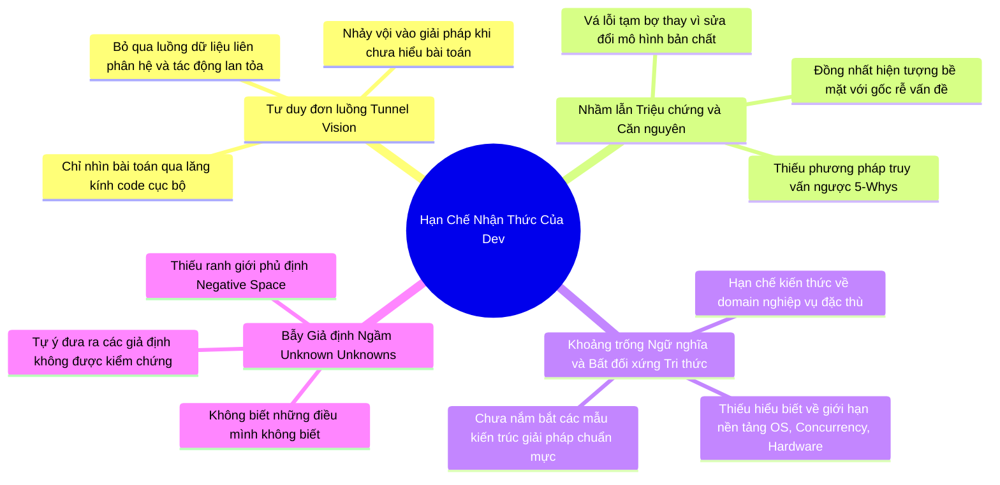
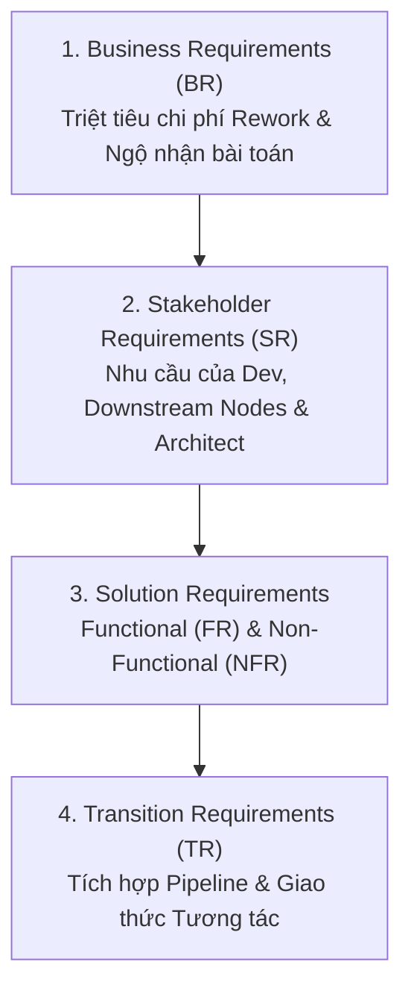
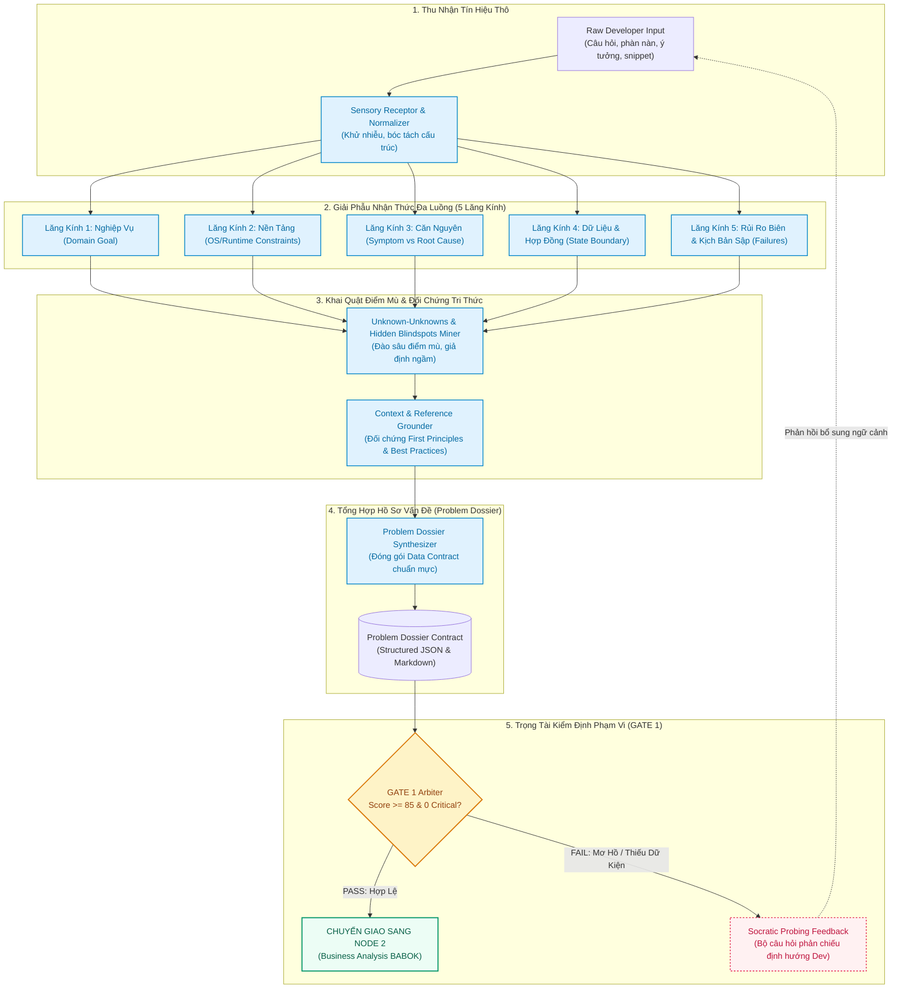

# Đặc Tả Kiến Trúc & Bóc Tách Nghiệp Vụ Node 1: Problem Discovery & Gate 1 (SPEC-NODE1-001)

> **Mã đặc tả**: `SPEC-NODE1-PROBLEM-DISCOVERY-001`  
> **Phiên bản**: `1.1.0` | **Trạng thái**: `APPROVED & ACTIVE BASELINE`  
> **Cấp thẩm quyền**: IIBA BABOK Guide v3 & Cognitive Steering Engine (`AGENTS.md`)  
> **Thuộc Pipeline**: [`SPEC-AI-PIPELINE-001`](file:///home/stveve/Documents/workspace/Steve/Steves-Test-agent-agy/Docs/Diagrams/Didagram-AI-Agent_workflows/main.md) (Mạng Nơ-ron AI Agent SDLC)  
> **Sơ đồ hạt nhân**: [`main.drawio`](file:///home/stveve/Documents/workspace/Steve/Steves-Test-agent-agy/Docs/Diagrams/Didagram-AI-Agent_workflows/main.drawio) (Vị trí: `n_input` ➔ `node1` ➔ `gate1`)  
> **Đặc tả Phân rã Sub-Nodes F1**: [`node1-f1-decomposition-architecture.md`](file:///home/stveve/Documents/workspace/Steve/Steves-Test-agent-agy/Docs/Diagrams/Didagram-AI-Agent_workflows/node1-f1-decomposition-architecture.md) (`SPEC-NODE1-F1-DECOMPOSITION-001`)

---

## 1. Bản Chất Vấn Đề & Rào Cản Nhận Thức Của Kỹ Sư Phần Mềm (Problem Space)

### 1.1. Thực Trạng & Điểm Nghẽn Tâm Lý - Kỹ Thuật
Trong quá trình xây dựng phần mềm phức tạp, hệ thống đòi hỏi tính logic, cấu trúc và sự chặt chẽ ở cấp độ tối đa. Tuy nhiên, nút thắt cổ chai lớn nhất không nằm ở công cụ hay cú pháp code, mà nằm ở **sự hạn chế nhận thức (Cognitive Bottleneck) của người lập trình**:



1. **Tư duy Logic Đơn Luồng (Single-Threaded Cognitive Tunnel)**:
   - Kỹ sư thường có xu hướng bám chặt vào một luồng suy nghĩ duy nhất: *"Nhận dữ liệu A ➔ Viết hàm B ➔ Lưu vào bảng C"*.
   - Thiếu khả năng hình dung đa luồng về: Tác động tài nguyên, tính đồng thời (concurrency race conditions), các biến thể trạng thái phân tán, và hành vi của người dùng phi kỹ thuật.
2. **Nhầm lẫn giữa Triệu chứng (Symptom) và Căn nguyên gốc rễ (Root Cause)**:
   - Khi gặp sự cố hoặc yêu cầu mới, dev thường mô tả: *"API phản hồi chậm, cần thêm Redis cache"*, hoặc *"Dữ liệu 2 bảng lệch nhau, cần viết script đồng bộ chạy cron 1 phút/lần"*.
   - Bản chất: Redis cache hay cron job chỉ là **giải pháp vá víu triệu chứng**. Nguyên nhân thực sự có thể là thiếu Index cơ sở dữ liệu, lỗi thiết kế transaction ranh giới Domain, hoặc lỗi kiến trúc Eventual Consistency.
3. **Hạn chế Ngữ cảnh & Bất Đối Xứng Tri thức (Contextual & Domain Asymmetry)**:
   - Lập trình viên thường bị cô lập trong kho mã nguồn hiện tại, thiếu tầm nhìn về toàn bộ hệ sinh thái kinh doanh, các chuẩn mực tuân thủ (compliance), các ràng buộc vật lý (IOPS, memory bandwidth, network latency), và các giải pháp đã được chứng minh trong ngành.
4. **Bẫy Giả Định Ngầm (Unknown Unknowns - Điểm Mù Tuyệt Đối)**:
   - Lập trình viên không nhận thức được những điểm bị ẩn mà bản thân họ chưa từng nghĩ tới (ví dụ: Idempotency khi mạng chập chờn, kịch bản Failover DB, GDPR/Data Privacy, hay Windows STA Threading).

---

## 2. Sứ Mệnh Nhận Thức & 4 Tín Hiệu Chiều Sâu (S1 - S4) Của Node 1

**NODE 1** đóng vai trò là **Cơ quan Thụ cảm Cảm giác (Sensory Receptor)** và **Bộ Lọc Nhiễu Nhận Thức (Cognitive De-noising & Deconstruction Engine)** đứng ở tuyến đầu của toàn bộ pipeline SDLC:

```yaml
node1_cognitive_mandate:
  role: "Chuyển hóa kích thích thô, đơn luồng, thiên kiến của dev thành Bộ Hồ Sơ Phân Tích Phạm Vi Bài Toán (Problem Dossier) đa chiều, chính xác và được kiểm chứng."
  core_transformation: "Từ 'Developer nói giải pháp họ muốn làm' ➔ Đến 'Hệ thống hiểu bản chất bài toán thực sự cần giải quyết là gì'."
```

### 4 Tín Hiệu Tư Duy Bắt Buộc (Signals S1 – S4)
1. **S1 — Negation Density (Negative Space - Không Gian Phủ Định)**:
   - Thiết lập ngay lập tức ranh giới cấm kỵ: Xác định tối thiểu 3-5 điều bài toán này **TUYỆT ĐỐI KHÔNG GIẢI QUYẾT** hoặc hệ thống **CẤM LÀM**.
   - *Hậu quả nếu vi phạm*: Phình to phạm vi (Scope Creep), làm loãng mục tiêu cốt lõi, phá vỡ cấu trúc phần mềm hiện hữu.
2. **S2 — Reverse Probing (Truy Vấn Ngược & Kịch Bản Sập Nguồn)**:
   - Giả định kịch bản tồi tệ nhất: *"Nếu hiểu sai yêu cầu này và triển khai theo ý dev, điều gì sẽ nổ tung ở production? Điểm nghẽn rò rỉ tài nguyên, xung đột lock ở đâu?"*
   - Truy vấn ngược từ hiện tượng về 5 cấp độ "Tại sao" (5-Whys) để chạm tới bản chất vật lý / nghiệp vụ.
3. **S3 — Multi-Stakeholder Analysis (Tác Động Đa Chiều 4 Góc Nhìn)**:
   - *Góc nhìn Người dùng cuối / Nghiệp vụ*: Vấn đề này làm mất bao nhiêu tiền/thời gian? Có tạo ra giá trị đo lường được không?
   - *Góc nhìn Lập trình viên (Requester)*: Gỡ bỏ định kiến đơn luồng, cảnh báo các bẫy kỹ thuật dev chưa nhận ra.
   - *Góc nhìn Kiến trúc sư (Node 3)*: Xác định các ràng buộc hệ thống (System Boundaries, Coupling, Clean Layering).
   - *Góc nhìn Vận hành / QA (Node 5 & 6)*: Làm thế nào để kiểm chứng bài toán bằng máy móc? Kịch bản giám sát lỗi ra sao?
4. **S4 — Constraint Anchoring (Neo Ràng Buộc Vật Lý & Nền Tảng)**:
   - Neo giải pháp vào thực tế: Hệ điều hành (Linux epoll / Windows STA / P-Invoke), giới hạn bộ nhớ, network latency, token budget của LLM context window.

---

## 3. Không Gian Phủ Định & Kỷ Luật Thép Của Node 1 (Hard Invariants)

<guardrails>

```yaml
node1_hard_invariants:
  INV-01_No_Premature_Solutioning:
    mandate: "CẤM TUYỆT ĐỐI đưa giải pháp kỹ thuật cụ thể (viết code, tạo table, chọn framework/thư viện) vào giai đoạn này."
    consequence: "Vi phạm sẽ biến Node 1 thành cái bẫy thực thi mù quáng, phá vỡ vai trò phân tích bài toán."

  INV-02_No_Symptom_Acceptance:
    mandate: "CẤM chấp nhận triệu chứng bề mặt làm định nghĩa vấn đề."
    consequence: "Bắt buộc phải bóc tách thành ít nhất 2 trường riêng biệt: 'Triệu Chứng Bề Mặt (Symptom)' và 'Căn Nguyên Giả Thuyết (Hypothesized Root Cause)'."

  INV-03_Anti_Semantic_Void:
    mandate: "CẤM tự ý suy diễn hoặc bịa đặt thông tin khi đề bài của lập trình viên thiếu dữ kiện cốt lõi."
    consequence: "Phải đánh dấu rõ ràng là 'GIẢ ĐỊNH CHƯA XÁC MINH (UNVERIFIED_ASSUMPTION)' và kích hoạt câu hỏi làm rõ qua Gate 1."

  INV-04_Multi_Dimensional_Enforcement:
    mandate: "CẤM xuất hồ sơ phân tích chỉ dựa trên 1 lăng kính kỹ thuật đơn lẻ."
    consequence: "Bắt buộc phải đi qua đủ 5 lăng kính phân rã: Domain, Platform/Tech, Causality, Data State, và Edge/Failure."

  INV-05_Binary_Gate_Strictness:
    mandate: "CẤM phê duyệt chuyển giao sang Node 2 nếu Gate 1 chưa đạt điểm chuẩn cơ học (Score >= 85/100, 0 Critical Flaw)."
    consequence: "Ngăn chặn triệt để hiện tượng 'Garbage In - Garbage Out' lan truyền vào pha phân tích nghiệp vụ và thiết kế kiến trúc."
```

</guardrails>

---

## 4. Bóc Tách Nghiệp Vụ Chuẩn IIBA BABOK Cho Node 1 (`ba-requirements-analyzer`)

Tuân thủ phương pháp luận bóc tách 4 tầng BABOK, các yêu cầu của **NODE 1** được phân loại như sau:



### 4.1. Business Requirements (BR) — Mục Tiêu Chiến Lược Của Hệ Thống
- **BR-01 (Zero-Defect Inception)**: Triệt tiêu tối thiểu **80% chi phí lãng phí tái thiết kế (Rework)** trong SDLC bằng cách phát hiện và chặn đứng 100% các sai lệch bài toán, thiên kiến lập trình và yêu cầu mơ hồ ngay tại cửa ngõ tiếp nhận.
- **BR-02 (Cognitive Augmentation ROI)**: Nâng cao năng lực giải quyết bài toán của kỹ sư bằng cách tự động cung cấp góc nhìn đa chiều, các phương án đối chứng và các điểm mù kỹ thuật trong vòng dưới 15 giây.

### 4.2. Stakeholder Requirements (SR) — Nhu Cầu Bên Liên Quan
- **SR-01 (Kỹ sư Lập trình - Developer)**:
  - *Là một*: Lập trình viên đang gặp bài toán khó hoặc có ý tưởng tính năng.
  - *Tôi cần*: Hệ thống tiếp nhận input tự nhiên, vạch rõ những điểm tôi chưa nghĩ tới, phân biệt rõ điều gì là triệu chứng, điều gì là gốc rễ và chỉ ra các rủi ro tiềm ẩn.
  - *Để mà*: Tôi không lãng phí hàng tuần viết code cho một bài toán sai hoặc một giải pháp chắp vá.
- **SR-02 (Node 2 - Business Analyst Agent)**:
  - *Là một*: Agent phân tích nghiệp vụ chuyên sâu ở pha kế tiếp.
  - *Tôi cần*: Nhận một bản `Problem Dossier Contract` sạch nhiễu, có ranh giới phạm vi (In-Scope vs Out-of-Scope vs Negative Space) chuẩn hóa.
  - *Để mà*: Tôi có thể lập tức xây dựng ma trận BABOK 4 tầng và RTM mà không phải đoán mò ngữ cảnh.
- **SR-03 (Lead Architect & Product Owner)**:
  - *Là*: Người bảo trợ kỹ thuật và sản phẩm.
  - *Tôi cần*: Chốt chặn Gate 1 từ chối mọi yêu cầu vi phạm ranh giới hoặc không rõ ràng trước khi tiêu tốn tài nguyên thiết kế (Node 3) và sinh mã (Node 5).

### 4.3. Solution Requirements — Functional Requirements (FR)

| Mã FR | Tên Chức Năng | Đặc Tả Hành Vi Của Hệ Thống | Kết Quả Đầu Ra |
| :--- | :--- | :--- | :--- |
| **FR-01** | Raw Ingestion & Noise Filtering | Tiếp nhận text/prompt thô từ Dev, bóc tách các yếu tố cảm xúc, từ ngữ viết tắt, lọc sạch nhiễu cú pháp và chuẩn hóa thành chuỗi dữ liệu nhận thức. | `NormalizedStimulus` |
| **FR-02** | 5-Dimensional Cognitive Layering | Phân rã bài toán đồng thời qua 5 lăng kính nhận thức: (1) Domain/Business, (2) Platform/Runtime, (3) Causality (Nguyên nhân vs Triệu chứng), (4) Data/State, (5) Failure Modes. | `DeconstructedLayers` |
| **FR-03** | Unknown-Unknowns Mining | Sử dụng phương pháp First Principles & 5-Whys để rà soát các giả định ngầm, các rủi ro biên, các điểm mù mà input chưa cung cấp. | `IdentifiedBlindspots` |
| **FR-04** | Context Enrichment & Dialectical Probing | Đối chứng với các mẫu hình kiến trúc chuẩn (Architectural Patterns) và tài liệu tham chiếu để lập luận phản chiếu, đề xuất các khía cạnh bổ trợ. | `EnrichedContext` |
| **FR-05** | Structured Problem Dossier Synthesis | Đóng gói toàn bộ kết quả phân tích thành bản hợp đồng dữ liệu chuẩn hóa `ProblemDossierContract`. | `ProblemDossier` |
| **FR-06** | Gate 1 Scoping Arbiter & Adaptive Feedback | Chấm điểm chất lượng hồ sơ theo thang 100. Nếu $\ge 85$: `PASS` chuyển sang Node 2. Nếu $< 85$: `FAIL`, sinh bản câu hỏi Socratic chẩn đoán gửi lại Dev. | `Gate1Decision` |

### 4.4. Solution Requirements — Non-Functional Requirements (NFR - SMART Metrics)
- **NFR-01 (Contract Rigor)**: 100% dữ liệu xuất từ Node 1 phải tuân thủ nghiêm ngặt JSON Schema của `ProblemDossierContract` với exit code 0 khi kiểm chứng cơ học.
- **NFR-02 (Processing Latency)**: Thời gian xử lý phân tách 5 chiều và tổng hợp hồ sơ Node 1 đạt $p95 \le 15\text{s}$.
- **NFR-03 (Token Economy & Context Density)**: Bản tóm tắt `ProblemDossier` chuyển giao cho Node 2 không vượt quá **3,500 tokens**, loại bỏ 100% từ ngữ thừa thãi để bảo tồn Context Window cho pipeline downstream.
- **NFR-04 (Negative Space Completeness)**: 100% hồ sơ bàn giao bắt buộc phải chứa tối thiểu **3 điều CẤM (Negative Rules)** với lý do kỹ thuật/nghiệp vụ rõ ràng.
- **NFR-05 (Zero Hallucination Tagging)**: Mọi thông tin suy đoán về domain không có trong prompt thô phải được gắn cờ `UNVERIFIED_ASSUMPTION` kèm chỉ số tin cậy (Confidence Score $< 0.8$).

### 4.5. Transition Requirements (TR)
- **TR-01 (Pipeline Interoperability)**: Định dạng dữ liệu của Node 1 phải tương thích trực tiếp với đầu vào của Node 2 (`SPEC-AI-PIPELINE-001`).
- **TR-02 (Interactive Developer Guidance)**: Cung cấp mẫu câu hỏi chuẩn (Socratic Clarification Template) để lập trình viên dễ dàng trả lời khi Gate 1 yêu cầu bổ sung thông tin.

---

## 5. Kiến Trúc Chi Tiết Nội Bộ Của Node 1 (Internal Architecture Blueprint)



---

## 6. Đặc Tả 6 Phân Hệ Con Của Node 1 (Sub-Module Breakdown)

### 6.1. Phân hệ 1: Sensory Receptor & Lexical Normalizer (Thu Nhận & Lọc Nhiễu)
- **Nhiệm vụ**:
  - Tách bạch phần dữ kiện khách quan (Log error, stack trace, data schema) khỏi phần cảm xúc chủ quan (than phiền, sốt ruột).
  - Khử các từ viết tắt cục bộ hoặc thuật ngữ mơ hồ (ví dụ: "chỗ này lag lắm", "cần làm cái tool auto sync").
  - Phân tích cú pháp ban đầu thành 3 phần: *Hiện tượng được báo cáo*, *Mã nguồn/Tài nguyên liên quan*, và *Ý định ban đầu của Dev*.

### 6.2. Phân hệ 2: Multi-Perspective Cognitive Deconstructor (Bộ Phân Rã 5 Lăng Kính)
Nhận diện bài toán trên 5 bình diện độc lập để bẻ gãy tư duy đơn luồng:
1. **Domain Dimension (Nghiệp vụ)**: Người dùng cuối thực sự cần gì? Nếu không giải quyết thì ai chịu thiệt hại?
2. **Platform & Runtime Dimension (Kỹ thuật nền tảng)**: Hệ thống chạy trên nền gì? (Windows STA, .NET ThreadPool, Node.js Event Loop, Linux Docker container)? Có ràng buộc I/O hay bộ nhớ vật lý nào chi phối?
3. **Causality Dimension (Phân định Triệu chứng vs Căn nguyên)**: Áp dụng kỹ thuật 5-Whys để tách hiện tượng bề mặt ra khỏi điểm lỗi thực sự.
4. **Data & State Dimension (Dữ liệu & Trạng thái)**: Luồng dữ liệu vào/ra là gì? Trạng thái nhất quán (ACID hay BASE)? Ranh giới sở hữu dữ liệu thuộc về module nào?
5. **Failure & Edge Cases Dimension (Thất bại & Biên)**: Kịch bản sập nguồn là gì? Network timeout, Race condition, OOM (Out-of-Memory), Deadlock, hay Data Corruption?

### 6.3. Phân hệ 3: Deep Probing & Hidden Blindspots Miner (Khai Quật Điểm Mù)
- **Nhiệm vụ**: Tự động đặt các câu hỏi phản biện đối chứng dựa trên nguyên lý First Principles:
  - *"Dev đang giả định điều gì là hiển nhiên mà chưa được kiểm chứng?"*
  - *"Có yếu tố nào về concurrency hoặc scale mà dev chưa tính tới?"*
  - *"Nếu volume tăng gấp 100 lần, giải pháp trong đầu dev sẽ sập ở đâu?"*
  - *"Có vi phạm ranh giới Clean Architecture hay Single Responsibility không?"*

### 6.4. Phân hệ 4: Context & Reference Grounding Engine (Đối Chứng Tri Thức Thực Nghiệm)
- **Nhiệm vụ**:
  - Tra cứu các Design Patterns kinh điển (GoF, Cloud Architecture Patterns) tương ứng với bản chất bài toán.
  - Cung cấp các tiền lệ kỹ thuật (Technical Precedents) và cảnh báo Anti-Patterns phổ biến (ví dụ: Distributed Monolith, God Object, Busy Waiting).

### 6.5. Phân hệ 5: Problem Dossier Synthesizer (Tổng Hợp Hồ Sơ Bài Toán)
- **Nhiệm vụ**: Đóng gói toàn bộ phân tích thành một cấu trúc dữ liệu máy đọc được (`ProblemDossierContract`).

```typescript
export interface ProblemDossierContract {
  dossier_id: string;                      // Mã định danh hồ sơ: DOS-YYYYMMDD-XXX
  timestamp: string;                       // Thời điểm phân tích (ISO 8601)
  raw_input_summary: string;               // Tóm lược input gốc của lập trình viên
  
  // 1. Phân định Bản chất vấn đề
  problem_core: {
    symptom_reported: string;              // Triệu chứng được dev báo cáo
    hypothesized_root_cause: string;       // Nguyên nhân gốc rễ được bóc tách
    causality_analysis: string[];          // Chuỗi logic 5-Whys dẫn từ Triệu chứng đến Căn nguyên
  };

  // 2. Phân rã 5 Lăng kính nhận thức
  multithreaded_dimensions: {
    business_impact: string;               // Tác động nghiệp vụ & người hưởng lợi
    platform_constraints: string[];        // Ràng buộc OS, runtime, hardware
    data_contracts_affected: string[];     // Thực thể và trạng thái dữ liệu liên can
    failure_scenarios: string[];           // Kịch bản lỗi tồi tệ nhất (Worst-case)
    edge_cases: string[];                  // Các trường hợp biên ranh giới
  };

  // 3. Khai quật Điểm mù & Ẩn số
  blindspots_and_hidden_aspects: {
    unverified_assumptions: string[];      // Giả định ngầm dev chưa chứng minh
    missing_critical_context: string[];    // Dữ kiện còn thiếu sống còn
    architectural_risks: string[];         // Rủi ro kiến trúc dài hạn
  };

  // 4. Ranh giới Không gian Phủ định
  scope_boundaries: {
    in_scope: string[];                    // Những gì bài toán này giải quyết
    out_of_scope: string[];                // Những gì thuộc về pha sau hoặc module khác
    negative_space: string[];              // Tối thiểu 3 điều CẤM TUYỆT ĐỐI KHÔNG ĐƯỢC LÀM
  };

  // 5. Thẩm định Gate 1
  gate1_assessment: {
    scoping_score: number;                 // Điểm đánh giá (0 - 100)
    critical_flaws: string[];              // Danh sách vi phạm nghiêm trọng (nếu có)
    verdict: "PASS" | "FAIL";              // Quyết định nhị phân
    socratic_feedback?: {                  // Chỉ có khi verdict == "FAIL"
      clarification_questions: string[];   // 3-5 câu hỏi dev cần trả lời
      suggested_hypotheses: string[];      // Các giả thuyết kỹ thuật đề xuất dev chọn
    };
  };
}
```

### 6.6. Phân hệ 6: GATE 1 Scoping Arbiter & Adaptive Feedback (Chốt Chặn Phạm Vi)
- **Tiêu chuẩn nghiệm thu Gate 1 (Passing Criteria)**:
  1. `scoping_score >= 85/100`.
  2. `critical_flaws.length === 0`.
  3. Đã phân tách rạch ròi giữa Triệu chứng và Căn nguyên gốc rễ.
  4. Đã định nghĩa tối thiểu 3 điều thuộc `negative_space`.
  5. Không còn `missing_critical_context` mang tính sống còn chưa được giải quyết.
- **Quy trình điều hướng khi FAIL (Adaptive Socratic Feedback)**:
  - Nếu thiếu dữ kiện hoặc phạm vi mơ hồ: **Không trả về lỗi vô hồn**, mà gửi lại một bản **Gương Phản Chiếu Chẩn Đoán (Diagnostic Mirror)** gồm:
    1. *Tóm tắt điều hệ thống đã hiểu về bài toán*.
    2. *Chỉ ra điểm mâu thuẫn hoặc rủi ro mà dev chưa tính tới*.
    3. *Đưa ra 3-5 câu hỏi lựa chọn nhiều phương án (Multiple-choice Clarifications) để dev nhanh chóng bấm chọn hoặc bổ sung*.

---

## 7. Kịch Bản Minh Họa Thực Tế: Chuyển Hóa Nhận Thức Tại Node 1

### 7.1. Kịch Bản Lỗi Điển Hình
- **Input Thô Của Lập Trình Viên**:
  > *"Hệ thống chạy background thỉnh thoảng bị đứng cứng đơ không phản hồi. Mình nghĩ là do thư viện HttpClient bị lỗi connection pool. Mình muốn viết một script bash watchdog tự động restart tiến trình mỗi khi nó bị đơ quá 2 phút."*

### 7.2. Quá Trình Xử Lý Của 5 Lăng Kính Tại Node 1:
1. **Lọc nhiễu & Phân định Căn nguyên (Causality)**:
   - *Triệu chứng*: Tiến trình bị đơ, không phản hồi sau một thời gian chạy background.
   - *Giải pháp dev đề xuất*: Viết bash watchdog để restart (Anti-Pattern: Chữa cháy triệu chứng, che giấu lỗi rò rỉ hoặc deadlock).
   - *5-Whys Truy vấn ngược*: Tại sao đơ? Có phải connection pool hay do Deadlock? Có log thread dump không? Có hiện tượng thread starvation hay sync lock trên main thread (như Windows STA Dispatcher)?
2. **Lăng kính Nền tảng (Platform & Runtime)**:
   - Nếu tiến trình có giao diện hoặc tương tác Win32 / P-Invoke, việc gọi `async/await` sai cách có thể gây deadlock trên UI dispatcher thread (`.Result` hoặc `.Wait()`).
   - Việc tự động restart tiến trình có thể làm hỏng giao dịch ghi dở dang vào database (Data Inconsistency).
3. **Khai quật Điểm Mù (Hidden Blindspots)**:
   - Dev chưa kiểm tra thread dump và memory snapshot trước khi kết luận lỗi do HttpClient.
   - Dev chưa lường trước hậu quả của việc `kill -9` hoặc restart đột ngột đối với các tác vụ I/O đang dang dở.
4. **Không Gian Phủ Định (Negative Space)**:
   - *CẤM 1*: CẤM triển khai watchdog restart tự động khi chưa xác định được nguyên nhân deadlock.
   - *CẤM 2*: CẤM che giấu exception bằng empty catch blocks.
5. **Đánh Giá GATE 1**:
   - `Verdict`: **FAIL (Score: 45/100)** do thiếu thread dump, nhầm lẫn triệu chứng và giải pháp chắp vá vi phạm nguyên tắc kiến trúc.
   - `Socratic Feedback Phát Ra Cho Dev`:
     1. *"Chúng tôi phát hiện giải pháp restart bằng watchdog có rủi ro làm hỏng dữ liệu dở dang (Data Corruption). Bạn có thể cung cấp log thread dump hoặc stack trace tại thời điểm tiến trình bị đơ không?"*
     2. *"Tiến trình này có chạy trên luồng STA Thread (Windows UI/Dispatcher) hay thuần Background Service?"*
     3. *"Vấn đề xảy ra theo chu kỳ thời gian cố định hay tương ứng với số lượng request tăng đột biến?"*

➔ **Kết quả**: Lập trình viên lập tức nhận ra điểm mù, thu thập thread dump, phát hiện lỗi `.GetAwaiter().GetResult()` trên dispatcher thread và xử lý dứt điểm tận gốc trong 10 phút, thay vì mất 2 tuần xây dựng hệ thống watchdog restart chắp vá!

---

## 8. Ma Trận Truy Vết Nghiệp Vụ Hai Chiều (Traceability Matrix - RTM)

| Mã BR | Mã SR | Mã FR / NFR | Thành Phần Thực Thi Trong Node 1 | Tiêu Chí Kiểm Chứng Cơ Học |
| :--- | :--- | :--- | :--- | :--- |
| **BR-01** | SR-01, SR-03 | **FR-01, FR-02** | Sensory Receptor & 5-D Deconstructor | Tách bạch 100% Triệu chứng vs Căn nguyên trong JSON |
| **BR-01** | SR-01 | **FR-03, FR-04** | Hidden Blindspots Miner & Grounder | Liệt kê tối thiểu 2 điểm mù / giả định ngầm chưa xác minh |
| **BR-01** | SR-02 | **FR-05, NFR-01** | Problem Dossier Synthesizer | Schema Audit exit code 0 (`ProblemDossierContract`) |
| **BR-01** | SR-03 | **FR-06, NFR-04** | GATE 1 Scoping Arbiter | Thẩm định nhị phân: $\ge 85$ Pass, có đủ 3 Negative Rules |
| **BR-02** | SR-01 | **NFR-02, NFR-03** | Toàn bộ Engine Node 1 | Latency $\le 15\text{s}$, Token size $\le 3,500$ tokens |

---

## 9. Kết Luận & Hướng Dẫn Kế Thừa Cho Node 2

1. **Vị trí chuyển giao**: Toàn bộ hồ sơ `ProblemDossier` đã được thẩm định `PASS` tại Gate 1 sẽ trở thành **nguyên liệu đầu vào độc quyền** cho **NODE 2: Business Analysis (BABOK Requirements)**.
2. **Tính độc lập**: Node 2 không cần phải phỏng vấn lại lập trình viên từ đầu về bối cảnh hay nhặt nhạnh log vụn vặt; Node 2 chỉ tập trung chuyển hóa `ProblemDossier` thành các tầng BR, SR, FR, NFR, TR và lập ma trận RTM hoàn chỉnh.
3. **Cơ chế phòng thủ**: Nếu Node 2 phát hiện hồ sơ còn sót điểm mơ hồ, tín hiệu lỗi sẽ được phát ngược lại Node 1 qua kênh `Backprop Error Loop` để tinh chỉnh phạm vi.
