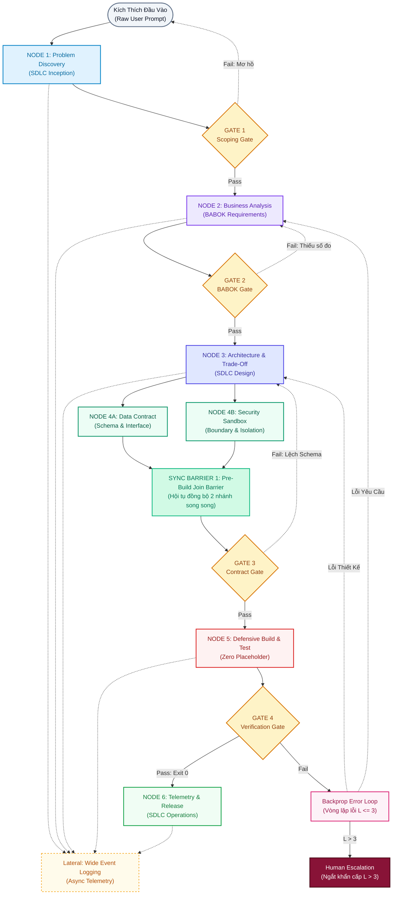

# Kiến Trúc Mạng Nơ-Ron AI Agent Pipeline Theo Vòng Đời SDLC (SPEC-AI-PIPELINE-001)

> **Tài liệu tham chiếu chuẩn**: [`main.drawio`](file:///home/stveve/Documents/workspace/Steve/Steves-Test-agent-agy/Docs/Diagrams/Didagram-AI-Agent_workflows/main.drawio) (Sơ đồ trực quan hạt nhân)  
> **Mã định danh**: `SPEC-AI-PIPELINE-001` | **Phiên bản**: `1.1.0` (Streamlined Architectural Reference)  
> **Trạng thái**: `APPROVED & ACTIVE BASELINE`  
> **Vai trò tài liệu**: Tài liệu markdown đóng vai trò **bổ trợ chú giải chuyên sâu** cho sơ đồ kiến trúc [`main.drawio`](file:///home/stveve/Documents/workspace/Steve/Steves-Test-agent-agy/Docs/Diagrams/Didagram-AI-Agent_workflows/main.drawio), chuẩn hóa trách nhiệm từng node, cơ chế dẫn truyền tín hiệu nơ-ron, chốt chặn nhị phân và giao thức phản hồi ngược theo các pha SDLC.

---

## 1. Nguyên Lý Vận Hành Mạng Nơ-Ron AI Agent

Kiến trúc chuyển dịch từ mô hình tuần tự tuyến tính đơn khối sang **Mạng Nơ-ron Nhận Thức Phân Tầng (Neural-Synaptic State Machine)**:
- **Dendrite (Sợi nhánh cảm giác)**: Tiếp nhận kích thích thô, chuẩn hóa và khử nhiễu tín hiệu đầu vào.
- **Soma (Thân nơ-ron xử lý)**: Các Node cha Layer 1 đảm nhiệm logic chuyên biệt tương ứng với từng pha của Vòng đời Phát triển Phần mềm (SDLC).
- **Synapse (Khớp thần kinh)**: Khe dẫn truyền trạng thái và hợp đồng dữ liệu giữa các node.
- **Activation Gate (Chốt chặn kích hoạt)**: Cơ chế phóng điện nhị phân (All-or-None); chỉ mở đường sang node kế tiếp khi thỏa mãn đầy đủ điều kiện kiểm chứng cơ học (Exit code 0).
- **Backpropagation Error Loop (Lan truyền ngược)**: Khi phát hiện sai lệch tại chốt chặn, tín hiệu lỗi được mã hóa thành gradient phản hồi ngược về đúng node gốc rễ để tự điều chỉnh (giới hạn tối đa 3 chu kỳ).
- **Pre-Build Convergence Barrier (Điểm chờ hội tụ)**: Nơ-ron đồng bộ khóa các nhánh song song trước khi bước vào giai đoạn thực thi mã nguồn.
- **Lateral Independent Synapse (Nơ-ron quan sát cạnh bên)**: Cung cấp viễn trắc (Telemetry) và ghi nhật ký sự kiện mở rộng (Wide Event Logging) bất đồng bộ với tải phụ trội $\le 5\text{ms}$, không gây nghẽn luồng tư duy chính.

### Không Gian Phủ Định & Ranh Giới Cấm Kỵ (System Negative Space)
1. **CẤM 1**: Tuyệt đối **CẤM** bất kỳ Agent nào nhảy trực tiếp vào thiết kế giải pháp kỹ thuật hoặc viết code khi chưa vượt qua Node 1 (Problem Discovery & Scoping Gate).
2. **CẤM 2**: Tuyệt đối **CẤM** các node xử lý độc lập cạnh bên (Lateral Nodes) chặn luồng (blocking deadlock) hoặc làm rò rỉ dữ liệu chưa kiểm duyệt vào ngữ cảnh của các node chính.
3. **CẤM 3**: Tuyệt đối **CẤM** các vòng lặp phản hồi ngược (Backprop Loops) chạy vô hạn; hệ thống bắt buộc kích hoạt chốt ngắt cứng khi chu kỳ $L > 3$ và chuyển quyền cho con người xử lý (Human Escalation).
4. **CẤM 4**: Tuyệt đối **CẤM** đưa các giải pháp công nghệ, thư viện cụ thể, hoặc cú pháp mã nguồn vào tầng Business Requirements (BR) theo chuẩn IIBA BABOK v3.
5. **CẤM 5**: Tuyệt đối **CẤM** chuyển trạng thái pipeline khi các đặc tính chất lượng còn mang tính cảm tính, thiếu số đo định lượng (100% NFR phải đi kèm chỉ số vật lý SMART rõ ràng như latency ms, throughput RPS, RAM MB, % SLA, exit code nhị phân).

---

## 2. Bản Đồ Dòng Chảy Hạt Nhân (Pipeline Topology)

Sơ đồ sau đây đồng bộ cấu trúc 1:1 với tệp tham chiếu chuẩn [`main.drawio`](file:///home/stveve/Documents/workspace/Steve/Steves-Test-agent-agy/Docs/Diagrams/Didagram-AI-Agent_workflows/main.drawio):



---

## 3. Bảng Chú Giải Vai Trò Chi Tiết Từng Node & Thành Phần

Bảng chú giải kỹ thuật này bổ trợ chi tiết cho từng hộp thành phần hiển thị trên [`main.drawio`](file:///home/stveve/Documents/workspace/Steve/Steves-Test-agent-agy/Docs/Diagrams/Didagram-AI-Agent_workflows/main.drawio):

### 3.1. Kích Thích Đầu Vào (Raw User Prompt)
- **Vị trí**: Điểm khởi tạo luồng (`n_input`).
- **Bản chất**: Kích thích cảm giác ngoại vi phi cấu trúc (Unstructured Stimulus).
- **Đặc tả**:
  - Nhận câu hỏi, yêu cầu tính năng, báo cáo lỗi hoặc bối cảnh kinh doanh thô từ người dùng/hệ thống gọi vào.
  - Dữ liệu ở trạng thái chưa được chuẩn hóa cú pháp, tiềm ẩn nguy cơ thiếu dữ kiện và ô nhiễm ngữ cảnh.

---

### 3.2. NODE 1: Problem Discovery (SDLC Inception) & GATE 1 (Scoping Gate)
- **Tài liệu đặc tả chi tiết**: [`node1-problem-discovery.md`](file:///home/stveve/Documents/workspace/Steve/Steves-Test-agent-agy/Docs/Diagrams/Didagram-AI-Agent_workflows/node1-problem-discovery.md) (`SPEC-NODE1-PROBLEM-DISCOVERY-001`)
- **Vị trí**: Pha 1 (`node1`, `gate1`).
- **Vai trò SDLC**: Project Inception & Problem Scoping.
- **Bản chất Thần kinh**: Cơ quan thụ cảm (Sensory Receptor) & Lọc nhiễu nhận thức.
- **Nhiệm vụ cốt lõi**:
  - Neo giữ bối cảnh, kích hoạt 4 tín hiệu tư duy chiều sâu (S1: Phủ định, S2: Truy vấn ngược, S3: Đa bên liên quan, S4: Ràng buộc vật lý).
  - Bóc tách bài toán thành 4 trường dữ liệu cốt lõi: Điểm đau/Hiện trạng, Mục tiêu mong đợi, Đối tượng thụ hưởng, và Negative Space.
  - Phân tích tính cần thiết trước khi bắt tay vào thiết kế giải pháp.
- **GATE 1 (Scoping Gate)**:
  - *Tiêu chuẩn*: Thẩm định tính hoàn thiện về phạm vi và không gian phủ định.
  - *Luồng rẽ*: Nếu đạt chuẩn ➔ Chuyển giao sang `Node 2`. Nếu đề bài mơ hồ hoặc trái ranh giới ➔ `Fail` quay lại bước tiếp nhận yêu cầu để làm rõ với người dùng.

---

### 3.3. NODE 2: Business Analysis (BABOK Requirements) & GATE 2 (BABOK Gate)
- **Vị trí**: Pha 2 (`node2`, `gate2`).
- **Vai trò SDLC**: Requirements Engineering & Domain Modeling.
- **Bản chất Thần kinh**: Thùy trán xử lý nhận thức bậc cao (Prefrontal Cortex).
- **Nhiệm vụ cốt lõi**:
  - Phân loại toàn diện theo 4 tầng chuẩn mực IIBA BABOK (BR, SR, Solution FR/NFR, TR).
  - Thiết lập Ma trận truy vết hai chiều (RTM) nối từ BR ➔ SR ➔ FR/NFR ➔ Test Case.
  - Loại bỏ triệt để rủi ro Gold-Plating (tính năng mồ côi không có mục tiêu) và Orphaned Goals (mục tiêu bị bỏ rơi).
- **GATE 2 (BABOK Gate)**:
  - *Tiêu chuẩn*: 100% NFR được định lượng bằng chỉ số vật lý SMART (ms, RPS, RAM, SLA); không còn tính từ mơ hồ cảm tính; bảng RTM phủ kín 100%.
  - *Luồng rẽ*: `Pass` ➔ Chuyển giao sang `Node 3`. `Fail` ➔ Quay lại hiệu chỉnh trong nội bộ `Node 2`.

---

### 3.4. NODE 3: Architecture & Trade-Off (SDLC Design)
- **Vị trí**: Pha 3 (`node3`).
- **Vai trò SDLC**: System Architecture & High-Level Design.
- **Bản chất Thần kinh**: Khớp thần kinh phân nhánh & Đánh giá rủi ro (Synaptic Router).
- **Nhiệm vụ cốt lõi**:
  - Đánh đổi kiến trúc trên 6 trục kỹ thuật: Performance, Complexity, Reliability, Cost, Scalability, Security.
  - Tính toán chỉ số rủi ro nhị phân: $\text{Risk Index} = \text{Blast Radius (1..4)} \times (5 - \text{Reversibility (1..4)})$.
  - **Phân loại quyết định**:
    - **Type 1 ($\text{Risk Index} \ge 8$)**: Quyết định một chiều, rủi ro cao (đổi database, phá vỡ cấu trúc layer) ➔ Tạm dừng, lập hồ sơ ADR và xin Human Approval trước khi viết code.
    - **Type 2 ($\text{Risk Index} < 8$)**: Quyết định hai chiều, khả nghịch ➔ Tự chủ phê duyệt và kích hoạt phân nhánh song song.
  - Điều phối luồng phóng điện đồng thời sang 2 nhánh chuyên biệt: `Node 4A` và `Node 4B`.

---

### 3.5. Cụm Song Song: NODE 4A, NODE 4B, SYNC BARRIER 1 & GATE 3 (SDLC Detailed Design)
- **Vị trí**: Pha 4 (`node4a`, `node4b`, `sync_barrier`, `gate3`).
- **Vai trò SDLC**: Detailed Design, Interface Freezing & Security Boundary.
- **Bản chất Thần kinh**: Bán cầu não kép xử lý song song & Khối đồng bộ (Dual-Hemisphere & Convergence Barrier).
- **Cấu trúc thành phần**:
  - **NODE 4A (Data Contract & Schema)**: Khóa cứng cấu trúc dữ liệu DTO/POCO, giao diện Interface Boundary và JSON Schema kiểm thực.
  - **NODE 4B (Security Sandbox & Boundary)**: Thiết lập phân quyền thực thi, ranh giới cách ly sandbox và bộ lọc kháng Prompt Injection theo chuẩn OWASP Top 10 for LLM.
  - **SYNC BARRIER 1 (Pre-Build Join Barrier)**: Nơ-ron rào chắn đóng vai trò chốt chờ đồng bộ. Liên tục giám sát trạng thái của cả hai nhánh 4A và 4B. Chỉ khi cả hai đều phát tín hiệu `READY`, rào chắn mới mở khóa.
- **GATE 3 (Contract Gate)**:
  - *Tiêu chuẩn*: Data Contract không còn xung đột cú pháp; ranh giới an ninh đã được khóa cứng.
  - *Luồng rẽ*: `Pass` ➔ Mở đường sang `Node 5`. `Fail` ➔ Quay lại `Node 3` để tái cấu trúc thiết kế.

---

### 3.6. NODE 5: Defensive Build & Test & GATE 4 (Verification Gate)
- **Vị trí**: Pha 5 (`node5`, `gate4`).
- **Vai trò SDLC**: Construction, Defensive Programming & Verification.
- **Bản chất Thần kinh**: Vỏ não vận động & Cung phản xạ cơ học (Motor Cortex & Reflex Arc).
- **Nhiệm vụ cốt lõi**:
  - Triển khai mã nguồn tuân thủ nghiêm ngặt Data Contract đã khóa tại Node 4.
  - Kỷ luật Zero-Placeholder: Cấm tuyệt đối mã tạm giữ chỗ, ghi chú sửa lỗi chưa đóng, hoặc dữ liệu giả lập chưa kiểm chứng trên luồng chính.
  - Lập trình phòng vệ (Defensive Coding): Thiết lập đầy đủ fallback mode và xử lý các kịch bản suy thoái có kiểm soát (Graceful Fallback).
- **GATE 4 (Verification Gate)**:
  - *Tiêu chuẩn*: Chốt chặn nhị phân tất định: 100% unit tests pass, linter exit code 0, không có cảnh báo nghiêm trọng.
  - *Luồng rẽ*:
    - `Pass` (Exit code 0) ➔ Kích hoạt phóng điện sang `Node 6`.
    - `Fail` (Exit code khác 0 hoặc vi phạm contract) ➔ Đóng gói vector lỗi và phát tín hiệu sang `Backprop Error Loop`.

---

### 3.7. NODE 6: Continuous Telemetry & Release (SDLC Operations)
- **Vị trí**: Pha 6 kết thúc luồng thành công (`node6`).
- **Vai trò SDLC**: Production Release, SRE & Operations.
- **Bản chất Thần kinh**: Hệ thần kinh giao cảm duy trì trạng thái cân bằng nội môi (Homeostasis).
- **Nhiệm vụ cốt lõi**:
  - Bàn giao mã nguồn/giải pháp đã qua kiểm chứng cơ học vào môi trường vận hành.
  - Giám sát viễn trắc vận hành thời gian thực, đo lường độ trễ và tỷ lệ lỗi để duy trì SLA $\ge 99{,}9\%$.

---

### 3.8. Backprop Error Loop & Human Escalation (Cơ Chế Phản Hồi Ngược)
- **Vị trí**: Pha xử lý ngoại lệ (`backprop`, `human_esc`).
- **Vai trò**: Cơ chế tự điều chỉnh thần kinh (Synaptic Plasticity & Self-Healing).
- **Quy trình hoạt động**:
  1. Khi `Gate 4` đánh rớt, `Backprop Error Loop` tiếp nhận và trích xuất vector gradient lỗi (Callstack, tệp tin vi phạm, phân loại lỗi).
  2. **Định tuyến ngược có điều kiện**:
     - Nếu lỗi thuộc về kiến trúc / thuật toán chưa đạt chỉ số latency ➔ Dẫn truyền tín hiệu ngược về **`Node 3`**.
     - Nếu lỗi thuộc về nghiệp vụ / thiếu kịch bản kiểm thử biên ➔ Dẫn truyền tín hiệu ngược về **`Node 2`**.
  3. **Chốt ngắt cứng (Circuit Breaker)**: Bộ đếm vòng lặp ghi nhận số lần phản hồi ($L$).
     - Nếu $L \le 3$: Tiếp tục luồng lặp tự điều chỉnh.
     - Nếu $L > 3$: Lập tức ngắt luồng và kích hoạt **`Human Escalation`** để chặn đứng tình trạng cạn kiệt tài nguyên (Token Exhaustion) và lặp vô hạn.

---

### 3.9. Lateral: Wide Event Logging (Async Telemetry)
- **Vị trí**: Thành phần quan sát độc lập cạnh bên (`obs_node`).
- **Bản chất**: Khe xi-náp cạnh bên (Lateral Synapse) bất đồng bộ.
- **Nhiệm vụ cốt lõi**:
  - Thu thập sự kiện từ toàn bộ các Node cha qua mô hình Publish/Subscribe.
  - Ghi nhận nhật ký sự kiện mở rộng (Wide Events / Canonical Log Lines) với tải phụ trội $\le 5\text{ms}$.
  - Bán kính ảnh hưởng (Blast Radius) bằng 0: Nếu node quan sát gặp sự cố quá tải bộ nhớ, luồng thực thi chính của pipeline vẫn tiếp tục vận hành bình thường.

---

## 4. Hợp Đồng Tín Hiệu Nơ-Ron Giữa Các Khe Xi-Náp (Synaptic Signal Contract)

Mọi trạng thái truyền dẫn giữa các node và chốt chặn trên sơ đồ [`main.drawio`](file:///home/stveve/Documents/workspace/Steve/Steves-Test-agent-agy/Docs/Diagrams/Didagram-AI-Agent_workflows/main.drawio) đều tuân thủ hợp đồng dữ liệu máy đọc được sau:

```json
{
  "$schema": "http://json-schema.org/draft-07/schema#",
  "title": "NeuralSynapticSignalContract",
  "type": "object",
  "properties": {
    "signal_id": { "type": "string", "description": "UUID định danh tín hiệu" },
    "source_node": { 
      "type": "string", 
      "enum": ["RAW_INPUT", "NODE_1", "NODE_2", "NODE_3", "NODE_4A", "NODE_4B", "NODE_5", "NODE_6"] 
    },
    "target_node": { 
      "type": "string", 
      "enum": ["GATE_1", "GATE_2", "GATE_3", "GATE_4", "SYNC_BARRIER_1", "NODE_2", "NODE_3", "NODE_5", "NODE_6", "HUMAN_ESCALATION"] 
    },
    "sdlc_phase": { 
      "type": "string", 
      "enum": ["INCEPTION", "ANALYSIS", "DESIGN", "DETAILED_DESIGN", "BUILD_TEST", "OPERATIONS"] 
    },
    "signal_type": { 
      "type": "string", 
      "enum": ["FEEDFORWARD", "PARALLEL_SPLIT", "SYNC_JOIN", "GATE_PASS", "BACKPROP_ERROR", "CIRCUIT_TRIP"] 
    },
    "loop_telemetry": {
      "type": "object",
      "properties": {
        "current_loop_iteration": { "type": "integer", "minimum": 0, "maximum": 3 },
        "error_gradient_summary": { "type": "string" }
      },
      "required": ["current_loop_iteration"]
    },
    "payload": {
      "type": "object",
      "description": "Dữ liệu trạng thái chuyển giao giữa các node"
    }
  },
  "required": ["signal_id", "source_node", "target_node", "sdlc_phase", "signal_type", "loop_telemetry", "payload"]
}
```

---

## 5. Ma Trận Ánh Xạ Yêu Cầu BABOK & Truy Vết Hai Chiều (Compact RTM)

### 5.1. Danh Mục Yêu Cầu 4 Tầng Chuẩn Hóa
- **Business Requirements (BR)**:
  - `[BR-01]`: Cắt giảm 100% tình trạng Agent suy diễn sai lệch phạm vi; rút ngắn thời gian định hình bài toán $\le 300\text{s}$.
  - `[BR-02]`: Đảm bảo 100% quyết định kiến trúc Type 1 có ADR; tỷ lệ tự phục hồi qua Backpropagation đạt $\ge 90{,}0\%$.
- **Stakeholder Requirements (SR)**:
  - `[SR-01]`: Lead BA cần Node 1 bóc tách bài toán 4 chiều trong $\le 60\text{s}$.
  - `[SR-02]`: Solution Architect cần khả năng phân tách thiết kế hợp đồng dữ liệu và vùng an toàn độc lập song song trước khi tích hợp vào mã nguồn.
  - `[SR-03]`: Software Engineer & QA Lead cần Gate 4 kiểm tra nhị phân (Zero Placeholder, 100% test pass).
  - `[SR-04]`: SRE cần Node quan sát Lateral ghi nhận Wide Events với độ trễ phụ trội $\le 5\text{ms}$.
- **Functional Requirements (FR)**:
  - `[FR-01]`: Hệ thống tiếp nhận bối cảnh thô, đo Thought Latency và xuất bản Problem-Scoping-Baseline (Node 1).
  - `[FR-02]`: Hệ thống bóc tách 4 tầng BABOK, định lượng NFR và lập ma trận RTM (Node 2).
  - `[FR-03]`: Hệ thống đánh đổi 6 trục, tính Risk Index và phân bổ nhánh song song (Node 3).
  - `[FR-04]`: Hệ thống khóa Data Contract và ranh giới an ninh, hội tụ tại Sync Barrier (Node 4A, 4B).
  - `[FR-05]`: Hệ thống thực thi mã nguồn không placeholder và chạy test suite tự động exit code 0 (Node 5).
  - `[FR-06]`: Hệ thống viễn trắc vận hành và điều phối Backpropagation Loop tối đa 3 chu kỳ (Node 6).
- **Non-Functional Requirements (NFR)**:
  - `[NFR-01]`: Độ trễ truyền tín hiệu nơ-ron p95 $\le 1.500\text{ms}$, p99 $\le 2.500\text{ms}$.
  - `[NFR-02]`: Chốt chặn nhị phân tất định, tỷ lệ False-Positive $< 0{,}1\%$.
  - `[NFR-03]`: Tiêu thụ RAM $\le 512\text{MB}$ mỗi node; dọn dẹp scratch $\le 1.000\text{ms}$; rò rỉ $0\text{ bytes}$.
  - `[NFR-04]`: Thời gian phục hồi cục bộ khi timeout (MTTR) $\le 3\text{s}$; tỷ lệ crash toàn pipeline $0{,}00\%$.
  - `[NFR-05]`: Lọc 100% tấn công Prompt Injection theo chuẩn OWASP Top 10 for LLM.
- **Transition Requirements (TR)**:
  - `[TR-01]`: Ánh xạ 100% quy tắc hiện hữu trong `AGENTS.md` sang chốt chặn mới.
  - `[TR-02]`: Khung kiểm thử mô phỏng 4 kịch bản luồng nơ-ron đạt exit code 0 trước Go-Live.
  - `[TR-03]`: Chuyển đổi khẩn cấp `PIPELINE_FALLBACK_MODE=legacy_sequential` với RTO $\le 10\text{s}$.

### 5.2. Ma Trận Truy Vết Hai Chiều (Traceability Matrix)

| Mã BR | Mã SR | Mã FR (Node Ánh Xạ) | Mã NFR | Mã TR | Tiêu Chí Nghiệm Thu Cơ Học |
| :---: | :---: | :---: | :---: | :---: | :--- |
| **BR-01** | SR-01 | **FR-01** (Node 1) | NFR-01, NFR-05 | TR-01 | Thời gian bóc tách $\le 300\text{s}$ & Audit 5 điều CẤM |
| **BR-01** | SR-01 | **FR-02** (Node 2) | NFR-02 | TR-01 | Bóc tách 4 tầng BABOK & 100% NFR có số đo SMART |
| **BR-02** | SR-02 | **FR-03** (Node 3) | NFR-01, NFR-04 | TR-02 | Bảng đánh đổi 6 trục & Duyệt ADR Type 1 |
| **BR-02** | SR-02 | **FR-04** (Node 4A, 4B) | NFR-01, NFR-03 | TR-02 | Đồng bộ song song tại Sync Barrier $\le 15\text{s}$ |
| **BR-02** | SR-03 | **FR-05** (Node 5) | NFR-02, NFR-03 | TR-02 | Zero-Placeholder & 100% unit tests pass (Exit code 0) |
| **BR-02** | SR-04 | **FR-06** (Node 6) | NFR-01, NFR-04 | TR-03 | Backpropagation $\le 3$ vòng & Rollback switch $\le 10\text{s}$ |

---

## 6. Quy Chuẩn Màu Sắc & Đối Chiếu Trực Quan Với `main.drawio`

| Nhóm Thành Phần | Mã Màu Hex | Đối Tượng Trên `main.drawio` | Ý Nghĩa Trực Quan |
| :--- | :--- | :--- | :--- |
| **Input** | `#f1f5f9` (Slate) | `n_input`, `leg_inp` | Điểm tiếp nhận kích thích thô ban đầu |
| **Layer 1 Cognitive Nodes** | `#0284c7`, `#7c3aed`, `#4f46e5` | `node1`, `node2`, `node3` | Các thùy nhận thức chính (Khám phá, Phân tích, Kiến trúc) |
| **Parallel Cluster & Sync** | `#059669`, `#10b981` (Emerald) | `node4a`, `node4b`, `sync_barrier` | Phân nhánh song song và điểm chờ hội tụ đồng bộ |
| **Activation Gates** | `#d97706` (Amber) | `gate1`, `gate2`, `gate3`, `gate4` | Các cổng kiểm soát điều kiện nhị phân |
| **Defensive Construction** | `#dc2626` (Red) | `node5` | Thực thi mã nguồn cơ học phòng vệ & kiểm thử |
| **Production Release** | `#16a34a` (Green) | `node6` | Bàn giao thành công và viễn trắc vận hành |
| **Backpropagation Loop** | `#db2777` (Magenta) | `backprop` | Đường dẫn truyền ngược khắc phục lỗi ($L \le 3$) |
| **Human Escalation** | `#881337` (Rose Dark) | `human_esc` | Chốt ngắt cầu dao khẩn cấp can thiệp con người ($L > 3$) |
| **Lateral Telemetry** | `#f59e0b` (Dashed Amber) | `obs_node` | Nơ-ron quan sát cạnh bên chạy bất đồng bộ |
