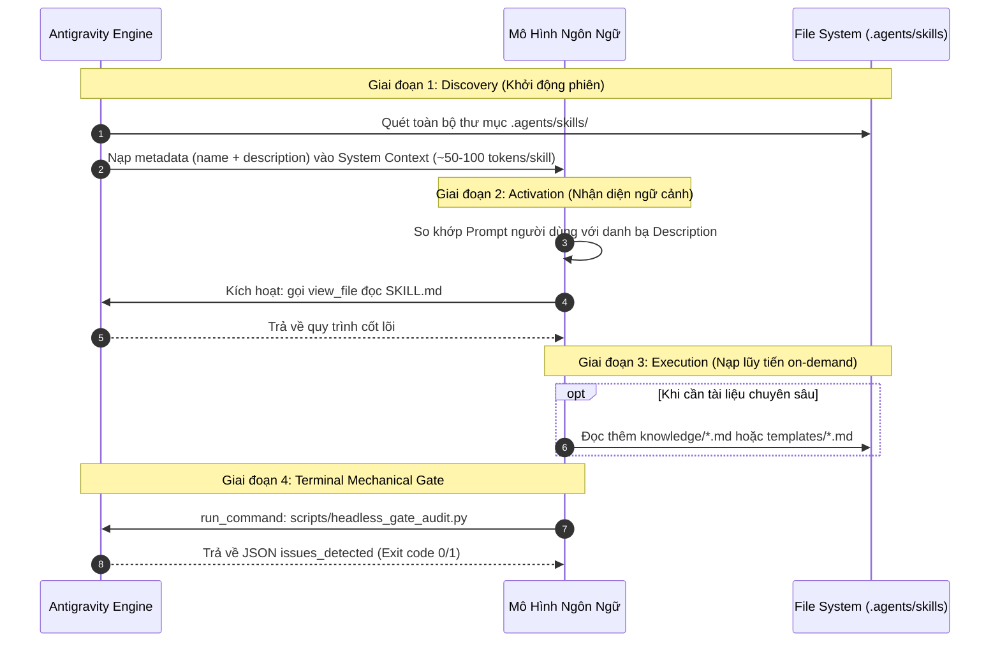

# Giải Phẫu Cơ Chế Agent Skills & Headless State Gate Trong Antigravity

**Chủ đề**: Kiến trúc mở rộng tác tử AI (Agent Skills Standard), Cơ chế tiết lộ lũy tiến (Progressive Disclosure) và Chốt chặn cơ học ngầm (Headless Mechanical Gate).  
**Mục tiêu bài học**: Hiểu tận gốc lý do sinh ra chuẩn Skill, cách nạp bộ nhớ chống tràn context, và kỹ thuật dùng Headless Gate làm chốt chặn chất lượng đầu ra.  
**Độ khó**: Chuyên sâu (Advanced Systems Architecture)

---

## 1. Neo Đậu Nguyên Lý Đầu Tiên (First Principles Anchor)

### 1.1. Nỗi Đau Lịch Sử: Thảm Họa "Prompt Chắp Vá"
Trước khi có chuẩn mở Agent Skills, các kỹ sư tương tác với AI Agent theo hai cách cực đoan:
1. **Nhồi nhét toàn bộ vào System Prompt / Rule**: Đưa hàng ngàn dòng quy tắc, tài liệu hướng dẫn và schema công cụ vào ngữ cảnh khởi động.
2. **Copy-paste prompt thủ công**: Mỗi phiên làm việc phải gõ lại hàng loạt câu chỉ dẫn rườm rà.

### 1.2. Giới Hạn Vật Lý Của Bộ Nhớ Ngữ Cảnh (Context Window Degradation)
Bộ nhớ của Large Language Model (LLM) không phải là vô hạn. Khi Context Window bị lấp đầy bởi hàng chục ngàn tokens văn bản tĩnh:
- **Attention Dilution (Loãng sự chú ý)**: Cơ chế Self-Attention phải tính toán ma trận tương quan giữa tất cả các token ($O(N^2)$). Càng nhiều token rác, AI càng dễ quên các chỉ dẫn cốt lõi ở giữa ngữ cảnh (hiện tượng *Lost in the Middle*).
- **Chi phí & Độ trễ tăng vọt**: Chi phí token và thời gian sinh phản hồi (TTFT - Time To First Token) tăng tuyến tính theo độ dài ngữ cảnh.

### 1.3. Sự Xuất Hiện Tất Yếu Của Chuẩn Agent Skills
Agent Skill giải quyết bài toán này bằng nguyên lý **Progressive Disclosure (Tiết Lộ Lũy Tiến)** vay mượn từ ngành thiết kế giao diện (UI/UX) và kiến trúc hệ điều hành: *Chỉ giữ trong RAM những gì tối thiểu nhất; chỉ nạp dữ liệu chi tiết vào bộ nhớ khi tiến trình thực sự chạm tới.*

---

## 2. Giải Phẫu Cơ Chế Vận Hành Ngầm (Under-The-Hood Mechanics)



### 2.1. Tiến Trình 3 Tầng Nạp Ngữ Cảnh (Memory Tiering)
1. **Tier 1 - Static Catalog (Luôn thường trực)**: Chỉ gồm trường `name` và `description` trong YAML Frontmatter. Chiếm dưới 120 tokens.
2. **Tier 2 - Workflow Backbone (`SKILL.md`)**: Chỉ được nạp khi tác vụ cần đến. Chứa quy trình 4 pha và ranh giới cấm đoán.
3. **Tier 3 - On-Demand Knowledge & Templates**: Các tệp trong `knowledge/` và `templates/` nằm yên trên ổ đĩa SSD, chỉ được nạp khi bước thực thi yêu cầu.

### 2.2. Cơ Chế Chốt Chặn Headless Gate (Sub-process Sandboxing)
Thay vì chạy các lệnh kiểm thử và phân tích trực tiếp trong phiên chính gây phình to ngữ cảnh, Agent gọi:
```bash
python .agents/skills/pedagogical-knowledge-explainer/scripts/headless_gate_audit.py --draft draft.md --effort medium
```
Tiến trình này chạy ngầm một sub-process độc lập qua CLI `agy -p`, thẩm định toàn bộ tài liệu dựa trên schema và chỉ trả về một JSON Envelope siêu nhẹ (~40 tokens). Nếu có lỗi, AI nhận danh sách `actionable_fix` để tự sửa; nếu exit code `0`, kết quả được bàn giao.

### 2.3. Mã Nguồn Minh Họa Cơ Chế Tự Sửa Lỗi (Runnable Code)
```python
import json
import subprocess
import sys

def execute_terminal_gate_loop(draft_path: str, max_retries: int = 2) -> bool:
    """Mô phỏng cơ chế Feedback Loop giữa Agent và Headless Gate."""
    for attempt in range(1, max_retries + 1):
        # Gọi script headless gate độc lập
        cmd = [sys.executable, ".agents/skills/pedagogical-knowledge-explainer/scripts/headless_gate_audit.py", "--draft", draft_path, "--effort", "low"]
        proc = subprocess.run(cmd, capture_output=True, text=True, encoding="utf-8")
        
        try:
            audit_result = json.loads(proc.stdout)
        except Exception:
            audit_result = {"status": "FAIL", "total_issues_count": 1, "issues_detected": []}
            
        if proc.returncode == 0 and audit_result.get("total_issues_count", 0) == 0:
            print(f"[Attempt {attempt}] Headless Gate PASS: Bài giảng đạt chuẩn.")
            return True
        else:
            print(f"[Attempt {attempt}] Headless Gate FAIL: Phát hiện {audit_result.get('total_issues_count')} vấn đề. Đang tự sửa...")
            # Agent đọc actionable_fix để viết lại bản thảo
    return False

if __name__ == "__main__":
    print("Khởi chạy kiểm chứng cơ chế Feedback Loop...")
```

---

## 3. Không Gian Phủ Định, Ma Trận Đánh Đổi & Kịch Bản Sập

### 3.1. Ma Trận Đánh Đổi 6 Trục Của Kiến Trúc Agent Skills
| Trục Đánh Đổi | Cái Đạt Được (Gain) | Cái Giá Phải Trả (Pain / Cost) |
| :--- | :--- | :--- |
| **Độ trễ (Latency)** | Giảm thời gian phản hồi ở các turn thông thường do context gọn nhẹ. | Mất thêm 1-2 lượt công cụ (`view_file`) ở turn đầu tiên khi Agent nạp file `SKILL.md`. |
| **Bộ nhớ & Token (Memory)** | Tiết kiệm hơn 70% dung lượng Context Window so với việc nạp tài liệu tĩnh. | Phải thiết kế cấu trúc thư mục phân tầng chặt chẽ (`knowledge/`, `templates/`). |
| **Độ phức tạp (Complexity)** | Kiểm soát chất lượng tất định thông qua Headless Gate ở bước cuối. | Tăng thêm thời gian chờ kiểm duyệt ngầm (thêm 3-5 giây cho tiến trình headless chạy). |

### 3.2. Không Gian Phủ Định (Negative Space — Khi Nào CẤM Dùng?)
- ❌ **CẤM gộp tất cả kiến thức vào một file `SKILL.md` duy nhất**: Nếu file vượt quá 800 dòng, cơ chế Progressive Disclosure hoàn toàn vô hiệu hóa, biến Skill thành một tệp prompt khổng lồ gây Context Fog.
- ❌ **CẤM đặt Headless Gate ở các State đầu**: Nếu đặt kiểm tra cơ học ngay từ Pha 1, AI sẽ bị "đóng băng nhận thức", không dám sáng tạo hay đào sâu nguyên lý đầu tiên.
- ❌ **CẤM dùng Skill cho các quy tắc bất biến toàn cục**: Những quy tắc an ninh tuyệt đối (như cấm xóa ổ cứng, cấm lộ API key) phải nằm ở `AGENTS.md` hoặc System Rule, không được đặt ở Skill vì Skill chỉ nạp theo nhu cầu.

### 3.3. Mổ Xẻ Kịch Bản Sập Nguồn (Catastrophic Failure Modes)

#### Kịch Bản Sập 1: Description Mơ Hồ Dẫn Tới "Undertriggering" Hoặc "False Triggering"
- **Điều kiện kích hoạt**: Khi trường `description` trong YAML Frontmatter viết quá ngắn ngủi (ví dụ: *"Hỗ trợ học tập"*) hoặc viết ở ngôi thứ nhất (*"Tôi sẽ dạy bạn"*).
- **Cơ chế gãy ngầm**: LLM so khớp ngữ nghĩa (Semantic Embedding) giữa prompt người dùng và description thất bại. Agent bỏ qua Skill và trả lời bằng tri thức mặc định hời hợt, hoặc kích hoạt nhầm khi người dùng chỉ hỏi câu chào hỏi thông thường.
- **Biện pháp phòng vệ**: Viết description ở ngôi thứ ba, chỉ rõ hành động và tập từ khóa kích hoạt cụ thể (VD: *"Chuyên gia sư phạm... Kích hoạt khi người dùng muốn học, hiểu bản chất, hỏi tại sao..."*).

#### Kịch Bản Sập 2: Vòng Lặp Vô Tận Ở Chốt Chặn Kiểm Duyệt (Feedback Loop Deadlock)
- **Điều kiện kích hoạt**: Headless Gate đưa ra yêu cầu sửa đổi mâu thuẫn với năng lực mô hình, hoặc bài kiểm tra không thể vượt qua nhưng code không có cơ chế giới hạn số lần thử lại (Infinite Retry).
- **Cơ chế gãy ngầm**: Agent chạy lặp lại mãi mãi giữa việc sửa bản thảo và chạy kiểm duyệt, làm cạn kiệt tài nguyên tính toán và treo phiên làm việc.
- **Biện pháp phòng vệ**: Thiết lập ngưỡng chặn cứng `MAX_ATTEMPTS = 2`. Nếu sau 2 lần sửa vẫn không đạt, dừng lại và xuất báo cáo minh bạch cho người dùng can thiệp.

---

## 4. Thử Thách Socratic Dành Cho Bạn (The Socratic Probe)

> [!IMPORTANT]
> **Tình huống phản biện dành cho bạn**:  
> Giả sử hệ thống của bạn có **50 skills khác nhau** được cài đặt trong `.agents/skills/`.  
> 1. Nếu mỗi skill có `description` dài khoảng 100 tokens, lượng token tiêu hao cố định khi khởi động một phiên hội thoại mới là bao nhiêu?  
> 2. Nếu có 2 skills cùng cạnh tranh nhau một ngữ cảnh (ví dụ: `code-reviewer` và `security-auditor`), cơ chế nào trong Antigravity quyết định skill nào sẽ được nạp trước, và bạn sẽ thiết kế câu lệnh thế nào để cưỡng chế Agent chọn đúng skill bạn muốn?
