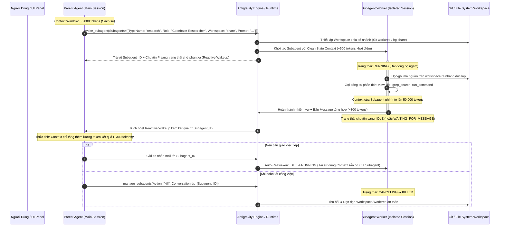

# Giải Phẫu Cơ Chế Vận Hành Subagent Trong Antigravity: Từ Nguyên Lý Forking Đến Kiến Trúc Đa Tác Tử Bất Đồng Bộ

**Chủ đề**: Cơ chế hoạt động ngầm của Asynchronous Subagents trong Google Antigravity & Antigravity CLI.  
**Mục tiêu bài học**: Hiểu rõ bản chất vì sao sinh ra Subagent, cơ chế cách ly bộ nhớ (Clean Slate), kiến trúc Filesystem (`inherit`, `share`, `branch`), cỗ máy trạng thái đa tầng của Runtime, giao thức phản xạ sự kiện (Event-driven Wakeup) và các bẫy sập nguồn trong phân tán tác tử.  
**Độ khó**: Chuyên sâu (Advanced Systems Architecture & Agentic Concurrency)  

---

## 1. Neo Đậu Nguyên Lý Đầu Tiên (First Principles Anchor)

### 1.1. Nỗi Đau Lịch Sử: Giới Hạn Của Kiến Trúc Single-Agent Loop
Trong các hệ thống AI thế hệ đầu (hoặc các Agent đơn luồng), mọi công việc đều được dồn vào một vòng lặp suy luận duy nhất (Single-turn ReAct Loop):
```
User Prompt ➔ [LLM Think ➔ Tool Call ➔ Tool Output ➔ LLM Think] (Lặp lại N lần) ➔ Final Answer
```
Khi giải quyết các bài toán kỹ thuật phức tạp (như tìm kiếm toàn bộ codebase, chạy test suite, kiểm toán bảo mật nhiều thư mục), kiến trúc đơn tác tử này ngay lập tức đối mặt với **3 rào cản vật lý nghiêm trọng**:

1. **Ngộ Độc Ngữ Cảnh (Context Window Pollution & Attention Dilution)**:
   - Một lệnh `grep` quét codebase hoặc một log lỗi compiler có thể đổ về hàng chục ngàn dòng văn bản thô.
   - Tất cả dữ liệu rác này bị nhồi trực tiếp vào Context Window của Agent chính. Theo cơ chế Self-Attention ($O(N^2)$), việc mở rộng ngữ cảnh quá mức làm suy giảm khả năng tập trung (*Attention Dilution*), dẫn đến hiện tượng **Lost-in-the-middle**: AI bắt đầu quên các chỉ dẫn cốt lõi, sinh ảo giác (hallucination) và lạc hướng khỏi mục tiêu ban đầu của người dùng.
2. **Nghẽn Cổ Chai Tuần Tự (Single-Threaded Latency Bottleneck)**:
   - Agent chính phải làm việc tuần tự: Đọc file A (3s) ➔ Đọc file B (3s) ➔ Chạy test C (15s) ➔ Phân tích D (5s). Tổng thời gian chờ đợi là tổng đại số của toàn bộ các bước, trong khi các tác vụ này hoàn toàn độc lập về mặt dữ liệu.
3. **Chi Phí Suy Luận Lũy Tiến (Compounding Token Cost)**:
   - Vì toàn bộ lịch sử các bước trung gian nằm lại trong Context, mỗi lượt (turn) kế tiếp phải gửi lại toàn bộ khối lượng token khổng lồ đó lên LLM API, làm chi phí và độ trễ phản hồi (Time To First Token - TTFT) tăng vọt theo cấp số cộng.

### 1.2. Bản Chất Vật Lý: Từ Unix `fork()` Đến Kiến Trúc Subagent
Để giải quyết triệt để vấn đề này, Antigravity không cố gắng "kéo giãn" Context Window vô hạn, mà quay về **Nguyên lý Đệ nhất trong Thiết kế Hệ điều hành (Operating System Design)**:
> *"Khi một tiến trình cha (Parent Process) phải xử lý một tác vụ nặng nề hoặc có nguy cơ làm bẩn không gian địa chỉ, nó sẽ tạo ra một tiến trình con (Child Process/Worker) với không gian bộ nhớ độc lập, giao việc bất đồng bộ, và chỉ nhận lại kết quả cuối cùng qua cơ chế truyền tin (IPC / Message Passing)."*

Subagent trong Antigravity chính là sự hiện thực hóa của mô hình **Actor Model** và **Process Forking** trong môi trường LLM:
- **Parent Agent**: Đóng vai trò bộ não điều phối trung tâm (Orchestrator), giữ gìn Context Window sạch sẽ và tập trung vào mục tiêu của người dùng.
- **Subagent**: Đóng vai trò Worker chuyên biệt chạy ngầm, được cấp phát một ngữ cảnh trống (Clean Slate), thực hiện nhiệm vụ nặng nhọc trong không gian riêng, và chỉ gửi bản tóm tắt tinh gọn về cho Parent.

---

## 2. Giải Phẫu Cơ Chế Vận Hành Ngầm (Under-The-Hood Mechanics)

### 2.1. Sơ Đồ Kiến Trúc & Vòng Đời Vận Hành (Lifecycle & Dataflow)



### 2.2. Bóc Tách 4 Trụ Cột Cơ Chế Ngầm

#### 1. Cơ Chế Cách Ly Ngữ Cảnh Tuyệt Đối (Clean Slate Context Isolation)
Khi Parent Agent gọi `invoke_subagent`:
- **Không kế thừa Chat History**: Subagent **không nhận** toàn bộ tin nhắn trước đó của Parent. Nó bắt đầu với một không gian Context hoàn toàn mới (Clean Slate).
- **Bộ nhớ khởi điểm chỉ gồm**:
  1. System Prompt của vai trò được chỉ định (hoặc định nghĩa trong file `.agents/agents/<name>.md`).
  2. Danh mục công cụ được phân quyền (Tools Schema theo trường `tools` trong YAML frontmatter).
  3. Prompt mô tả nhiệm vụ cụ thể do Parent Agent truyền vào.
- **Ý nghĩa cơ học**: Dù Subagent có quét hàng trăm file làm phình to context lên 100,000 tokens thì khi hoàn thành, nó chỉ gửi về Parent một đoạn text tóm tắt (ví dụ 300 tokens). Toàn bộ 100,000 tokens rác biến mất khỏi tầm nhìn của Parent Agent!

#### 2. Kiến Trúc Phân Vùng Không Gian Làm Việc (Workspace Isolation Modes)
Antigravity cung cấp 3 cơ chế phân vùng đĩa cứng khi khởi tạo Subagent:

| Chế Độ Workspace | Cơ Chế Vật Lý Bên Dưới | Ưu Điểm | Rủi Ro / Nhược Điểm |
| :--- | :--- | :--- | :--- |
| `inherit` | Subagent dùng chung trọn vẹn working directory vật lý của Parent | Khởi động tức thì (0ms), không tốn thêm dung lượng ổ đĩa | **Rủi ro Race Condition / Dirty Writes**: Nếu cả hai cùng ghi vào một file đồng thời sẽ làm hỏng dữ liệu |
| `share` *(Khuyến nghị)* | Chia sẻ kho lưu trữ nền tảng (underlying repository) của Parent qua cơ chế rẽ nhánh không gian làm việc (`git worktree` hoặc `hg share`) | Phân nhánh độc lập, an toàn tuyệt đối mà **không tốn dung lượng sao chép lại toàn bộ repo** | Đòi hỏi kho mã nguồn phải được quản lý dưới Git/VCS |
| `branch` | Tạo một workspace rẽ nhánh / nhân bản cô lập hoàn toàn từ Parent | Cô lập triệt để cả về mặt logic lẫn cấu trúc thư mục; an toàn tuyệt đối cho các tác vụ refactor diện rộng | Tốn chi phí khởi tạo ban đầu và tiêu hao thêm không gian lưu trữ |

#### 3. Cỗ Máy Trạng Thái Đa Tầng Của Runtime (Runtime Lifecycle State Machine)
Khác với suy nghĩ đơn giản rằng Subagent chỉ có 3 trạng thái, Antigravity Runtime quản lý một cỗ máy trạng thái chặt chẽ gồm:
- **`running`**: Đang tích cực thực thi prompt, gọi tool, phân tích dữ liệu.
- **`idle`**: Đã hoàn thành đợt xử lý hiện tại, tạm dừng tiêu thụ CPU/Token, giữ nguyên trạng thái context trong bộ nhớ để sẵn sàng nhận lệnh tiếp theo.
- **`waiting_for_input`**: Tạm dừng vì cần thông tin đầu vào bổ sung từ người dùng hoặc hệ thống.
- **`waiting_for_dependents`**: Đang chờ kết quả từ các tác tử phụ thuộc khác trong đồ thị công việc (DAG).
- **`waiting_for_message`**: Chờ tin nhắn truyền tới từ Parent hoặc Peer Agent qua bus liên lạc.
- **`canceling`**: Đang trong tiến trình giải phóng tài nguyên và hủy bỏ theo lệnh can thiệp.
- **`errored`**: Gặp sự cố không thể tự phục hồi (lỗi mạng, exception hệ thống).
- **`unspecified`**: Trạng thái chưa xác định trong chu trình khởi tạo.

Khi cần kết thúc một Subagent, lệnh primitive chuẩn mực theo đặc tả Antigravity Tool Schema là sử dụng `manage_subagents` với mảng `ConversationIds`:
```json
manage_subagents(Action="kill", ConversationIds=["<subagent-conversation-id>"])
```

#### 4. Giao Thức Phản Xạ Sự Kiện (Event-Driven Reactive Wakeup)
Parent Agent **không bao giờ sử dụng vòng lặp thăm dò (polling loop)** như `while True: check_status()`.
- Khi Subagent đang chạy, Parent Agent thực hiện **Non-blocking Yield Turn** — nhường lại CPU và Event Loop cho hệ thống để làm việc khác hoặc đi vào trạng thái ngủ đông (Dormant).
- Khi Subagent hoàn tất và chuyển trạng thái, Runtime Messaging Bus kích hoạt sự kiện **Reactive Wakeup**, đánh thức Parent Agent dậy và nạp message của Subagent vào context như một thông báo ưu tiên cao.

### 2.3. Mã Nguồn Minh Họa: Cơ Chế Bất Đồng Bộ & Phản Xạ Sự Kiện (Runnable Async Simulation)

Đoạn mã Python dưới đây sử dụng chuẩn thư viện `asyncio` (`async/await`, `asyncio.create_task`, `asyncio.Queue`) để minh họa chính xác cơ chế phi phong tỏa (non-blocking yield turn), chạy ngầm song song và tự thức tỉnh (Reactive Wakeup) khi có thông điệp từ Subagent:

```python
import asyncio
import uuid
from typing import Dict, Any, List

class SubagentWorker:
    """Mô phỏng Subagent chạy ngầm bất đồng bộ với Clean Slate Context."""
    def __init__(self, role: str, system_prompt: str, message_bus: asyncio.Queue):
        self.agent_id = f"sub-{uuid.uuid4().hex[:6]}"
        self.role = role
        self.system_prompt = system_prompt
        self.message_bus = message_bus
        self.state = "idle"
        self.local_context: List[Dict[str, str]] = []  # Context độc lập hoàn toàn

    async def execute_task(self, prompt: str):
        """Tiến trình làm việc ngầm phi phong tỏa (Non-blocking worker task)."""
        self.state = "running"
        self.local_context.append({"role": "user", "content": prompt})
        
        # Mô phỏng tác vụ nặng: Quét hàng trăm files qua I/O bất đồng bộ
        await asyncio.sleep(0.5)
        self.local_context.append({
            "role": "assistant",
            "content": f"[{self.role}] Đã quét 850 files, thực thi 12 static rules."
        })
        
        # Tạo kết quả cô đọng và gửi vào message bus
        summary_payload = {
            "sender_id": self.agent_id,
            "role": self.role,
            "result": "Hoàn tất kiểm toán: 0 lỗi rò rỉ bộ nhớ, 1 cảnh báo thiếu index database."
        }
        self.state = "idle"  # Chuyển sang idle chờ lệnh mới
        
        # Gửi sự kiện phản xạ về bus mà không chặn luồng
        await self.message_bus.put(summary_payload)


class ParentOrchestrator:
    """Mô phỏng Parent Agent - Điều phối bất đồng bộ và Reactive Wakeup."""
    def __init__(self):
        self.context_window: List[Dict[str, Any]] = []
        self.message_bus: asyncio.Queue = asyncio.Queue()
        self.active_workers: Dict[str, SubagentWorker] = {}

    async def spawn_subagent(self, role: str, system_prompt: str, task_prompt: str) -> str:
        """Sinh Subagent và đẩy vào background task (Non-blocking yield turn)."""
        worker = SubagentWorker(role, system_prompt, self.message_bus)
        self.active_workers[worker.agent_id] = worker
        
        print(f"[Parent] Khởi tạo {worker.agent_id} (Role: {role}) với Clean Slate.")
        # Đẩy việc vào Event Loop chạy nền bằng asyncio.create_task — KHÔNG BLOCK!
        asyncio.create_task(worker.execute_task(task_prompt))
        print(f"[Parent] Tác vụ đã đẩy xuống nền. Parent tự do làm việc khác mà không bị chặn!")
        return worker.agent_id

    async def wait_for_reactive_wakeup(self):
        """Parent ngủ đông hoặc chờ phản xạ sự kiện từ Message Bus (Zero Polling)."""
        print("[Parent] Đi vào trạng thái chờ phản xạ sự kiện (Reactive Wakeup)...")
        event = await self.message_bus.get()  # Nhận sự kiện khi có worker xong
        
        # Thức tỉnh và ghi nhận kết quả cực nhẹ vào context
        self.context_window.append({
            "role": "system_event",
            "from": event["sender_id"],
            "summary": event["result"]
        })
        print(f"[Parent WAKEUP!] Đã nhận kết quả từ {event['sender_id']}: '{event['result']}'")
        print(f"[Parent] Dung lượng Context Parent chỉ tăng nhẹ +1 thông điệp tóm tắt.")

    async def kill_subagent(self, sub_id: str):
        """Hủy Subagent theo đúng primitive: manage_subagents(Action='kill', ConversationIds=[sub_id])."""
        if sub_id in self.active_workers:
            self.active_workers[sub_id].state = "canceling"
            await asyncio.sleep(0.05)
            self.active_workers[sub_id].state = "killed"
            print(f"[Parent] Đã tiêu hủy an toàn {sub_id} qua manage_subagents(Action='kill', ConversationIds=['{sub_id}']).")


async def main():
    print("=== MÔ PHỎNG KIẾN TRÚC SUBAGENT BẤT ĐỒNG BỘ TRONG ANTIGRAVITY ===")
    orchestrator = ParentOrchestrator()
    
    # 1. Spawn Subagent chạy ngầm
    worker_id = await orchestrator.spawn_subagent(
        role="code-auditor",
        system_prompt="Bạn là chuyên gia rà soát mã nguồn.",
        task_prompt="Phân tích toàn bộ module thanh toán /payment"
    )
    
    # 2. Parent thực hiện việc của mình trong khi worker đang chạy song song
    print("[Parent] Đang soạn thảo tài liệu kiến trúc song song...")
    await asyncio.sleep(0.2)
    
    # 3. Phản xạ thức tỉnh khi worker hoàn tất
    await orchestrator.wait_for_reactive_wakeup()
    
    # 4. Quản lý dọn dẹp worker
    await orchestrator.kill_subagent(worker_id)


if __name__ == "__main__":
    asyncio.run(main())
```

---

## 3. Không Gian Phủ Định, Ma Trận Đánh Đổi & Kịch Bản Sập Nguồn

### 3.1. Ma Trận Đánh Đổi 6 Trục (Architectural Trade-Off Matrix)

| Trục Đánh Đổi | Lợi Điểm Khi Dùng Subagent (Gain) | Cái Giá Phải Trả (Cost / Penalty) |
| :--- | :--- | :--- |
| **Độ trễ tổng thể (Total Latency)** | Giảm đáng kể nhờ thực thi song song các tác vụ I/O nặng (tải file, quét mã, chạy test). | Tăng độ trễ ban đầu (Orchestration Overhead): Mất thời gian nạp model, cấu hình workspace rẽ nhánh, bootstrap prompt. |
| **Bảo toàn Ngữ cảnh (Context Cleanliness)** | Parent Context luôn sạch sẽ ($<10k$ tokens), không bị ngộ độc bởi hàng ngàn dòng log/grep rác. | **Mất mát ngữ cảnh ngầm (Context Blindness)**: Subagent không hề biết những gì Parent đã trao đổi trước đó nếu không được mớm dữ liệu vào prompt. |
| **Chi phí Token (Token Consumption)** | Tránh gửi lại lịch sử khổng lồ ở mỗi turn cho các tác vụ rà soát diện rộng. | Tiêu tốn thêm token cố định khởi tạo (System Prompt + Tool Schemas) cho mỗi Subagent mới. |
| **An toàn Hệ thống (Fault Isolation)** | Subagent bị lỗi, tràn bộ nhớ hoặc crash không làm chết Parent Agent. | Rủi ro **Race Condition** trên filesystem nếu chọn sai cơ chế workspace (`inherit`). |
| **Khả năng Mở rộng (Scalability)** | Dễ dàng scale theo chiều ngang để giải quyết các dự án lớn, nhiều module. | Cần thiết lập giới hạn phân cấp (Nesting Depth Guardrail) để tránh bùng nổ tác tử không kiểm soát. |
| **Tính Kiểm Soát (Observability)** | Toàn bộ hành động của Subagent được ghi log độc lập ra file JSONL (`transcript.jsonl`). | Người dùng bị phân tán sự chú ý khi phải giám sát nhiều tiến trình nền cùng lúc. |

### 3.2. Không Gian Phủ Định (Negative Space — Khi Nào CẤM Dùng Subagent?)

> [!CAUTION]
> **Những trường hợp CẤM TUYỆT ĐỐI việc kích hoạt Subagent**:
> 1. ❌ **Tác vụ vi mô tuần tự (Micro-linear Tasks)**: Khi chỉ cần đọc 1 hàm ngắn, sửa 1 dòng code, hoặc chạy 1 lệnh CLI đơn giản. Việc sinh Subagent sẽ gây lãng phí gấp 10 lần thời gian và token cho khâu bootstrap.
> 2. ❌ **Các tác vụ phụ thuộc trạng thái dây chuyền (Tight Sequential Coupling)**: Bước B phụ thuộc 100% vào từng câu chữ phản hồi chi tiết của Bước A. Phân tách ra Subagent sẽ làm đứt gãy mạch suy luận (Loss of Nuance).
> 3. ❌ **Đồng thời sửa chung 1 file với cấu hình `workspace: inherit`**: Cực kỳ nguy hiểm! Hai tiến trình cùng ghi vào một file vật lý trên đĩa sẽ gây ra hiện tượng *Dirty Writes*, phá hủy mã nguồn và làm hỏng trạng thái Git.

### 3.3. Mổ Xẻ Kịch Bản Sập Nguồn (Catastrophic Failure Modes)

#### Kịch Bản Sập 1: Hiện Tượng Mù Ngữ Cảnh Dẫn Đến Phá Hủy Mã Nguồn (Context Blindness Hallucination)
- **Điều kiện kích hoạt**: Parent Agent gọi Subagent nhưng chỉ đưa một câu lệnh cụt lủn: *"Sửa hàm login đi"*, mà không truyền context về công nghệ, kiến trúc hay các ràng buộc bảo mật đã thống nhất với người dùng từ các turn trước.
- **Cơ chế gãy ngầm**: Vì Subagent khởi động với **Clean Slate**, nó hoàn toàn mù tịt về các quyết định kiến trúc trước đó. Nó tự ý giả định, viết lại hàm `login` bằng một thư viện hoàn toàn khác lạ (ví dụ dùng JWT thay vì Session Cookies mà hệ thống đang chạy), phá vỡ toàn bộ kiến trúc ứng dụng.
- **Biện pháp phòng vệ (Defensive Design)**: Parent Agent bắt buộc phải đóng gói đầy đủ **ngữ cảnh cốt lõi (Core Anchors)** vào task prompt khi gọi `invoke_subagent`.

#### Kịch Bản Sập 2: Bẫy Treo Tiến Trình Chạy Ngầm Do Đòi Hỏi Tương Tác Stdin (Headless Background Stdin Deadlock)
- **Điều kiện kích hoạt**: Subagent chạy ngầm trong background nhưng thực thi một lệnh CLI tương tác đòi hỏi nhập liệu thời gian thực từ bàn phím (ví dụ: `npm init`, `read-host`, hoặc script cài đặt hỏi xác nhận `[y/N]`), hoặc khai báo sai lệch schema công cụ khiến runtime chuyển trạng thái sang `errored`.
- **Cơ chế gãy ngầm**:
  1. Khi một tiến trình con trong background yêu cầu nhập liệu `stdin`, runtime lập tức chuyển trạng thái của Subagent sang **`waiting_for_input`**. Tuy nhiên, vì chạy ở chế độ nền ngầm (asynchronous background) không có người dùng trực tiếp gõ vào stdin của subagent đó, tiến trình rơi vào trạng thái nghẽn nhập xuất (**I/O Blocking Deadlock**) vô thời hạn.
  2. Tương tự, nếu công cụ bị lỗi schema, Subagent chuyển sang **`errored`**. Nếu Parent Agent không thiết lập cơ chế kiểm tra lỗi (Fault Tolerance) hay thời gian chờ (Timeout), Parent sẽ tiếp tục chờ đợi thông điệp thành công mà không bao giờ nhận được, dẫn đến toàn bộ phiên làm việc bị tê liệt.
- **Biện pháp phòng vệ (Defensive Design)**:
  - Luôn truyền cờ non-interactive (ví dụ: `npm init -y`, `apt-get install -y`, `git --no-pager`) vào mọi câu lệnh CLI mà Subagent thực thi.
  - Trên Parent Agent, luôn thiết lập cơ chế Timeout và lắng nghe cả hai sự kiện: hoàn tất thành công hoặc rơi vào trạng thái `errored` / `canceling` để kịp thời giải phóng tài nguyên.

#### Kịch Bản Sập 3: Bùng Nổ Đệ Quy Cạn Kiệt Hạn Ngạch (Recursive Fork Bomb & Token Drain)
- **Điều kiện kích hoạt**: Subagent con lại được cấp quyền gọi công cụ quản trị tác tử và gặp bài toán phân rã đệ quy không có điểm dừng.
- **Cơ chế gãy ngầm**: Subagent A sinh ra Subagent B, B sinh C... cấp số nhân. Nếu hệ điều phối không cài đặt chốt chặn phân cấp an toàn (ví dụ guardrail khuyến nghị `Nesting Depth <= 10`), ở độ sâu 5 với phân nhánh 3, hệ thống đã sinh ra $3^5 = 243$ subagents cùng lúc. Điều này ngay lập tức làm tê liệt kết nối mạng, cạn sạch Rate Limit của Gemini API và ngốn cạn bộ nhớ máy tính cục bộ.
- **Biện pháp phòng vệ**: Vô hiệu hóa quyền sinh tác tử con ở các worker thông thường bằng cách thiết lập cờ cấu hình `enable_subagent_tools: false` trong schema định nghĩa tác tử (`define_subagent` / agent configuration), chỉ giữ quyền điều phối ở Orchestrator tối cao.

---

## 4. Thử Thách Phản Biện Socratic Dành Cho Bạn (The Socratic Probe)

> [!IMPORTANT]
> **2 Câu Hỏi Thách Đố Tư Duy Dành Cho Bạn**:
> 
> 1. **Bản chất của Clean Slate**: Tại sao đội ngũ kiến trúc Antigravity lại lựa chọn phương án cho Subagent khởi động với một **Clean Slate** (ngữ cảnh trống rỗng) thay vì cơ chế `Copy-on-Write` (sao chép nguyên xi Context của Parent tại thời điểm fork giống như lệnh `fork()` trong Linux)? Quyết định này đánh đổi điều gì lớn nhất giữa tính toàn vẹn thông tin và hiệu năng suy luận?
> 
> 2. **Tối ưu hóa Chi Phí & Tốc Độ**: Giả sử bạn cần rà soát bảo mật cho một kho mã nguồn lớn gồm 20 microservices độc lập. Bạn có 2 phương án thiết kế:
>    - *Phương án A*: Dùng 1 Parent Agent sử dụng model `Gemini Pro`, đọc tuần tự từng repo một.
>    - *Phương án B*: Dùng 1 Parent Agent phân rã nhiệm vụ và spawn đồng loạt 20 Subagents chạy song song với model `Gemini Flash`, mỗi Subagent dùng `workspace: share`.
>    
>    Trong tình huống nào thì **Phương án B** sẽ gây tốn chi phí và chậm hơn cả **Phương án A**? (Gợi ý: Hãy nghĩ về giới hạn phần cứng I/O của máy tính cá nhân, chi phí bootstrap token cho 20 instances và bài toán tổng hợp kết quả của Parent Agent).
