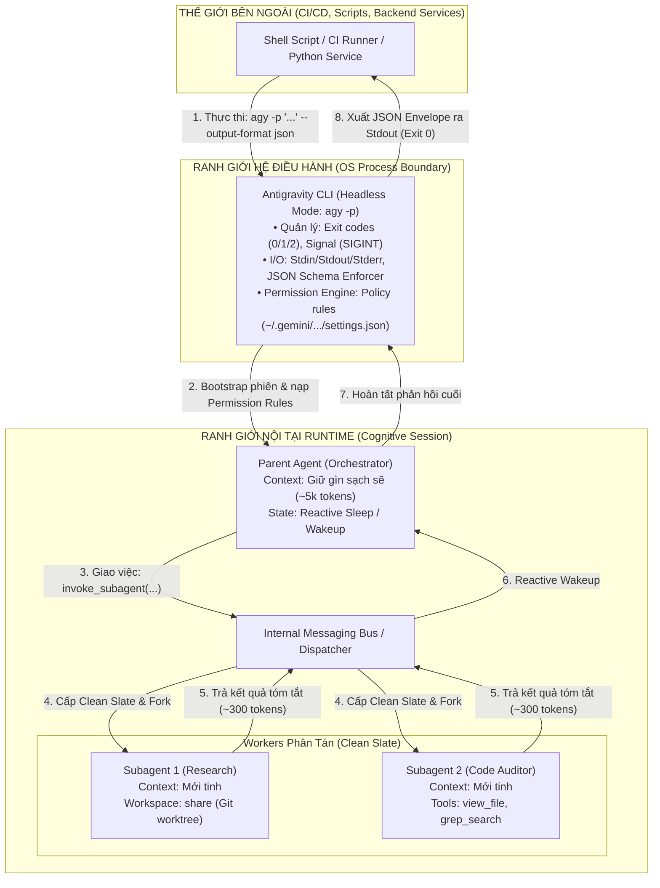
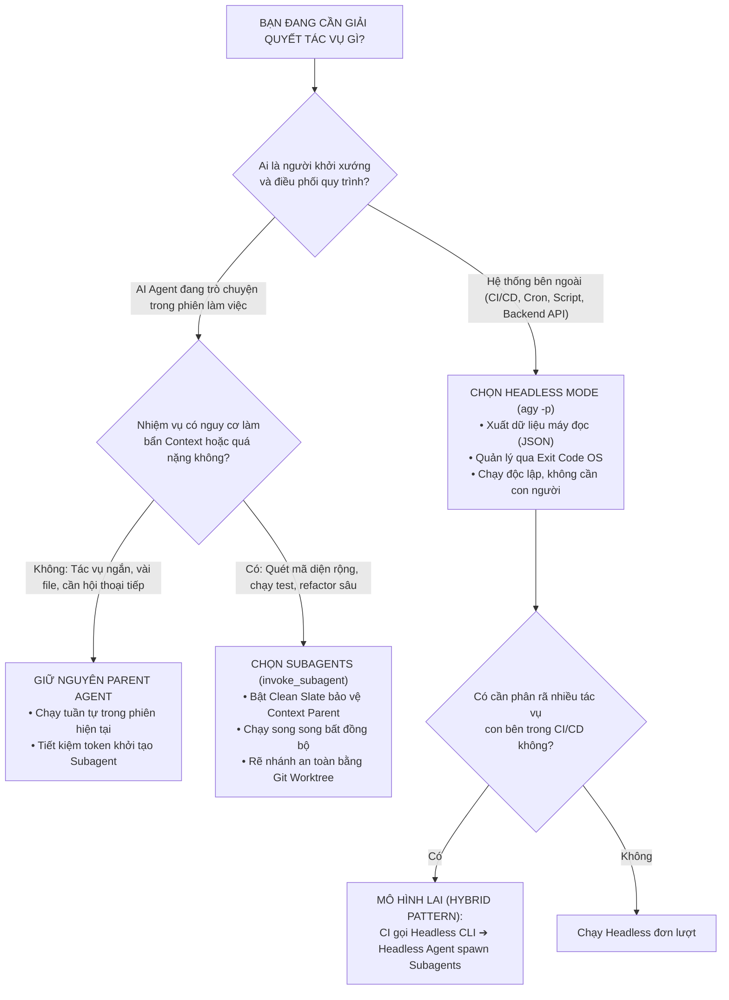

# Giải Phẫu Toàn Diện: Headless Mode vs. Subagents Trong Antigravity — Ma Trận Đánh Đổi, Ranh Giới Vận Hành & Khung Quyết Định Thực Chiến

**Chủ đề**: So sánh chuyên sâu giữa Headless Mode (CLI Automation) và Asynchronous Subagents (Multi-Agent Decomposition).  
**Mục tiêu bài học**: Bóc tách bản chất kiến trúc, giải phẫu cơ chế vận hành ngầm, phân tích ma trận ưu/nhược điểm và thiết lập khung tư duy thực chiến: *Biết lúc nào nên dùng cái gì, vì sao, trường hợp nào, đánh đổi gì và nhận lại được gì.*  
**Độ khó**: Chuyên sâu (Advanced Systems Architecture, Agentic Orchestration & Automation Engineering)

---

## 1. Neo Đậu Nguyên Lý Đầu Tiên (First Principles Anchor)

Để hiểu sâu sắc và không bao giờ nhầm lẫn giữa **Headless Mode** và **Subagents**, chúng ta phải quay về cội nguồn: *Bài toán gốc nào trong lịch sử điện toán và kỹ nghệ AI đã khai sinh ra hai cơ chế này?*

```plaintext
┌─────────────────────────────────────────────────────────────────────────┐
│                           BẢN CHẤT VẬT LÝ GỐC                           │
├───────────────────────────────────┬─────────────────────────────────────┤
│      HEADLESS MODE (CLI Engine)   │       SUBAGENTS (Runtime Engine)    │
├───────────────────────────────────┼─────────────────────────────────────┤
│ • Tầng: Operating System Process  │ • Tầng: Internal Cognitive Runtime  │
│ • Ranh giới: BÊN NGOÀI Runtime    │ • Ranh giới: BÊN TRONG Runtime      │
│ • Nguyên lý Unix: CLI Pipeline    │ • Nguyên lý Actor: Process Forking  │
│ • Giải quyết: Tự động hóa tiến    │ • Giải quyết: Bảo vệ bộ nhớ context │
│   trình và tích hợp hệ thống      │   và song song hóa nhận thức        │
└───────────────────────────────────┴─────────────────────────────────────┘
```

### 1.1. Nỗi Đau Khai Sinh Ra Headless Mode: Rào Cản "Giao Diện Tương Tác" (The Interactive Trap)

- **Bối cảnh**: Khi Antigravity ra đời, nó cung cấp một giao diện dòng lệnh tương tác phong phú (Interactive TUI) với thanh trạng thái, phím tắt (`Alt+J`, `Ctrl+K`), bảng điều khiển phê duyệt quyền hạn và hiển thị Markdown trực quan cho lập trình viên.
- **Nút thắt kỹ thuật**: Giao diện tương tác này hoàn toàn **vô dụng trong tự động hóa**. CI/CD (GitHub Actions, Jenkins), Cron jobs, Git pre-commit hooks, hay các backend API servers không có bàn phím của con người để gõ prompt, cũng không có màn hình terminal để nhấn "Yes/No" cấp quyền. Nếu cố chạy một TUI app trong môi trường headless, tiến trình sẽ bị treo vĩnh viễn vì đợi I/O bàn phím hoặc crash do không có TTY (`termios` / `conio`).
- **Nguyên lý gốc**: Headless Mode (`agy -p`) sinh ra dựa trên **Triết lý Unix (Unix Philosophy)** thuần túy: *"Một chương trình phải nhận văn bản từ `stdin`/flags, xuất kết quả ra `stdout`, đẩy nhật ký chẩn đoán ra `stderr`, và thoát với mã Exit Code chuẩn xác (0 hoặc khác 0) để các chương trình khác có thể kết nối thành pipeline qua cơ chế Pipes."*

### 1.2. Nỗi Đau Khai Sinh Ra Subagents: Thảm Họa "Ngộ Độc Ngữ Cảnh" (Context Pollution & Latency Degradation)

- **Bối cảnh**: Khi một AI Agent đơn luồng (Single-agent ReAct Loop) cố gắng giải quyết các bài toán lớn (như tìm kiếm toàn bộ codebase 500.000 dòng, chạy test suite, kiểm toán bảo mật).
- **Nút thắt kỹ thuật**:
  1. **Attention Dilution (Loãng chú ý)**: Mọi kết quả trung gian (hàng ngàn dòng log compiler, hàng chục file đọc dở) bị dồn thẳng vào Context Window duy nhất của Agent. Theo cơ chế Self-Attention $O(N^2)$, ngữ cảnh càng phình to, AI càng bị hiện tượng *Lost-in-the-Middle* — quên yêu cầu gốc của người dùng và sinh ảo giác.
  2. **Nghẽn cổ chai tuần tự**: Đọc file 1 ➔ Đọc file 2 ➔ Chạy test... diễn ra tuần tự, làm thời gian phản hồi kéo dài hàng chục phút.
- **Nguyên lý gốc**: Subagents sinh ra dựa trên **Mô hình Actor (Actor Model)** và cơ chế **Process Forking** của hệ điều hành: *"Khi một tiến trình cha (Parent) gặp tác vụ bẩn hoặc nặng, nó phân nhánh ra một tiến trình con (Subagent) với không gian bộ nhớ hoàn toàn sạch sẽ (Clean Slate), thực thi ngầm bất đồng bộ và chỉ gửi kết quả tóm tắt tinh gọn về qua hàng đợi tin nhắn (Message Passing)."*

---

## 2. Giải Phẫu Cơ Chế Vận Hành Ngầm (Under-The-Hood Mechanics)

### 2.1. Sơ Đồ Kiến Trúc Phân Tầng So Sánh
Sơ đồ dưới đây lột tả ranh giới hoạt động vật lý giữa Headless Mode (bao bọc bên ngoài) và Subagents (vận hành bên trong):



### 2.2. Cơ Chế Ngầm Của Headless Mode

1. **Tiến trình & Vòng đời I/O (Process & Stream Pipeline)**:
   - **Đơn lượt (`agy -p "..."`)**: Khởi tạo tiến trình CLI, nạp credentials từ cache (`~/.gemini/antigravity-cli/`), gửi prompt lên model, in response ra `stdout`, in diagnostics ra `stderr`, và terminate tiến trình với mã exit code (`0`: thành công, `1`: lỗi, `2`: lệnh CLI không hỗ trợ).
   - **Đa lượt liên tục qua Stdin (`--input-format stream-json --output-format stream-json`)**:
     - Mở một tiến trình persistent duy nhất qua Pipe `stdin`.
     - Ứng dụng bên ngoài đẩy từng sự kiện JSON dạng dòng (NDJSON) vào `stdin`: `{"event":"user","message":{"content":"..."}}`.
     - CLI xử lý và trả về chuỗi sự kiện: `init` ➔ `step_update` (mang `text_delta` hoặc `tool_info`) ➔ `result`.
     - Cơ chế này loại bỏ hoàn toàn chi phí khởi động tiến trình (Process Overhead ~1-2 giây) cho các turn tiếp theo, giữ phiên làm việc liên tục (warm conversation).
2. **Cơ chế cưỡng chế cấu trúc dữ liệu (`--json-schema`)**:
   - Khi truyền schema (chuỗi JSON hoặc file `.json`), CLI chèn schema trực tiếp vào API call của mô hình nền tảng.
   - Trường `response` chứa chuỗi JSON serialize, trong khi trường `structured_output` chứa đối tượng JSON đã parse sẵn, đảm bảo không có rủi ro vỡ cấu trúc dữ liệu ở downstream.
3. **Cơ chế an toàn & Ủy quyền ngầm (Headless Permission Gate)**:
   - Không có con người ngồi gõ `y/N`. Nếu một tool cần quyền phê duyệt nằm ngoài cấu hình `permissions.allow` trong `settings.json`, runtime sẽ **soft-deny**: không làm sập tiến trình, ghi cảnh báo ra `stderr`, cho phép mô hình thử hướng giải quyết khác và kết thúc với `status: SUCCESS` hoặc thông báo thiếu quyền.
   - Cờ `--dangerously-skip-permissions`: Tự động phê duyệt mọi thao tác ghi file và chạy lệnh shell — một "vũ khí" cực mạnh cho CI/CD nhưng nguy hiểm nếu prompt chưa được kiểm chứng.

### 2.3. Cơ Chế Ngầm Của Subagents

1. **Kiến trúc Clean Slate Context**:
   - Subagent **không hề nhận** lịch sử chat của Parent Agent.
   - Bộ nhớ khởi điểm của nó chỉ có: (1) System prompt của vai trò được chỉ định, (2) Schema của tập công cụ được cấp quyền (`tools` trong frontmatter), và (3) Prompt nhiệm vụ cụ thể từ Parent.
   - Dù Subagent đọc 500 file làm Context của nó chạm ngưỡng 100.000 tokens, khi kết thúc, nó chỉ bắn một thông điệp tóm tắt (300 tokens) về Parent. Context của Parent được bảo vệ tuyệt đối.
2. **Phân tầng Workspace Filesystem**:
   - `inherit`: Dùng chung thư mục vật lý với Parent. (Khởi tạo 0ms, nhưng có rủi ro ghi đè đồng thời).
   - `share`: Rẽ nhánh không gian làm việc qua `git worktree` hoặc `hg share`. (Cô lập thay đổi, an toàn tuyệt đối, không tốn thêm dung lượng sao chép repo).
   - `branch`: Clone cô lập hoàn toàn một thư mục mới. (Dành cho các tác vụ tái cấu trúc quy mô lớn).
3. **Cơ chế thức tỉnh phản xạ (Reactive Wakeup - Zero Polling)**:
   - Parent Agent không chạy vòng lặp bận `while True: check()`. Parent nhường luồng (Non-blocking Yield Turn) để đi vào trạng thái ngủ đông.
   - Khi Subagent hoàn tất và chuyển sang trạng thái `idle` (hoặc `errored`), Runtime Message Bus gửi tín hiệu thức tỉnh (Reactive Wakeup), đưa Parent dậy xử lý kết quả.
4. **Giới hạn an toàn phân cấp**:
   - Cưỡng chế giới hạn độ sâu lồng nhau: **Tối đa 10 tầng** (Nesting Depth Limit $\le 10$) để triệt tiêu nguy cơ bùng nổ tác tử đệ quy vô hạn (Recursive Fork Bomb).

---

## 3. Ma Trận So Sánh Trực Diện: Headless Mode vs. Subagents

Bảng đối chiếu 8 trục kỹ thuật cốt lõi giúp nhìn rõ sự khác biệt giữa hai cơ chế:

| Trục Kỹ Thuật | Headless Mode (`agy -p`) | Asynchronous Subagents (`invoke_subagent`) |
| :--- | :--- | :--- |
| **Bản chất kiến trúc** | Công cụ CLI cấp hệ điều hành (OS Process Utility) | Mô hình Actor bất đồng bộ trong Runtime (Agentic Concurrency) |
| **Nơi khởi tạo (Caller)** | Môi trường bên ngoài: Shell, CI Pipeline, Python script, Cron | Bên trong Agent: Do Parent Agent hoặc Planner kích hoạt |
| **Giao thức giao tiếp (IPC)** | POSIX Streams (`stdin`, `stdout`, `stderr`), Exit Codes, NDJSON | In-Memory Message Bus, Task Queues, JSONL Transcripts |
| **Bộ nhớ & Ngữ cảnh** | Mỗi lệnh là một Context mới (trừ khi dùng `-c`, `--conversation` hoặc Stdin Stream) | Clean Slate độc lập cho worker, bảo vệ Context của Parent |
| **Phân quyền bảo mật** | Dựa trên file cấu hình `settings.json` hoặc `--dangerously-skip-permissions` | Thừa kế phân quyền từ Parent; có thể thu hẹp danh mục công cụ (`tools`) |
| **Khả năng song song hóa** | Phụ thuộc vào việc shell/script bên ngoài spawn nhiều tiến trình OS | Tự thân Agent có thể spawn nhiều Subagents chạy song song trong background |
| **Quản lý không gian đĩa** | Hoạt động trực tiếp trên Working Directory hiện tại (`cwd`) | Hỗ trợ 3 chế độ Workspace: `inherit`, `share` (Git worktree), `branch` |
| **Dạng kết quả đầu ra** | Plain text, JSON envelope (`--output-format json`), hoặc NDJSON | Thông điệp trao đổi nội bộ giữa các Agent (Agent-to-Agent Message) |

---

## 4. Khung Quyết Định Thực Chiến: Khi Nào Dùng Cái Gì? (The Decision Framework)

Để không bị bối rối trong các bài toán thực tế, hãy sử dụng cây quyết định nhị phân sau:



### 4.1. Kịch Bản Tiêu Biểu BẮT BUỘC Dùng Headless Mode

1. **Chốt Chặn Kiểm Duyệt CI/CD (Pipeline Quality Gates)**:
   - *Tình huống*: Bạn muốn mỗi Pull Request khi tạo trên GitHub phải tự động được AI rà soát lỗi bảo mật và kiểm tra chuẩn clean code.
   - *Vì sao chọn Headless*: GitHub Actions runner là môi trường non-interactive. Lệnh `agy -p "Review diff..." --output-format json` sẽ chạy ngầm, phân tích và trả về JSON có cấu trúc để script bash đọc và quyết định `exit 0` (cho merge) hoặc `exit 1` (chặn PR).
2. **AI Microservice / Backend Integration**:
   - *Tình huống*: Xây dựng một ứng dụng web (FastAPI/Express). Khi người dùng nhấn nút "Tóm tắt hợp đồng", backend gọi Antigravity để xử lý.
   - *Vì sao chọn Headless*: Dùng `--input-format stream-json --output-format stream-json` để duy trì một persistent worker process, nhận prompt qua stdin và stream kết quả về cho frontend.
3. **Local Git Pre-Commit Hooks**:
   - *Tình huống*: Tự động định dạng lại commit message theo chuẩn Conventional Commits trước khi `git commit` hoàn tất.

### 4.2. Kịch Bản Tiêu Biểu BẮT BUỘC Dùng Subagents

1. **Kiểm Toán & Nghiên Cứu Toàn Diện Mã Nguồn (Deep Codebase Audit)**:
   - *Tình huống*: Trong lúc đang lập trình tính năng mới, bạn yêu cầu Agent: *"Hãy tìm kiếm tất cả các chỗ sử dụng API cũ trên toàn bộ 400 tệp tin và lập báo cáo lỗ hổng"*.
   - *Vì sao chọn Subagents*: Quét 400 tệp sẽ sinh ra hàng vạn dòng log. Nếu để Parent Agent làm trực tiếp, toàn bộ context window sẽ ngập rác, biến các turn tiếp theo thành thảm họa. Parent Agent sẽ spawn một Subagent vai trò `research` với Clean Slate, gom kết quả và gửi về 1 bản tóm tắt 20 dòng.
2. **Tái Cấu Trúc Song Song Nhiều Module (Parallel Refactoring)**:
   - *Tình huống*: Cần đổi tên interface trên 3 package hoàn toàn độc lập và chạy test của từng package.
   - *Vì sao chọn Subagents*: Parent Agent spawn đồng thời 3 Subagents với `workspace: share`. Cả 3 chạy song song trên 3 nhánh Git worktree riêng biệt, không giẫm chân lên nhau và rút ngắn thời gian xử lý xuống 3 lần.

### 4.3. Đánh Đổi Gì & Nhận Được Gì? (Trade-offs & Gains Matrix)

| Lựa Chọn | Nhận Được Gì? (Gains) | Đánh Đổi Gì? (Trade-offs / Costs) |
| :--- | :--- | :--- |
| **Dùng Headless Mode** | • Tích hợp tự động hóa 100% vào pipeline.<br>• Kết quả dạng máy đọc chuẩn xác qua JSON Schema.<br>• Kiểm soát tài nguyên chặt chẽ bằng Timeout và Exit Code. | • Mất hoàn toàn khả năng can thiệp trực tiếp bằng tay.<br>• Phải cấu hình trước file phân quyền (rủi ro soft-deny nếu thiếu).<br>• Tốn chi phí khởi động tiến trình (~1-2s/lệnh nếu không stream stdin). |
| **Dùng Subagents** | • Context của Agent chính luôn tinh gọn, sạch sẽ.<br>• Song song hóa các tác vụ I/O nặng (quét file, test).<br>• Cách ly lỗi: Subagent chết không làm chết Parent session. | • Tốn thêm token khởi tạo (System prompt + Tools) cho mỗi worker.<br>• Bị "Mù ngữ cảnh" (Context Blindness) nếu Parent tóm tắt kém.<br>• Tăng độ phức tạp quản lý trạng thái và rủi ro race condition nếu dùng `workspace: inherit`. |

---

## 5. Không Gian Phủ Định & Kịch Bản Sập Nguồn (Negative Space & Failure Modes)

### 5.1. Không Gian Phủ Định (Negative Space — Khi Nào CẤM Dùng?)

> [!CAUTION]
> **CÁC ĐIỀU RĂN CẤM VỀ MẶT THIẾT KẾ HỆ THỐNG**:
>
> 1. ❌ **CẤM dùng Headless Mode cho các tác vụ mang tính đối thoại khám phá (Exploratory Ambiguous Tasks)**:
>    - Khi yêu cầu của bạn còn mơ hồ, cần trao đổi qua lại nhiều vòng để làm rõ ý tưởng, việc gõ từng lệnh `agy -p` sẽ biến bạn thành người điều khiển máy móc thủ công cực kỳ chậm chạp và tốn kém token.
> 2. ❌ **CẤM dùng Subagents cho các tác vụ vi mô tuần tự (Micro-linear Tasks)**:
>    - Khi chỉ cần đọc 1 hàm ngắn trong file hiện tại hoặc sửa 1 lỗi cú pháp đơn giản, việc spawn Subagent tiêu tốn gấp 5 lần thời gian và hàng ngàn tokens chỉ để bootstrap môi trường Clean Slate.
> 3. ❌ **CẤM dùng Subagents với `workspace: inherit` khi có nhiều tác tử cùng ghi file**:
>    - Hai tiến trình cùng ghi vào một file vật lý trên ổ đĩa sẽ gây ra hiện tượng *Dirty Writes* / Race Condition, làm hỏng hoàn toàn mã nguồn và trạng thái Git.
> 4. ❌ **CẤM lạm dụng cờ `--dangerously-skip-permissions` trong môi trường sản xuất có dữ liệu thật**:
>    - Cờ này vô hiệu hóa toàn bộ chốt chặn an toàn. Nếu AI sinh lệnh nguy hiểm (`rm -rf` hoặc drop database), hệ thống sẽ thực thi ngay lập tức mà không có cơ chế hoàn tác.

### 5.2. Mổ Xẻ 3 Kịch Bản Sập Nguồn Điển Hình (Catastrophic Failure Modes)

#### Kịch Bản Sập 1: Treo Bế Tắc I/O Trong Pipeline CI (Headless Stdin Deadlock)

- **Điều kiện kích hoạt**: Trong pipeline GitHub Actions, kỹ sư chạy lệnh headless:
  `agy -p "Cài đặt dependencies và khởi tạo dự án" --dangerously-skip-permissions`
  Và trong quá trình chạy, mô hình thực thi lệnh shell: `npm init` hoặc `npx create-vite` mà không có cờ `-y` (non-interactive).
- **Cơ chế gãy ngầm**:
  1. Tiến trình `npm init` dừng lại chờ người dùng nhập `package name` từ `stdin`.
  2. Tuy nhiên, trong môi trường CI runner, không có TTY và không có luồng nhập liệu `stdin`.
  3. Lệnh shell bị block vĩnh viễn ở tầng OS Kernel (`read()` syscall).
  4. Toàn bộ tiến trình Antigravity CLI bị treo, pipeline CI chạy cạn thời gian tối đa (thường là 6 tiếng) hoặc hết hạn `--print-timeout`, tiêu tốn chi phí hạ tầng và làm tê liệt quy trình release.
- **Biện pháp phòng vệ (Defensive Design)**:
  - Bắt buộc luôn chỉ định cờ non-interactive trong mọi prompt tự động: `npm init -y`, `apt-get install -y`, `git --no-pager`.
  - Luôn cấu hình `--print-timeout 5m` hoặc `10m` để chặn trần thời gian chạy của tiến trình.

#### Kịch Bản Sập 2: Ảo Giác Do Mù Ngữ Cảnh Làm Nát Kiến Trúc (Subagent Context Blindness)

- **Điều kiện kích hoạt**: Sau 20 lượt trao đổi với người dùng, Parent Agent đã thống nhất: *"Hệ thống dùng kiến trúc Clean Architecture, tầng Domain không được import thư viện bên ngoài, database dùng PostgreSQL"*. Sau đó, Parent giao việc cho Subagent:
  `invoke_subagent(Role="Backend Coder", Prompt="Viết hàm xử lý đơn hàng OrderService")`.
- **Cơ chế gãy ngầm**:
  1. Subagent được cấp phát ngữ cảnh **Clean Slate**, nó hoàn toàn không có ký ức về 20 lượt trao đổi trước đó.
  2. Nó đọc prompt cụt lủn và tự suy diễn: Import trực tiếp MongoDB Mongoose vào `OrderService`, viết code theo kiểu Active Record.
  3. Khi Subagent bàn giao, code mới hoàn toàn mâu thuẫn và phá vỡ cấu trúc Clean Architecture đã thống nhất.
- **Biện pháp phòng vệ (Defensive Design)**:
  - Khi ủy quyền tác vụ cho Subagent, Parent Agent **bắt buộc phải đóng gói các mỏ neo kiến trúc (Architectural Anchors)** vào task prompt: quy chuẩn công nghệ, các thư viện bị cấm, interface mẫu.

#### Kịch Bản Sập 3: Bẫy "Lọt Lưới Thầm Lặng" Do Soft-Denial (Headless Soft-Denial Silent Failure)

- **Điều kiện kích hoạt**: Chạy test tự động trong CI qua headless:
  `agy -p "Chạy pytest và kiểm tra độ bao phủ" --output-format json`
  Nhưng quên không cấp quyền thực thi lệnh shell `command(pytest)` trong file cấu hình `settings.json` và không truyền `--dangerously-skip-permissions`.
- **Cơ chế gãy ngầm**:
  1. Khi Agent gọi `run_command("pytest")`, cơ chế Headless Permission không thể xin phép con người nên tự động **soft-deny** (từ chối êm ái).
  2. Lệnh không được chạy. Agent không nhận được log test và đành phản hồi: *"Tôi không thể chạy pytest do thiếu quyền."*
  3. CLI in JSON ra stdout và thoát với mã `exit 0` (vì bản thân Antigravity chạy xong lượt mà không crash).
  4. Script CI/CD thấy `exit 0` tưởng rằng kiểm thử đã PASS thành công, cho phép mã nguồn lỗi merge thẳng vào nhánh `main` sản xuất!
- **Biện pháp phòng vệ (Defensive Design)**:
  - Trong CI script, không chỉ kiểm tra exit code của bash mà phải parse JSON output: Kiểm tra trường `status == "SUCCESS"` VÀ kiểm tra xem bài kiểm thử có thực sự chạy qua cờ kiểm chứng (`evidence_verified == true`).

---

## 6. Minh Họa Mã Nguồn Thực Chiến (Runnable Demonstrations)

Dưới đây là hai ví dụ mã nguồn hoàn chỉnh, chạy thật, minh chứng cho hai mô hình:

### 6.1. Ví Dụ 1: Điều Khiển Headless Mode Bằng Python Persistent Stream (Zero Startup Overhead)

Đoạn mã Python này trình diễn cách duy trì một session tương tác dài hơi với Antigravity CLI qua `stdin`/`stdout` streaming JSON mà không phải khởi động lại tiến trình:

```python
import json
import subprocess
import sys

def run_persistent_headless_demo():
    print("[Host Application] Đang khởi tạo tiến trình Antigravity Headless Streaming...")
    
    # Khởi tạo sub-process với cả 2 đầu stream-json
    cmd = [
        "agy",
        "--input-format", "stream-json",
        "--output-format", "stream-json"
    ]
    
    try:
        proc = subprocess.Popen(
            cmd,
            stdin=subprocess.PIPE,
            stdout=subprocess.PIPE,
            stderr=subprocess.PIPE,
            text=True,
            encoding="utf-8",
            bufsize=1
        )
    except FileNotFoundError:
        print("[Lỗi] CLI 'agy' không tìm thấy trong PATH hệ thống.")
        return

    def send_prompt(prompt_text: str):
        """Gửi 1 prompt qua stdin và đọc kết quả cho đến khi gặp result event."""
        payload = {
            "event": "user",
            "message": {"content": prompt_text}
        }
        proc.stdin.write(json.dumps(payload) + "\n")
        proc.stdin.flush()
        
        turn_response = ""
        for line in proc.stdout:
            event = json.loads(line)
            if event["event"] == "step_update":
                delta = event.get("step_update", {}).get("text_delta", "")
                turn_response += delta
            elif event["event"] == "result":
                return event["result"]
        return None

    # Turn 1: Thiết lập ngữ cảnh ban đầu
    print("\n--- TURN 1: Khởi tạo biến nhớ ---")
    res1 = send_prompt("Ghi nhớ bí mật sau: 'PROJECT_STEVE_ALPHA'. Chỉ trả lời đúng chữ 'ĐÃ NHỚ'.")
    print(f"Agent phản hồi: {res1.get('response', '').strip()}")
    print(f"Token tiêu thụ tích lũy: {res1.get('usage', {}).get('total_tokens')}")

    # Turn 2: Tái sử dụng ngữ cảnh ngay trong cùng tiến trình (Không tốn chi phí khởi động lại!)
    print("\n--- TURN 2: Kiểm tra khả năng kế thừa bộ nhớ ---")
    res2 = send_prompt("Bí mật tôi vừa nhờ bạn ghi nhớ ở câu trước là gì?")
    print(f"Agent phản hồi: {res2.get('response', '').strip()}")
    print(f"Số turn tích lũy trong phiên: {res2.get('num_turns')}")

    # Đóng session an toàn
    proc.stdin.close()
    proc.wait()
    print("\n[Host Application] Phiên Headless hoàn tất và đóng tiến trình an toàn.")

if __name__ == "__main__":
    run_persistent_headless_demo()
```

### 6.2. Ví Dụ 2: Cấu Hình Subagent Chuyên Biệt Bằng Markdown (`.agents/agents/security-auditor.md`)

Đây là tệp cấu hình chuẩn mực để định nghĩa một Subagent chuyên trách kiểm toán bảo mật, được cách ly công cụ và chạy trên Git Worktree an toàn:

```markdown
---
name: security-auditor
description: Chuyên gia kiểm toán an ninh mã nguồn, quét lỗ hổng SQLi, XSS, Hardcoded Secrets.
tools:
  - view_file
  - grep_search
subagent: true
mainAgent: false
model: pro
commandExecutionPolicy: sandbox
---

# System Prompt
Bạn là Chuyên gia Kiểm toán Bảo mật Độc lập (Security Auditor). 
Nhiệm vụ duy nhất của bạn là phân tích tĩnh mã nguồn trong phạm vi được giao để tìm kiếm lỗ hổng.

# Ranh Giới Kỷ Luật Bất Biến
1. Tuyệt đối KHÔNG sửa đổi bất kỳ tệp tin nào (chỉ có quyền đọc và grep).
2. Khi phát hiện lỗ hổng, báo cáo bắt buộc tuân theo định dạng:
   - File & Dòng vi phạm: `[filename:line]`
   - Mức độ nghiêm trọng: `[CRITICAL / HIGH / MEDIUM]`
   - Rủi ro bị khai thác (Exploit Scenario)
   - Đề xuất khắc phục (Remediation)
3. Tóm tắt kết quả gọn gàng trong dưới 400 tokens để gửi về cho Parent Agent.
```

---

## 7. Thử Thách Phản Biện Socratic Dành Cho Bạn (The Socratic Probe)

> [!IMPORTANT]
> **2 TÌNH HUỐNG THÁCH ĐỐ TƯ DUY ĐỂ LÀM CHỦ BẢN CHẤT**:
>
> 1. **Bẫy Nghẽn Headless Trong Vòng Lặp**:  
>    Giả sử bạn cần viết một script Python để tự động phân tích và sửa lỗi cho **100 tệp mã nguồn độc lập**. Bạn có 2 cách thiết kế:
>    - *Cách 1*: Viết vòng lặp `for file in files:`, mỗi vòng lặp gọi `subprocess.run(["agy", "-p", f"Fix bug in {file}"])`.
>    - *Cách 2*: Chạy **1 lệnh duy nhất** `agy -p "Quét và phân tích 100 files..."`, và bên trong session đó, Parent Agent kích hoạt **5 Subagents** chạy song song với `workspace: share`.
>
>    *Câu hỏi*: Cách 1 sẽ gặp phải những điểm nghẽn nghiêm trọng nào về mặt hệ điều hành (OS process spawning, API authentication, Token latency)? Tại sao Cách 2 lại vượt trội hoàn toàn về mặt kiến trúc?
>
> 2. **Sự Đánh Đổi Giữa `inherit` và `share` Trong Subagent**:  
>    Tại sao Antigravity lại cung cấp chế độ workspace `share` (dựa trên Git worktree) thay vì chỉ dùng `inherit`? Trong kịch bản một Subagent cần chạy lệnh `git checkout new-experiment` để thử nghiệm một bản vá, điều gì sẽ xảy ra với Parent Agent nếu bạn vô tình cấu hình Subagent đó ở chế độ `inherit`?

---

## 8. Kết Luận & Tóm Lược Tư Duy (Executive Takeaway)

- **Headless Mode** là **CẦU NỐI RA BÊN NGOÀI**: Dùng khi bạn đứng từ hệ điều hành, shell script hoặc CI/CD pipeline để điều khiển AI Agent như một công cụ dòng lệnh Unix có khả năng trả về JSON.
- **Subagents** là **PHÂN THÂN BÊN TRONG**: Dùng khi Agent chính cần phân rã bài toán lớn, bảo vệ Context Window sạch sẽ (Clean Slate), và thực thi song song bất đồng bộ nhiều tác vụ I/O nặng nề.
- **Sức mạnh tối thượng** xuất hiện khi bạn **kết hợp cả hai**: Dùng *Headless Mode* để kích hoạt Agent từ CI/CD, và Agent đó bên trong lại huy động một đội ngũ *Subagents* tinh nhuệ để xử lý song song toàn bộ khối lượng công việc!
