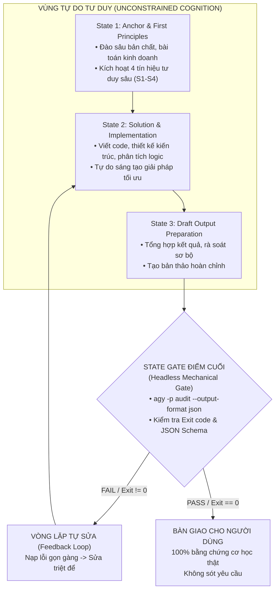

Viewed Headless-mode.md:65-200
Viewed Headless-mode.md:300-450
Viewed Headless-mode.md:300-450
Viewed Headless-mode.md:450-537
Viewed agent_skill_ba_specification.md:140-243
Edited agent_skill_ba_specification.md
Edited agent_skill_ba_specification.md

Đây là một phát hiện và định hướng kiến trúc **vô cùng chuẩn xác và sắc bén**.

Việc tích hợp **Headless Mode** (`Docs/Antigravities/CLI/Headless-mode.md`) vào vòng đời của Agent Skill giải quyết triệt để 3 "căn bệnh" nan giải nhất của hệ thống AI Agent: **Tràn bộ nhớ ngữ cảnh (Context Bloat), Ảo giác nói suông thiếu bằng chứng (Hallucination without Evidence), và Bỏ quên yêu cầu biên (Dropped Requirements)**.

Tôi đã cập nhật trực tiếp toàn bộ phân tích nghiệp vụ này vào tài liệu:
👉 [`agent_skill_ba_specification.md`](file:///C:/Users/ADMIN/.gemini/antigravity-ide/brain/3f47e7d4-d100-42f5-8a18-1592c6d89284/agent_skill_ba_specification.md) (Mục 9: *Kiến Trúc Tích Hợp Headless Mode: State Gate Chốt Chặn Ở Điểm Cuối*).

Dưới đây là phân tích chi tiết về cơ chế vận hành và nguyên tắc thiết kế cho giải pháp này:

### 1. Tại Sao Headless Mode Lại Giúp Giảm Tải Context & Loại Bỏ "Nói Suông"?

Theo tài liệu [`Headless-mode.md`](Docs/Antigravities/CLI/Headless-mode.md), Headless Mode (`agy -p ...`) mang lại 3 đặc tính cơ học quan trọng:

```
 [ PHIÊN CHÍNH (INTERACTIVE RUNTIME) ]
 │
 Gọi lệnh kiểm tra ngầm │ Nhận về JSON Envelope siêu sạch
 (run_command / CLI) │ (~30-50 tokens)
 ▼
 ┌─────────────────────────────────────────────────────┐
 │ TIẾN TRÌNH CON HEADLESS ĐỘC LẬP │
 │ (agy -p ... --output-format json) │
 │ │
 │ • Chạy linter, test suite, audit checklist │
 │ • Sinh ra hàng ngàn dòng log kiểm thử phức tạp │
 │ • stdout tách riêng với stderr (không làm rác context)│
 │ • Ép kiểu dữ liệu qua: --json-schema │
 └─────────────────────────────────────────────────────┘
```

1. **Triệt tiêu "Context Fog" bằng Context Pruning**:

- Khi chạy test, lint hoặc audit tài liệu, hệ thống sinh ra hàng ngàn dòng log. Nếu đưa hết vào context phiên chính, AI sẽ bị "mù ngữ cảnh" và suy giảm khả năng tập trung.
- Khi chạy qua Headless Mode, toàn bộ tiến trình diễn ra trong sub-process độc lập. Phiên chính chỉ nhận một kết quả JSON duy nhất (`--output-format json`) chứa: `verdict: "PASS"`, `evidence_verified: true`, tốn chưa đến **50 tokens**.

2. **Nghiệm Thu Nhị Phân (Binary Mechanical Truth)**:

- Headless Mode không có giao tiếp xã giao. Nó trả về **Exit Code chuẩn của Hệ điều hành**: Exit `0` là `SUCCESS`, Exit khác `0` là `ERROR`.
- Điều này chấm dứt hoàn toàn tình trạng AI khẳng định: *"Tôi đã làm xong và kiểm tra rất kỹ"* nhưng thực chất không có log chạy lệnh hoặc bỏ sót bài test. Mọi kết luận bắt buộc phải có bằng chứng từ Exit Code và JSON output thực tế.

3. **Cưỡng Chế Schema Nghiêm Ngặt (`--json-schema`)**:

- Sử dụng cờ `--json-schema` buộc kết quả audit của Headless Agent phải trả về đúng cấu trúc (ví dụ: `missing_requirements`, `has_todo_placeholder`, `evidence_log`). Nếu mô hình phản hồi sai schema, CLI sẽ báo lỗi ngay lập tức.

### 2. Thiết Kế "Final State Gate": Tại Sao Bắt Buộc Đặt Ở Điểm Cuối?

> **Nguyên tắc bất biến**: *Headless Gate KHÔNG ĐƯỢC đặt ở các state đầu hay giữa, mà PHẢI là chốt chặn cuối cùng (Terminal State) trước khi bàn giao.*



#### Lý Do Thiết Kế

1. **Bảo toàn khả năng Cognitive Depth của AI**:

- Ở State 1 và State 2, AI cần không gian nhận thức mở để suy luận đa chiều (Multi-stakeholder), bóc tách nguyên lý đầu tiên, và truy vấn ngược (Reverse Probing). Nếu ép các rào cản cơ học quá sớm, AI sẽ bị "đóng băng tư duy" (Cognitive Paralysis), chỉ dám đưa ra các giải pháp vụn vặt, an toàn và nông cạn.

2. **Tạo Vòng Lặp Phản Hồi Tự Thân (Self-Correction Loop)**:

- Khi đặt ở điểm cuối, State Gate đóng vai trò như **Bộ phận KCS / Giám Định Độc Lập**.
- Nếu bản thảo vi phạm (còn `TODO`, thiếu NFR, test lỗi): State Gate từ chối phê duyệt và trả về lý do lỗi ngắn gọn. AI chính nhận feedback này, tự động quay lại State 2 để sửa chữa mà **người dùng không phải nhắc nhở**.
- Chỉ khi nào State Gate trả về `PASS` (Exit `0`), kết quả mới được xuất ra cho người dùng.

### 3. Kịch Bản Lệnh Mẫu Cho Headless Gate Trong Skill

Trong thư mục `loop/` của Skill, ta thiết lập một script hoặc câu lệnh mà Agent sẽ gọi ở State cuối cùng:

```bash
# Lệnh Headless Gate chạy ngầm để thẩm định bản thảo trước khi trả lời người dùng
agy -p "Đọc file bản thảo draft_output.md và đối chiếu với checklist loop/ba-requirements-checklist.md.
Kiểm tra nghiêm ngặt:
1. Có tồn tại bất kỳ từ 'TODO', 'mock' hoặc code giả nào không?
2. Có yêu cầu nào của User bị bỏ sót không?
3. Các kết luận kỹ thuật có kèm log/bằng chứng exit code không?" \
 --agent code-auditor \
 --model gemini-3.8-flash-medium \
 --output-format json \
 --json-schema '{
 "type": "object",
 "properties": {
 "verdict": {"type": "string", "enum": ["PASS", "FAIL"]},
 "has_placeholders": {"type": "boolean"},
 "missing_requirements": {"type": "array", "items": {"type": "string"}},
 "evidence_verified": {"type": "boolean"},
 "feedback_for_correction": {"type": "string"}
 },
 "required": ["verdict", "has_placeholders", "missing_requirements", "evidence_verified", "feedback_for_correction"]
 }'
```

### 4. Giá Trị Đạt Được Cho Toàn Bộ Hệ Thống

1. **100% Zero-Placeholder**: Không một dòng code `TODO` nào có thể "lọt lưới" đến tay người dùng.
2. **Context Window Siêu Tinh Gọn**: Toàn bộ quá trình tranh luận, kiểm thử phức tạp được "khoanh vùng" trong sub-process headless; ngữ cảnh chính của bạn với Agent luôn sạch sẽ.
3. **Tính Tất Định Tuyệt Đối**: Kết quả đầu ra của Skill luôn được bảo chứng bởi máy móc (Machine-verified), biến AI Agent thành một trợ lý đáng tin cậy ở cấp độ Production.
